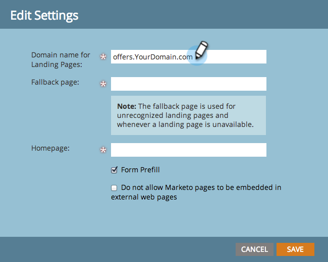
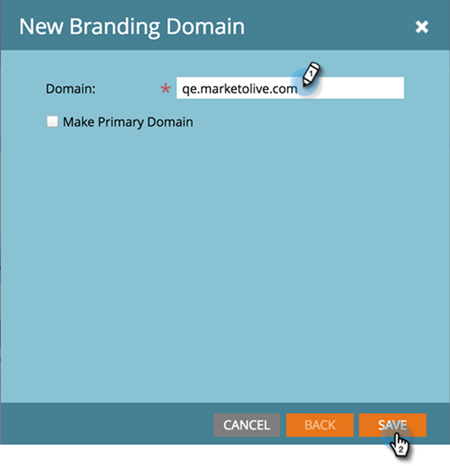

# Passaggi di configurazione {#setup-steps}

**Ti diamo il benvenuto in Marketo Engage.**

Prima di iniziare a utilizzare Marketo, devi completare alcuni passaggi.

Questi passaggi includono:

* Configurazione account di base
* Personalizzare gli URL della pagina di destinazione e i collegamenti e-mail per migliorare l’affidabilità e il recapito messaggi
* Sincronizzare il CRM
* Aggiungere il codice di tracciamento al sito web aziendale

>[!NOTE]
>
>Devi eseguire questi passaggi solo se la tua azienda **usa Marketo per la prima volta**. In caso contrario, la configurazione potrebbe essere già stata eseguita.

Alcuni passaggi richiedono il supporto del team IT.

>[!TIP]
>
>Se [stampi questo elenco di controllo](/help/marketo/getting-started/initial-setup/setup-checklist.md){target="_blank"}, puoi estrarre gli elementi mentre li completi.

## Accedi e crea altri utenti Marketo {#log-in-and-create-additional-marketo-users}

>[!IMPORTANT]
>
>Se la sottoscrizione a Marketo è stata creata il/dopo il 31 luglio 2023 o è già stata migrata a [Adobe Identity Management](/help/marketo/product-docs/administration/marketo-with-adobe-identity/adobe-identity-management-overview.md){target="_blank"}, i passaggi per l&#39;aggiunta di un utente descritti di seguito non saranno applicabili. Vedi [questo articolo](/help/marketo/product-docs/administration/marketo-with-adobe-identity/add-or-remove-a-user.md){target="_blank"}.

Accedi a Marketo [qui](https://app.marketo.com/){target="_blank"} utilizzando le credenziali ricevute tramite e-mail.

Congratulazioni! Ora sei in Marketo e puoi iniziare a esplorare. Potresti voler invitare i tuoi colleghi del team marketing a unirti a te. Per farlo, aggiungi nuovi utenti.

Passa alla schermata **[!UICONTROL Admin]**.

>[!TIP]
>
>Mentre sei qui, puoi fare clic su **[!UICONTROL My Account]** per modificare le impostazioni dell&#39;account e del percorso e impostare un nuovo nome di abbonamento.

>[!NOTE]
>
>**Autorizzazioni amministratore richieste**

Fai clic su **[!UICONTROL Users & Roles]**.

Fai clic su **[!UICONTROL Invite New User]**.

Compila l’indirizzo e-mail, il nome e il cognome del tuo collega. _L&#39;impostazione di una data di scadenza dell&#39;accesso è facoltativa_. Fai clic su **[!UICONTROL Next]**.

>[!TIP]
>
>Una data di scadenza è ideale per le parti interessate esterne a breve termine o per i consulenti che necessitano dell’accesso a Marketo solo per un breve periodo.

>[!NOTE]
>
>Quando arriva la data di scadenza, l’utente riceve una notifica di scadenza e l’account viene bloccato.

Selezionare un ruolo e fare clic su **[!UICONTROL Next]**. Gli utenti standard hanno accesso a tutte le aree eccetto Admin.

>[!NOTE]
>
>Oltre ai cinque ruoli incorporati, puoi anche creare ruoli personalizzati. Ulteriori informazioni su [Gestione di ruoli utente e autorizzazioni](/help/marketo/product-docs/administration/users-and-roles/managing-user-roles-and-permissions.md){target="_blank"}.

È possibile modificare il testo dell&#39;invito. Fai clic su **Invia**.

Il nuovo utente è ora elencato nella scheda **[!UICONTROL Users]** e dovrebbe ricevere un&#39;e-mail con un collegamento per creare una password e un login. Passaggio successivo

## Impostare I Contatti Autorizzati Per Il Supporto {#set-up-your-authorized-support-contacts}

È possibile che tu abbia ricevuto un&#39;e-mail da Marketo Support in cui si dichiara di essere l&#39;Amministratore dell&#39;Assistenza clienti Marketo per la tua azienda. In tal caso, puoi impostare **contatti per il supporto autorizzato** per il tuo team. Solo i contatti del supporto autorizzato possono contattare l&#39;Assistenza clienti Marketo direttamente tramite il [portale di assistenza Marketo](https://support.marketo.com){target="_blank"}.

>[!NOTE]
>
>Il numero di contatti di supporto che è possibile creare è determinato dal pacchetto acquistato. Questo limite è specificato nell’e-mail inviata dal supporto Marketo.

I documenti di contatto per il supporto autorizzato sono stati spostati nella community di Marketo. Consulta [questo articolo](https://nation.marketo.com/t5/Knowledgebase/Managing-Authorized-Support-Contacts/ta-p/254341){target="_blank"}.

>[!NOTE]
>
>Nell&#39;elenco vengono visualizzate solo le persone che hanno effettuato l&#39;accesso alla community di Marketo. Se non riesci a trovare la persona, accertati che prima acceda alla community.

## Personalizzare gli URL della pagina di destinazione con un CNAME {#customize-your-landing-page-urls-with-a-cname}

>[!NOTE]
>
>Sei cliente di Launch Pack? Puoi saltare questo passaggio. Il tuo consulente ti fornirà un documento con le istruzioni per la configurazione IT durante la chiamata iniziale.

>[!NOTE]
>
>**Autorizzazioni amministratore richieste**

Scegli un CNAME per le pagine di destinazione. Alcuni esempi:

    * **go**.[DominioAzienda].com
    * **www2**.[DominioAzienda].com
    * **lp**.[DominioAzienda].com

>[!TIP]
>
>Scegline uno breve. Gli URL più brevi sono più facili da ricordare. Consigliamo di usare “go” come dominio.

La prima parte (in grassetto) è il `[LandingPageCNAME]`. Ne avrai bisogno al Passaggio 5.

Per recuperare il Munchkin ID che sostituirai con il CNAME della pagina di destinazione, passa all’area Amministratore.

Fai clic su **Il mio account**.

Copia la [!UICONTROL Account String] dalle impostazioni delle pagine di destinazione.

Questo è il `[Munchkin ID]`. Salvalo. Dovrai fornirlo al reparto IT nel Passaggio 5.

Configura le impostazioni del dominio in modo che le pagine di destinazione utilizzino quello della tua azienda anziché quello di Marketo (dove sono ospitate).

## Assicurare la recapitabilità delle e-mail {#ensure-email-deliverability}

>[!NOTE]
>
>Sei cliente di Launch Pack? Puoi saltare questo passaggio. Il tuo consulente ti fornirà un documento con le istruzioni per la configurazione IT durante la chiamata iniziale.

Puoi adottare diverse misure per assicurarti che le e-mail raggiungano il maggior numero possibile di persone.

* **Personalizza i collegamenti di tracciamento con il tuo brand**. Puoi scegliere un CNAME per utilizzare il tuo dominio (anziché quello di Marketo) nei collegamenti che includi nelle e-mail inviate da Marketo. Questo rafforza il branding del dominio e aumenta l’affidabilità e la recapitabilità ai destinatari.
* **Aggiungi Marketo al tuo inserisco nell&#39;elenco Consentiti di e-mail aziendale per il tuo indirizzo e-mail di.** È consigliabile inviare e-mail di prova agli account di prova prima di inviarle alle persone. Inserendo Marketo nell’elenco Consentiti, puoi evitare che le e-mail di test vengano bloccate o contrassegnate come spam.
* **Configurare SPF e DKIM.** Queste tecnologie assicurano ai destinatari che le e-mail Marketo non siano spam. Per evitare che i filtri anti-spam dei destinatari rifiutino le e-mail di Marketo, segui questi passaggi per [Configurare un SPF e un DKIM per la recapitabilità delle tue e-mail](/help/marketo/product-docs/email-marketing/deliverability/set-up-spf-and-dkim-for-your-email-deliverability.md).
* **Configura un record MX per il tuo dominio.** Un record MX ti consente di ricevere e-mail al dominio da cui le stai inviando, per elaborare le risposte e i risponditori automatici. Se invii dal dominio aziendale, probabilmente lo hai già configurato. In caso contrario, in genere puoi configurarlo con la mappatura sul record MX del dominio aziendale.
* **Impostazioni consigliate per l’indirizzo Da.** In tutte le campagne e-mail devi utilizzare un dominio e-mail valido, esistente e funzionante nell’indirizzo Da. Può essere utile configurare un sottodominio del dominio aziendale invece di inviare da quest’ultimo. In questo modo eventuali problemi nel flusso di e-mail aziendale non influiranno su quello di Marketo e viceversa. Inoltre, se le e-mail vengono inviate da `something@nonexistentdomain.com`, verranno filtrate o bloccate. Il dominio utilizzato nell’indirizzo Da deve avere un account postmaster@ e un account abuse@ validi e funzionanti.

Se utilizzi le app Google per l’hosting dell’e-mail aziendale, non potrai creare e-mail abuse@ o postmaster@ nel tuo dominio. Per ovviare a questo problema, devi creare gruppi denominati “abuse” e “postmaster”. Gli utenti membri di questi gruppi riceveranno le e-mail inviate a tali indirizzi (ad esempio, <postmaster@domain.com>). Le istruzioni dettagliate per la creazione dei gruppi sono disponibili [qui](https://support.google.com/a/answer/33343#adminconsole){target="_blank"}.

Scegli un CNAME per i collegamenti di tracciamento e-mail (uno _diverso_ da quello della pagina di destinazione selezionata al Passaggio 3). Alcuni esempi:

* go2.[DominioAzienda].com
* em.[DominioAzienda].com
* wow.[DominioAzienda].com

La prima parte è il CNAME di tracciamento e-mail, `[EmailTrackingCNAME]`. Sarà necessario somministrarlo al reparto IT nel passaggio 5.

>[!CAUTION]
>
>I CNAME di e-mail e pagina di destinazione devono essere diversi. Inoltre, evita CNAME come “track” o “link”. Vengono spesso segnalati come spam

Per trovare il collegamento di tracciamento di Marketo, passa all’area **[!UICONTROL Admin]**.

Fai clic su **[!UICONTROL Email]**.

Copia il [!UICONTROL Tracking Link] dalle impostazioni e-mail.

Il [!UICONTROL Tracking Link] è nel formato: `mkto-[a-z][4 digits].com`.

Questo è il tuo `[MktoTrackingLink]`. Salvalo. Dovrai fornirlo al reparto IT nel Passaggio 5.

Raccogli i domini “Da”. Crea un elenco di tutti i domini “Da” (come in `[Sender]@[FromDomain].com`) che intendi utilizzare per l’invio di e-mail da Marketo. In genere, ce n’è solo uno.

Ad esempio, “marketo.com” “info.marketo.com”. Si tratta di `[FromDomain1]`,`[FromDomain2]`, ecc. Salvali. Dovrai fornirli al reparto IT nel Passaggio 5.

Ora hai tutte le informazioni necessarie per inviare la richiesta al reparto IT.

## Chiedere al reparto IT di configurare i protocolli {#ask-it-to-configure-protocols}

>[!NOTE]
>
>Sei cliente di Launch Pack? Puoi saltare questo passaggio. Il tuo consulente ti fornirà un documento con le istruzioni per la configurazione IT durante la chiamata iniziale.

Una volta raccolti tutti i dati necessari, puoi inviare una richiesta al reparto IT. Puoi utilizzare il testo seguente come modello, sostituendo quello in grassetto con i tuoi dati.

[Includi un collegamento a questo articolo](/help/marketo/getting-started/initial-setup/configure-protocols-for-marketo.md).

Incolla questo testo nell’e-mail e sostituisci i segnaposto in grassetto:

>[!NOTE]
>
>Vedi i Passaggi 3 e 4 per determinare il testo da sostituire ai segnaposto. Ricorda che `[LandingPageCNAME]` e `[EmailTrackingCNAME]` devono essere diversi.

`----------------------------------------------`

Gentile Amministratore IT,

il team Marketing ora utilizza la piattaforma Marketo per comunicare con il personale. Per garantire la migliore recapitabilità dei messaggi e-mail, è necessario apportare le seguenti modifiche:

`1)` Per le nostre pagine di destinazione, occorre aggiungere una voce DNS (CNAME) per **[CNAMEpaginaDestinazione]**.**[DominioAzienda]**.com, che punta a **[ID Munchkin]**.mktoweb.com.

`2)` Per i collegamenti di tracciamento nelle e-mail, aggiungi una voce DNS (CNAME) per **[CNAMEtracciamentoEmail]**.**[DominioAzienda]**.com, che punta a **[LinkTracciamentoMkto]**.

`3)` Inserisci gli inrdirizzi IP di Marketo nell’elenco Consentiti.

    * Se utilizziamo gli indirizzi IP nel nostro elenco di indirizzi consentiti per l’e-mail, aggiungi gli IP elencati di seguito:
    199.15.212.0/22
    
    192.28.144.0/20
    
    192.28.160.0/19
    
    185.28.196.0/22
    
    130.248.172.0/24
    
    130.248.173.0/24
    
    94.236.119.0/26

>[!NOTE]
>
>Se ti serve un elenco abbreviato di indirizzi IP da inserire nell’elenco Consentiti specifico per il tuo ambiente, contatta l’assistenza di Marketo.

    * Se il nostro sistema antispam utilizza i domini Da, aggiungi questi:

**`[FromDomain1]`**
**`[FromDomain2]`**

`4)` È necessario configurare SPF e DKIM in modo che Marketo sia autorizzato a inviare e-mail firmate per nostro conto.

`a.` Per configurare SPF, aggiungi la riga seguente alle voci DNS:

IN TXT **[Dominio Da]**: v=spf1 mx ip4:**[IP aziendali]**
 include: mktomail.com ~all

Se abbiamo già un record SPF nella voce DNS, aggiungi semplicemente quanto segue:

include:mktomail.com

`[`Sostituisci **Dominio Da** con il tuo dominio e-mail Da (es.: azienda.com) e **IP aziendali** con l’indirizzo IP del tuo server e-mail aziendale (es.: 255.255.255.255).  Se intendi inviare e-mail da più domini tramite Marketo, chiedi al personale IT di aggiungere questa riga per ciascun dominio (su una riga).`]`

`b.` Per DKIM, crea record di risorse DNS per ogni dominio da configurare. Di seguito sono riportati i record host e i valori TXT per ogni dominio per il quale firmeremo:

**`[DKIMDomain1]`**: il record host è **`[HostRecord1]`** e il valore TXT è **[TXTValue1]**.

**`[DKIMDomain2]`**: il record host è **`[HostRecord2]`** e il valore TXT è **`[TXTValue2]`**.

`[`Copia **HostRecord** e **TXTValue** per ogni **DKIMDomain** configurato dopo aver seguito le [istruzioni qui](/help/marketo/product-docs/email-marketing/deliverability/set-up-a-custom-dkim-signature.md). Non dimenticare di verificare ogni dominio in **Amministrazione > E-mail > DKIM** dopo che il personale IT avrà completato questo passaggio.`]`

`5)` È necessario verificare che sia presente un record MX valido per i domini FROM **[FromDomain1]**, **[FromDomain2]**, ecc. Puoi confermarlo? In caso contrario, ti prego di configuralo in modo che sia mappato sul record MX del nostro dominio aziendale. In questo modo sarà possibile elaborare le risposte e i risponditori automatici per i nostri mailing eseguiti con Marketo.

Avvisami quando hai completato questi passaggi, in modo che io possa completare il processo di configurazione di Marketo.

Grazie. Apprezzo molto il tuo aiuto!

Amore,

**`[Your Name]`**

`----------------------------------------------`

Invia l’e-mail al reparto IT. Sappiamo che il completamento di queste attività può richiedere del tempo all’IT. È possibile continuare con il passaggio 7, ma è necessario tornare al passaggio 6 per completare la configurazione di Marketo.

## Completare la configurazione di Marketo dopo il contributo del reparto IT {#complete-your-marketo-setup-after-it-finishes}

Una volta che il reparto IT avrà completato le attività richieste, segui questi passaggi per aggiungere i CNAME delle pagine di destinazione e e-mail e per attivare la firma DKIM.

Passa all’area **[!UICONTROL Admin]** per aggiungere il CNAME delle pagine di destinazione

Seleziona le pagine di destinazione e fai clic **[!UICONTROL Edit]** nell’area [!UICONTROL Settings].

Immetti il nuovo nome di dominio nel campo **[!UICONTROL Domain Name for Landing Pages]**. Dovrebbe essere nel seguente formato:

`[LandingPageCNAME].[CompanyDomain].com`

Nel campo della pagina **[!UICONTROL Fallback]**, immetti l’URL a cui desideri che le persone passino se una pagina di destinazione non è disponibile. Se non hai una pagina di fallback, puoi utilizzare la pagina Home della tua azienda. Nel campo **[!UICONTROL Homepage]**, immetti il sito web della tua azienda.

Nell’area [!UICONTROL Admin], seleziona **[!UICONTROL Email]** per aggiungere il tuo CNAME e-mail

Scorri verso il basso fino a [!UICONTROL Branding Domains]. Seleziona il dominio e fai clic su **[!UICONTROL Edit]**.

Nel campo Dominio, immetti il dominio di tracciamento e-mail. Dovrebbe essere nel seguente formato:

`[EmailTrackingCNAME].[CompanyDomain].com`. Fai clic su **[!UICONTROL Save]**.

## Integrare il CRM {#integrate-your-crm}

Questo è probabilmente il passaggio più emozionante della tua configurazione: è ora di riempire Marketo con tutti quei lead e contatti che hai memorizzato nel tuo CRM!

Scegli una delle seguenti opzioni, a seconda del CRM utilizzato dalla tua azienda.

    * [Integrare Marketo con [!DNL Salesforce.com]](/help/marketo/product-docs/crm-sync/salesforce-sync/understanding-the-salesforce-sync.md)
    * [Integrare Marketo con [!DNL Microsoft Dynamics]](/help/marketo/product-docs/crm-sync/microsoft-dynamics-sync/understanding-the-microsoft-dynamics-sync.md)

>[!NOTE]
>
>Per completare questi passaggi, è necessaria l’assistenza dell’amministratore del sistema CRM della tua azienda.

## Aggiungere il codice di tracciamento al tuo sito web {#add-tracking-code-to-your-website}

>[!NOTE]
>
>Sei un cliente di [!DNL Launch Pack]? Puoi saltare questo passaggio. Il tuo consulente ti fornirà le istruzioni del codice [!DNL Munchkin] nel documento di istruzioni per la configurazione IT.

Marketo dispone di un JavaScript di tracciamento personalizzato (denominato [!DNL Munchkin]) che è possibile utilizzare per tenere traccia delle attività personali su qualsiasi pagina Web. [!DNL Munchkin] è richiesto per integrare il sito web in Marketo. Segui questi passaggi per [aggiungere il codice di tracciamento [!DNL Munchkin] al tuo sito web](/help/marketo/product-docs/administration/additional-integrations/add-munchkin-tracking-code-to-your-website.md){target="_blank"}.

>[!NOTE]
>
>Per aggiungere il codice di tracciamento è necessaria un’esperienza con HTML.

## Aspettative in merito alle prestazioni {#performance-expectations}

Quali sono le tue aspettative in termini di prestazioni di Marketo? Possono variare a seconda della dimensione e della complessità delle campagne di marketing. Tuttavia, puoi contare su livelli di prestazioni equivalenti a quelli descritti nella colonna “Standard” in diverse tabelle presenti nella [descrizione del prodotto Marketo Engage](https://helpx.adobe.com/it/legal/product-descriptions/adobe-marketo-engage---product-description.html){target="_blank"}. Le colonne “Performance” e “Performance Plus” fanno riferimento a pacchetti per livello di prestazioni che forniscono [livelli di prestazioni superiori](https://nation.marketo.com/t5/product-documents/marketo-engage-performance-tiers/ta-p/328835){target="_blank"}.

Tutti i passaggi di configurazione sono terminati. L&#39;unica cosa che rimane è tuffarsi e usare Marketo!
