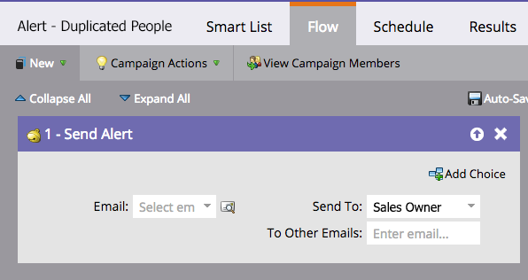

# Automatizzare un avviso per le persone duplicate possibili {#automate-an-alert-for-possible-duplicate-people}

Vuoi un avviso ogni volta che viene creata una persona duplicata possibile? Ecco come impostare una campagna avanzata per farlo.

1. [Crea una nuova campagna](/help/marketo/product-docs/core-marketo-concepts/smart-campaigns/creating-a-smart-campaign/create-a-new-smart-campaign.md) intelligente. Definisci il seguente elenco di smart:

* Trigger: **La persona viene creata**
* Filtro: **Campi duplicati.** Nome campo  **completo**

   

   >[!TIP]
   >
   >Sii creativo. Sperimenta con campi diversi per ottenere risultati di filtro migliori.

1. Nel passaggio del flusso, scegli [Invia avviso](/help/marketo/product-docs/core-marketo-concepts/smart-campaigns/flow-actions/send-alert.md) azione di flusso.

   

   >[!TIP]
   >
   >Utilizzando il [Send Alert Info token](/help/marketo/product-docs/email-marketing/general/using-tokens/use-the-send-alert-info-token.md) per includere un collegamento alla persona nel CRM.

   >[!CAUTION]
   >
   >Se importi un elenco di grandi dimensioni, puoi ricevere un sacco di questi avvisi tutti contemporaneamente!
   >
   >Inoltre, due persone con lo stesso nome non significa automaticamente che sono la stessa persona.

1. Attiva la campagna nella scheda **Pianificazione** .

   

Tutto qui! Questa campagna intelligente viene attivata ogni volta che una nuova persona con un nome completo esistente viene creata in Marketo.

>[!MORELIKETHIS]
>
>[Trova e unisci persone duplicate](/help/marketo/product-docs/core-marketo-concepts/smart-lists-and-static-lists/managing-people-in-smart-lists/find-and-merge-duplicate-people.md)
