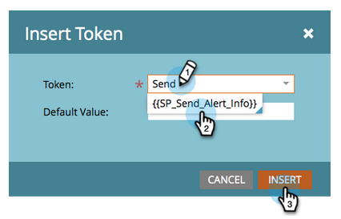
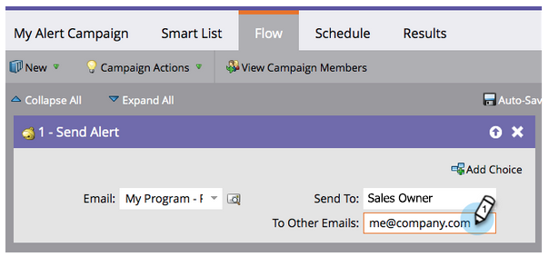

# Avvisare il rappresentante commerciale {#alert-the-sales-rep}

## Missione: Avvisa il rappresentante commerciale quando una persona compila un modulo sul tuo sito web {#mission-alert-the-sales-rep-when-a-person-fills-out-a-form-on-your-web-site}

Per inviare automaticamente le e-mail di avviso ai rappresentanti commerciali, tutto ciò di cui hai bisogno è un’e-mail di avviso e una campagna e-mail. Ecco come farlo.

>[!PREREQUISITES]
>
>[Pagina di destinazione con un modulo](/help/marketo/getting-started/quick-wins/landing-page-with-a-form.md)

## Passaggio 1: Creare un messaggio e-mail di avviso {#step-create-an-alert-email}

1. Vai all&#39;area **Attività di marketing**.

   

1. Seleziona **Il mio programma** che hai creato nella [Pagina di destinazione con una vittoria rapida di Form](/help/marketo/getting-started/quick-wins/landing-page-with-a-form.md), quindi in **Nuovo** fai clic su **Nuova risorsa locale**.

   

1. Fare clic su **Email**.

   

1. **** Assegna un nome all’e-mail &quot;My Email Alert&quot;, seleziona un modello e fai clic su  **Crea**.

   

1. Immetti i valori **Da nome**, **Da e-mail**, **Risposta-a** e **Oggetto** che desideri che venga visualizzato dal team di vendita.

   

1. Fai doppio clic per modificare il testo dell’e-mail.

   

1. Digita il contenuto dell’e-mail.

   

1. Posizionare il cursore nel punto in cui si desidera inserire le informazioni di contatto della persona e fare clic sull&#39;icona **Inserisci token**.

   

1. Trova e seleziona il `{{SP_Send_Alert_Info}}` **Token** e fai clic su **Inserisci**.

   

   >[!NOTE]
   >
   >{{SP_Send_Alert_Info}} è un token speciale per le e-mail di avviso. Per ulteriori informazioni, consulta [Utilizzare il token per le informazioni sull’invio degli avvisi](/help/marketo/product-docs/email-marketing/general/using-tokens/use-the-send-alert-info-token.md) .

1. Fare clic su **Salva**.

   

1. Chiudi la scheda/finestra dell’editor e-mail.

   

1. In **Azioni e-mail** fai clic su **Approva**.

   

## Passaggio 2: Creare una campagna di attivazione degli avvisi {#step-create-an-alert-trigger-campaign}

1. Seleziona **Il mio programma** creato in precedenza, quindi in **Nuovo** fai clic su **Nuova campagna avanzata**.

   

1. **** Denomina la campagna &quot;My Alert Campaign&quot; (Campagna di avviso personale) e fai clic su  **Crea**.

   

1. Sotto la scheda **Elenco avanzato** , trova e trascina il trigger **Riempie il modulo** sull’area di lavoro.

   

1. Selezionare il modulo creato in precedenza.

   

1. Nella scheda **Flusso** , trova e trascina l’azione di flusso **Invia avviso** nell’area di lavoro.

   

1. Seleziona **My Alert Email** creato in precedenza e lascia **Invia a** come **Proprietario vendite**.

   

1. Digita il tuo indirizzo e-mail nel campo **Fino ad altre e-mail** .

   

1. Vai alla scheda **Pianificazione** e fai clic sul pulsante **Attiva** .

   

   >[!TIP]
   >
   >Imposta le **Regole di qualifica** su **ogni volta** (modificando la Smart Campaign) per consentire alla stessa persona di attivare gli avvisi più volte.

1. Fai clic su **Attiva** nella schermata di conferma.

   

## Passaggio 3: Testa fuori! {#step-test-it-out}

1. Seleziona la pagina di destinazione e fai clic su **Visualizza pagina approvata**.

   

   >[!NOTE]
   >
   >Non dimenticare di approvare le pagine di destinazione; non vanno in diretta fino all&#39;approvazione.

1. Compila il modulo e fai clic su **Invia**.

   

1. A breve riceverai la tua e-mail. Dopo aver verificato che tutto funziona come dovrebbe, rimuovi il tuo indirizzo e-mail dal flusso di avvisi di invio (vedi il passaggio 2.7 sopra).

   >[!NOTE]
   >
   >Fai clic sulla scheda **Informazioni persona** in Marketo per visualizzare le informazioni sul contatto.

## Missione Completa! {#mission-complete}

  

[◄ Missione 7: Personalizzare un’e-mail](personalize-an-email.md)

[Missione 9 Aggiorna dati lead ►](update-person-data.md)
