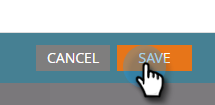

# Avvisare il rappresentante commerciale {#alert-the-sales-rep}

## Missione: avvisa il rappresentante commerciale quando una persona compila un modulo sul sito web {#mission-alert-the-sales-rep-when-a-person-fills-out-a-form-on-your-web-site}

Per inviare automaticamente e-mail di avviso agli agenti di vendita, devi solo inviare un’e-mail di avviso e una campagna e-mail. Ecco come farlo.

>[!PREREQUISITES]
>
>[Pagina di destinazione con modulo](/help/marketo/getting-started/quick-wins/landing-page-with-a-form.md){target="_blank"}

## Passaggio 1: creare un messaggio e-mail di avviso {#step-create-an-alert-email}

1. Passa alla schermata **[!UICONTROL Marketing Activities]**.

   

1. Seleziona **Il mio programma** che hai creato nella [Pagina di destinazione con un modulo](/help/marketo/getting-started/quick-wins/landing-page-with-a-form.md){target="_blank"} vinto rapidamente, quindi in **[!UICONTROL New]** fai clic su **[!UICONTROL New Local Asset]**.

   

1. Fai clic su **[!UICONTROL Email]**.

   

1. **Denomina** l&#39;e-mail &quot;Avviso e-mail&quot;, seleziona un modello e fai clic su **[!UICONTROL Create]**.

   

1. Immetti **Da nome**, **Da e-mail**, **[!UICONTROL Reply-to]** e **[!UICONTROL Subject]** che desideri che il team vendite veda.

   

1. Fai doppio clic per modificare il testo dell’e-mail.

   

1. Digita il contenuto dell’e-mail.

   

1. Posiziona il cursore nel punto in cui vuoi inserire le informazioni di contatto della persona e fai clic sull&#39;icona **Inserisci token**.

   

1. Trovare e selezionare `{{SP_Send_Alert_Info}}` **[!UICONTROL Token]** e fare clic su **[!UICONTROL Insert]**.

   

   >[!NOTE]
   >
   >{{SP_Send_Alert_Info}} è un token speciale per le e-mail di avviso. Per ulteriori informazioni, consulta [Utilizzare il token di informazioni per l&#39;invio degli avvisi](/help/marketo/product-docs/email-marketing/general/using-tokens/use-the-send-alert-info-token.md){target="_blank"}{target="_blank"}.

1. Fai clic su **[!UICONTROL Save]**.

   

1. Fai clic sul menu a discesa **[!UICONTROL Email Actions]** e seleziona **[!UICONTROL Approve and Close]**.

   

## Passaggio 2: creare una campagna di attivazione degli avvisi {#step-create-an-alert-trigger-campaign}

1. Seleziona **Il mio programma** creato in precedenza, quindi in **[!UICONTROL New]** fai clic su **[!UICONTROL New Smart Campaign]**.

   

1. **Denomina** la campagna &quot;La mia campagna di avvisi&quot; e fai clic su **[!UICONTROL Create]**.

   

1. Nella scheda **[!UICONTROL Smart List]**, individua e trascina il trigger **[!UICONTROL Fills Out Form]** nell&#39;area di lavoro.

   

1. Seleziona il modulo creato in precedenza.

   

1. Nella scheda **[!UICONTROL Flow]**, individua e trascina l&#39;azione di flusso **[!UICONTROL Send Alert]** nell&#39;area di lavoro.

   

1. Selezionare **[!UICONTROL My Alert Email]** creato in precedenza e lasciare **[!UICONTROL Send To]** come **[!UICONTROL Sales Owner]**.

   

1. Digitare l&#39;indirizzo di posta elettronica nel campo **[!UICONTROL To Other Emails]**.

   

1. Passare alla scheda **[!UICONTROL Schedule]** e fare clic sul pulsante **[!UICONTROL Activate]**.

   

   >[!TIP]
   >
   >Imposta **[!UICONTROL Qualification Rules]** su **[!UICONTROL every time]** (modificando Smart Campaign) per consentire alla stessa persona di attivare gli avvisi più volte.

1. Fai clic su **[!UICONTROL Activate]** nella schermata di conferma.

   

## Passaggio 3: Testarlo! {#step-test-it-out}

1. Seleziona la pagina di destinazione e fai clic su **[!UICONTROL View Approved Page]**.

   

   >[!NOTE]
   >
   >Non dimenticare di approvare le pagine di destinazione, che verranno pubblicate solo dopo l’approvazione.

1. Compila il modulo e fai clic su **[!UICONTROL Submit]**.

   

1. Riceverai la tua e-mail a breve. Dopo aver verificato che tutto funzioni come previsto, rimuovi il tuo indirizzo e-mail dal flusso di invio degli avvisi (vedi il precedente passaggio 2.7).

   >[!NOTE]
   >
   >Fare clic sulla scheda **[!UICONTROL Person Info]** in Marketo per visualizzare le informazioni di contatto.

## Missione completata! {#mission-complete}

  

[◄ Missione 7: personalizzare un messaggio e-mail](/help/marketo/getting-started/quick-wins/personalize-an-email.md)

[Missione 9: aggiornare i dati della persona ►](/help/marketo/getting-started/quick-wins/update-person-data.md)
