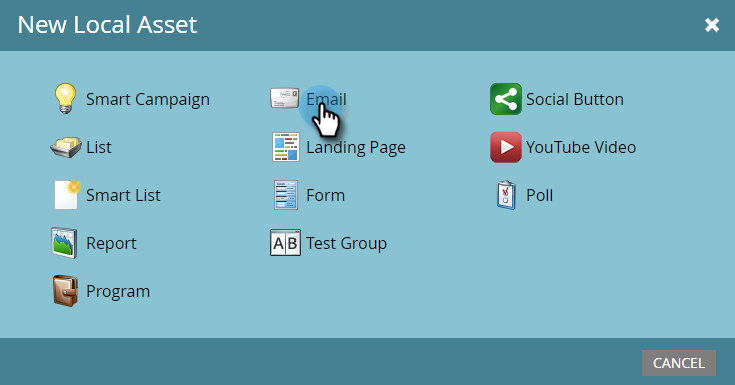

# Asciugatura, Asciugatura, Indurimento {#drip-drip-nurture}

## Missione: Inferire le persone che hanno partecipato al tuo recente show commerciale {#mission-nurture-the-people-who-attended-your-recent-tradeshow}

È possibile creare facilmente un sistema di nutrizione avanzato e sofisticato in Marketo. Ecco come!

>[!PREREQUISITES]
>
>* [Configurazione e aggiunta di una persona](/help/marketo/getting-started/quick-wins/get-set-up-and-add-a-person.md)
>* [Importare un elenco di persone](/help/marketo/getting-started/quick-wins/import-a-list-of-people.md)

## Passaggio 1: Creare un programma di coinvolgimento {#step-create-an-engagement-program}

1. Vai all&#39;area **Attività di marketing**.

   

1. Seleziona la cartella **Apprendimento**, fai clic sul menu a discesa **Nuovo** e seleziona **Nuovo programma**.

   

1. Immetti un **Nome** e seleziona **Coinvolgimento** per il **Tipo di programma**.

   

1. Assicurati che il campo **Canale** sia **Struttura** e fai clic su **Crea**.

   

   Ora hai creato un programma di coinvolgimento.

## Passaggio 2: Creare un messaggio e-mail {#step-create-an-email}

1. Seleziona il programma di coinvolgimento, quindi fai clic su **Nuovo** e seleziona **Nuova risorsa locale**.

   

1. Fare clic su **Email**.

   

1. Inserisci un **Nome**, seleziona il **Modello** che desideri utilizzare e fai clic su **Crea**.

   

   >[!NOTE]
   >
   >Non vedi l’editor e-mail? Il browser probabilmente ha bloccato la finestra. Abilita i pop-up da [app.marketo.com](https://app.marketo.com) nel browser e fai clic su **Modifica bozza** nella barra dei menu superiore.

1. Inserisci un soggetto.

   

1. Seleziona l’area dell’e-mail da modificare, fai clic sull’icona a forma di ingranaggio e seleziona **Modifica**.

   

1. Modifica l’e-mail e fai clic su **Salva**.

   

1. Chiudi la scheda/finestra dell’editor e-mail.

   

1. In **Azioni e-mail**, fai clic su **Approva**.

   

   >[!NOTE]
   >
   >Non dimenticare di approvare le e-mail o non potrai attivarle in un secondo momento.

1. Ora crea un’altra e-mail ripetendo le azioni del passaggio 2.

   

## Passaggio 3: Aggiungi contenuto al flusso {#step-add-content-to-your-stream}

1. Ora è il momento di creare un flusso di contenuti per il programma di coinvolgimento utilizzando le e-mail create.

1. Seleziona il programma di coinvolgimento e fai clic sulla scheda **Streams** .

   

1. Trascina le due e-mail create nell’area di lavoro destra.

   

   >[!TIP]
   >
   >È inoltre possibile utilizzare il pulsante **Aggiungi contenuto** o l&#39;icona di flusso **+**.

## Passaggio 4: Attiva contenuto flusso {#step-activate-stream-content}

1. Attiva tutti i contenuti contemporaneamente facendo clic sull&#39;icona dell&#39;ingranaggio del flusso, quindi fai clic su **Attiva tutti i contenuti**.

   

   >[!NOTE]
   >
   >Non puoi attivare il contenuto senza prima approvarlo.

   Ottimo lavoro! Un altro passo e il programma di coinvolgimento è pronto.

## Passaggio 5: Imposta la cadenza del flusso {#step-set-the-stream-cadence}

1. Fare clic su **Imposta cadenza flusso**.

   

1. Modifica le impostazioni in modo che corrispondano alla pianificazione desiderata e fai clic su **Salva**.

   

   Il tuo programma di coinvolgimento è pronto. Ora aggiungiamo una persona di prova al tuo programma.

   >[!NOTE]
   >
   >La persona che esegue il test è la persona che controlla il programma di coinvolgimento per verificare che sia corretto prima di inviare ai clienti.

## Passaggio 6: Aggiungere una persona di test al programma di coinvolgimento {#step-add-a-test-person-to-your-engagement-program}

1. Passa all&#39;area **Database**.

   

1. Cerca la persona di prova.

   

   >[!NOTE]
   >
   >Assicurati che la persona di prova disponga di un indirizzo e-mail valido in modo da poter confermare la ricezione delle e-mail durante il test.

1. Fare clic con il pulsante destro del mouse sulla persona, quindi scegliere Programmi e Aggiungi al programma di coinvolgimento.

   

1. Seleziona il tuo **Programma** e **Flusso**, quindi fai clic su **Esegui ora**.

   

1. Missione Completa!

1. Riceverai un’e-mail all’ora e alla cadenza specificate.

   >[!NOTE]
   >
   >Ulteriori informazioni su [Programmi di coinvolgimento](/help/marketo/product-docs/email-marketing/drip-nurturing/creating-an-engagement-program/understanding-engagement-programs.md).

  

[◄ Missione 5: Importare un elenco di lead](/help/marketo/getting-started/quick-wins/import-a-list-of-people.md)

[Missione 7: Personalizza un&#39;e-mail ►](/help/marketo/getting-started/quick-wins/personalize-an-email.md)
