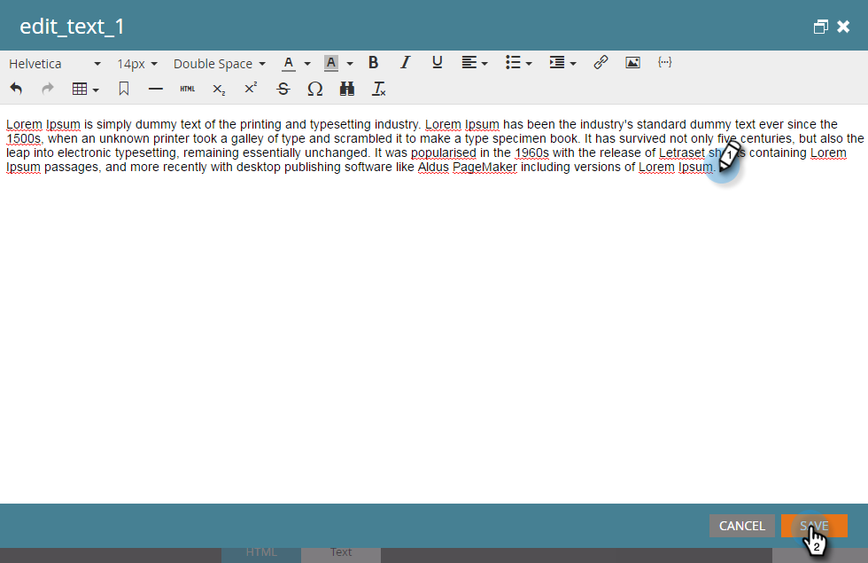

# Goccia, Goccia, Alimentazione {#drip-drip-nurture}

## Missione: coltivare le persone che hanno partecipato alla tua recente fiera {#mission-nurture-the-people-who-attended-your-recent-tradeshow}

Marketo offre un sistema di sviluppo avanzato e sofisticato. Ecco come!

>[!PREREQUISITES]
>
>* [Configurazione e aggiunta di una persona](/help/marketo/getting-started/quick-wins/get-set-up-and-add-a-person.md){target="_blank"}
>* [Importa un elenco di persone](/help/marketo/getting-started/quick-wins/import-a-list-of-people.md){target="_blank"}

## Passaggio 1: creare un programma di coinvolgimento {#step-create-an-engagement-program}

1. Vai a **[!UICONTROL Attività di marketing]** area.

   

1. Seleziona la **Apprendimento** cartella, fai clic su **[!UICONTROL Nuovo]** a discesa e selezionare **[!UICONTROL Nuovo programma]**.

   

1. Immetti un **[!UICONTROL Nome]** e seleziona **[!UICONTROL Coinvolgimento]** per **[!UICONTROL Tipo di programma]**.

   

1. Assicurati che le **[!UICONTROL Canale]** il campo è **[!UICONTROL Allevamento]** e fai clic su **[!UICONTROL Crea]**.

   

   Hai creato un programma di coinvolgimento.

## Passaggio 2: creare un messaggio e-mail {#step-create-an-email}

1. Seleziona il programma di coinvolgimento, fai clic su **[!UICONTROL Nuovo]** e seleziona **[!UICONTROL Nuova risorsa locale]**.

   

1. Clic **[!UICONTROL E-mail]**.

   

1. Immetti un **[!UICONTROL Nome]**, seleziona la **[!UICONTROL Modello]** desideri utilizzare e fai clic su **[!UICONTROL Crea]**.

   

   >[!NOTE]
   >
   >L’editor e-mail non è visualizzato? Probabilmente il browser ha bloccato la finestra. Abilita popup da `app.marketo.com` nel browser e fai clic su **[!UICONTROL Modifica bozza]** nella barra dei menu superiore.

1. Immetti un oggetto.

   

1. Seleziona l’area dell’e-mail da modificare, fai clic sull’icona a forma di ingranaggio e seleziona **[!UICONTROL Modifica]**.

   

1. Modifica l’e-mail e fai clic su **[!UICONTROL Salva]**.

   

1. Sotto **[!UICONTROL Azioni e-mail]**, fai clic su **[!UICONTROL Approva e chiudi]**.

   

   >[!NOTE]
   >
   >Ricorda di approvare le e-mail o non potrai attivarle in un secondo momento.

1. Ora crea un’altra e-mail ripetendo le azioni nei passaggi 2-7.

   

## Passaggio 3: aggiungere contenuti al flusso {#step-add-content-to-your-stream}

Ora è il momento di creare un flusso di contenuti per il programma di coinvolgimento utilizzando le e-mail create.

1. Seleziona il programma di coinvolgimento e fai clic su **[!UICONTROL Flussi]** scheda.

   

1. Fai clic su **[!UICONTROL Aggiungi contenuto]** nel flusso.

   

   >[!TIP]
   >
   >È inoltre possibile utilizzare **+** icona.

1. Lascia selezionato il tipo &quot;E-mail&quot;. Trova e seleziona le due e-mail create.

   

## Passaggio 4: attivare il contenuto del flusso {#step-activate-stream-content}

1. Attiva tutti i contenuti contemporaneamente facendo clic sull’icona dell’ingranaggio di flusso, quindi fai clic su **[!UICONTROL Attiva tutti i contenuti]**.

   

   >[!NOTE]
   >
   >Non puoi attivare il contenuto senza prima approvarlo.

   Ottimo lavoro! Un altro passo e il programma di coinvolgimento è pronto.

## Passaggio 5: impostare la cadenza del flusso {#step-set-the-stream-cadence}

1. Clic **[!UICONTROL Imposta cadenza flusso]**.

   

1. Modifica le impostazioni in base alla pianificazione desiderata e fai clic su **[!UICONTROL Salva]**.

   

   Il programma di coinvolgimento è tutto pronto. Ora aggiungiamo una persona di prova al tuo programma.

   >[!NOTE]
   >
   >La persona di prova è la persona che controlla il programma di coinvolgimento per verificarne la correttezza prima di inviarlo ai clienti.

## Passaggio 6: aggiungere una persona di prova al programma di coinvolgimento {#step-add-a-test-person-to-your-engagement-program}

1. Vai a **[!UICONTROL Database]** area.

   

1. Cerca la persona di prova.

   

   >[!NOTE]
   >
   >Assicurati che la persona che effettua il test disponga di un indirizzo e-mail valido, in modo da poter confermare la ricezione delle e-mail durante il test.

1. Fai clic con il pulsante destro del mouse sulla persona, quindi fai clic su **[!UICONTROL Programmi]** e **[!UICONTROL Aggiungi al programma di coinvolgimento...]**.

   

1. Seleziona il **[!UICONTROL Programma]** e **[!UICONTROL Flusso]**, quindi fai clic su **[!UICONTROL Esegui ora]**.

   

1. Missione completata!

1. Dovresti ricevere l’e-mail all’ora e alla frequenza specificate.

   >[!NOTE]
   >
   >Ulteriori informazioni su [Programmi di coinvolgimento](/help/marketo/product-docs/email-marketing/drip-nurturing/creating-an-engagement-program/understanding-engagement-programs.md){target="_blank"}.

## Missione completata! {#mission-complete}

  

[◄ Mission 5: importare un elenco di persone](/help/marketo/getting-started/quick-wins/import-a-list-of-people.md)

[Missione 7: personalizzare un ► e-mail](/help/marketo/getting-started/quick-wins/personalize-an-email.md)
