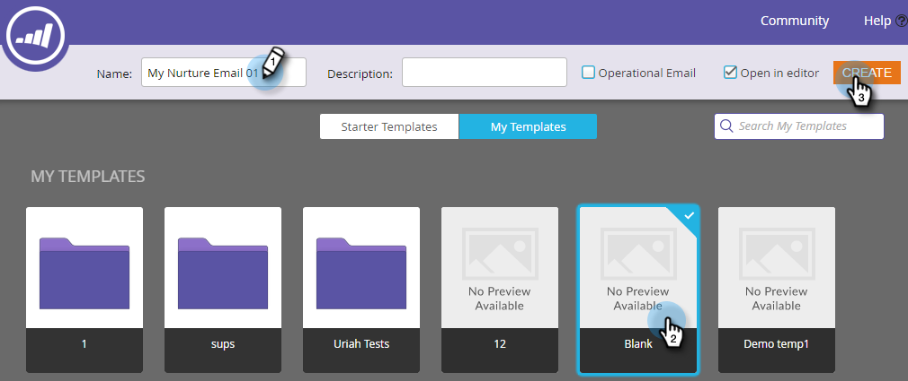

# Drip, Drip, Nurturing {#drip-drip-nurture}

## Missione: coltivare le persone che hanno partecipato alla tua recente fiera {#mission-nurture-the-people-who-attended-your-recent-tradeshow}

Marketo offre un sistema di sviluppo avanzato e sofisticato. Ecco come!

>[!PREREQUISITES]
>
>* [Configurare e aggiungere una persona](/help/marketo/getting-started/quick-wins/get-set-up-and-add-a-person.md){target="_blank"}
>* [Importa un elenco di persone](/help/marketo/getting-started/quick-wins/import-a-list-of-people.md){target="_blank"}

## Passaggio 1: creare un programma di coinvolgimento {#step-create-an-engagement-program}

1. Passa alla schermata **[!UICONTROL Marketing Activities]**.

   

1. Seleziona la cartella **Apprendimento**, fai clic sull&#39;elenco a discesa **[!UICONTROL New]** e seleziona **[!UICONTROL New Program]**.

   

1. Immettere **[!UICONTROL Name]** e selezionare **[!UICONTROL Engagement]** per **[!UICONTROL Program Type]**.

   

1. Verificare che il campo **[!UICONTROL Channel]** sia **[!UICONTROL Nurture]** e fare clic su **[!UICONTROL Create]**.

   

   Hai creato un programma di coinvolgimento.

## Passaggio 2: creare un messaggio e-mail {#step-create-an-email}

1. Selezionare il programma di coinvolgimento, fare clic su **[!UICONTROL New]** e selezionare **[!UICONTROL New Local Asset]**.

   

1. Fai clic su **[!UICONTROL Email]**.

   

1. Immettere **[!UICONTROL Name]**, selezionare **[!UICONTROL Template]** da utilizzare e fare clic su **[!UICONTROL Create]**.

   

   >[!NOTE]
   >
   >L’editor e-mail non è visualizzato? Probabilmente il browser ha bloccato la finestra. Abilita i popup da `app.marketo.com` nel browser e fai clic su **[!UICONTROL Edit Draft]** nella barra dei menu superiore.

1. Immetti un oggetto.

   

1. Selezionare l&#39;area dell&#39;e-mail che si desidera modificare, fare clic sull&#39;icona a forma di ingranaggio e selezionare **[!UICONTROL Edit]**.

   

1. Modifica l&#39;e-mail e fai clic su **[!UICONTROL Save]**.

   

1. In **[!UICONTROL Email Actions]**, fare clic su **[!UICONTROL Approve and Close]**.

   

   >[!NOTE]
   >
   >Ricorda di approvare le e-mail o non potrai attivarle in un secondo momento.

1. Ora crea un’altra e-mail ripetendo le azioni nei passaggi 2-7.

   

## Passaggio 3: aggiungere contenuti al flusso {#step-add-content-to-your-stream}

Ora è il momento di creare un flusso di contenuti per il programma di coinvolgimento utilizzando le e-mail create.

1. Selezionare il programma di coinvolgimento e fare clic sulla scheda **[!UICONTROL Streams]**.

   

1. Fare clic sul pulsante **[!UICONTROL Add Content]** nel flusso.

   

   >[!TIP]
   >
   >È inoltre possibile utilizzare l&#39;icona **+**.

1. Lascia selezionato il tipo &quot;E-mail&quot;. Trova e seleziona le due e-mail create.

   

## Passaggio 4: attivare il contenuto del flusso {#step-activate-stream-content}

1. Attiva tutti i contenuti contemporaneamente facendo clic sull&#39;icona dell&#39;ingranaggio di flusso, quindi fai clic su **[!UICONTROL Activate all content]**.

   

   >[!NOTE]
   >
   >Non puoi attivare il contenuto senza prima approvarlo.

   Ottimo lavoro! Un altro passo e il programma di coinvolgimento è pronto.

## Passaggio 5: impostare la cadenza del flusso {#step-set-the-stream-cadence}

1. Fai clic su **[!UICONTROL Set Stream Cadence]**.

   

1. Modificare le impostazioni in base alla pianificazione desiderata e fare clic su **[!UICONTROL Save]**.

   

   Il programma di coinvolgimento è tutto pronto. Ora aggiungiamo una persona di prova al tuo programma.

   >[!NOTE]
   >
   >La persona di prova è la persona che controlla il programma di coinvolgimento per verificarne la correttezza prima di inviarlo ai clienti.

## Passaggio 6: aggiungere una persona di prova al programma di coinvolgimento {#step-add-a-test-person-to-your-engagement-program}

1. Passa alla schermata **[!UICONTROL Database]**.

   

1. Cerca la persona di prova.

   

   >[!NOTE]
   >
   >Assicurati che la persona che effettua il test disponga di un indirizzo e-mail valido, in modo da poter confermare la ricezione delle e-mail durante il test.

1. Fare clic con il pulsante destro del mouse sulla persona, quindi scegliere **[!UICONTROL Programs]** e **[!UICONTROL Add to Engagement Program...]**.

   

1. Seleziona **[!UICONTROL Program]** e **[!UICONTROL Stream]**, quindi fai clic su **[!UICONTROL Run Now]**.

   

1. Missione completata!

1. Dovresti ricevere l’e-mail all’ora e alla frequenza specificate.

   >[!NOTE]
   >
   >Ulteriori informazioni su [Programmi di coinvolgimento](/help/marketo/product-docs/email-marketing/drip-nurturing/creating-an-engagement-program/understanding-engagement-programs.md){target="_blank"}.

## Missione completata! {#mission-complete}

  

[◄ Missione 5: importare un elenco di persone](/help/marketo/getting-started/quick-wins/import-a-list-of-people.md)

[Missione 7: personalizzare un&#39;e-mail ►](/help/marketo/getting-started/quick-wins/personalize-an-email.md)
