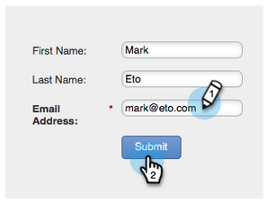

# Risposta automatica e-mail {#email-auto-response}

## Missione: Invia un messaggio e-mail di ringraziamento quando una persona compila un modulo {#mission-send-out-a-thank-you-email-when-a-person-fills-out-a-form}

>[!PREREQUISITES]
>
>* [Configurazione e aggiunta di una persona](/help/marketo/getting-started/quick-wins/get-set-up-and-add-a-person.md){target=&quot;_blank&quot;}
>* [Pagina di destinazione con un modulo](/help/marketo/getting-started/quick-wins/landing-page-with-a-form.md){target=&quot;_blank&quot;}

## Passaggio 1: Creare un messaggio e-mail {#step-create-an-email}

1. Vai all’area Attività di marketing .

   

1. Seleziona Programma nel menu a sinistra, fai clic sul menu a discesa Nuovo e seleziona Nuova risorsa locale.

   

1. Fai clic su E-mail.

   

1. Denomina l&#39;e-mail &quot;Auto Response Email&quot;, scegli un modello e fai clic su Crea.

   

   Viene aperto un editor e-mail in una nuova finestra o scheda. Se i popup sono bloccati, fare clic su **Modifica bozza** nella pagina di riepilogo delle risorse per accedere all’e-mail.

1. Inserisci un oggetto, quindi fai doppio clic sull’area modificabile dell’e-mail.

   

   _Viene aperto un editor Rich Text sopra l’editor e-mail._

1. Evidenzia il contenuto dell’e-mail esistente.

   

1. Digita il contenuto dell’e-mail e fai clic su Salva.

   

1. Le modifiche vengono salvate automaticamente. Chiudi la scheda/finestra dell’editor e-mail.

   

1. Seleziona il nuovo messaggio e-mail. In Azioni e-mail fare clic su Approva.

   

## Passaggio 2: Creare una campagna avanzata {#step-create-a-smart-campaign}

1. Fai clic con il pulsante destro del mouse **Il mio programma** e fai clic su **Nuova campagna Smart**.

   

1. **Nome** la campagna intelligente &quot;Auto Response Campaign&quot; e fai clic su **Crea**.

   

1. Vai a **Elenco avanzato** scheda .

   

   Questa campagna viene impostata per essere eseguita ogni volta che una persona compila il modulo creato in [**Pagina di destinazione con un modulo**](/help/marketo/getting-started/quick-wins/landing-page-with-a-form.md){target=&quot;_blank&quot;}.

1. Trova e trascina **Riempie il modulo** attiva l’area di lavoro a sinistra.

   

1. Seleziona **Modulo personale** nel menu a discesa . Fai clic sul pulsante **Flusso** scheda .

   

1. Trascina **Invia e-mail** azione di scorrimento verso l&#39;area di lavoro sinistra.

   

1. Seleziona la tua **E-mail di risposta automatica** e vai al **Pianificazione** scheda .

   

1. Fai clic su **Modifica**.

   

1. Seleziona **ogni volta** e fai clic su **Salva**.

   

1. Fai clic su **Attiva**.

   

1. Fai clic su **Attiva** nella schermata di conferma.

   

>[!NOTE]
>
>Una volta attivata, questa campagna viene eseguita ogni volta che una persona compila il modulo specificato. La campagna continuerà a essere in esecuzione finché non viene disattivata.

## Passaggio 3: Compilare il modulo {#step-fill-out-the-form}

1. Seleziona **Pagina personale**. Questa funzione è stata creata in [Pagina di destinazione con un modulo](/help/marketo/getting-started/quick-wins/landing-page-with-a-form.md){target=&quot;_blank&quot;} vittoria rapida.

   

1. Fai clic su **Visualizza pagina approvata**.

   

   La pagina di destinazione &quot;Prova gratuita&quot; si aprirà in una nuova scheda.

1. Compila il modulo con il tuo nome, cognome e indirizzo e-mail, quindi fai clic su **Invia**.

   

>[!NOTE]
>
>Assicurati di utilizzare il tuo indirizzo e-mail effettivo in modo da poter ricevere l&#39;e-mail.

## Missione completata {#mission-complete}

Nel giro di pochi minuti dovresti visualizzare l’e-mail di risposta automatica nella tua casella in entrata. Ottimo lavoro!

  

[◄ Missione 3: Punteggio semplice](/help/marketo/getting-started/quick-wins/simple-scoring.md)

[Missione 5: Importa un elenco di persone ►](/help/marketo/getting-started/quick-wins/import-a-list-of-people.md)
