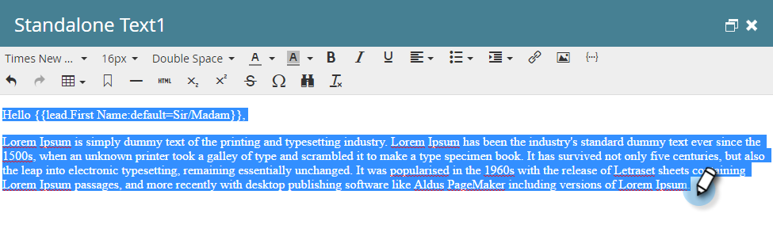

# Risposta automatica e-mail {#email-auto-response}

## Missione: inviare un’e-mail di ringraziamento quando una persona compila un modulo {#mission-send-out-a-thank-you-email-when-a-person-fills-out-a-form}

>[!PREREQUISITES]
>
>* [Configurare e aggiungere una persona](/help/marketo/getting-started/quick-wins/get-set-up-and-add-a-person.md){target="_blank"}
>* [Pagina di destinazione con modulo](/help/marketo/getting-started/quick-wins/landing-page-with-a-form.md){target="_blank"}

## Passaggio 1: creare un messaggio e-mail {#step-create-an-email}

1. Passa all&#39;area [!UICONTROL Marketing Activities].

   

1. Seleziona il programma nel menu a sinistra, fai clic sul menu a discesa **[!UICONTROL New]** e seleziona **[!UICONTROL New Local Asset]**.

   

1. Seleziona **[!UICONTROL Email]**.

   

1. Assegna un nome all&#39;indirizzo e-mail di risposta automatica, scegli un modello e fai clic su **[!UICONTROL Create]**.

   

   Un editor e-mail si aprirà in una nuova finestra o scheda. Se i pop-up sono bloccati, fai clic su **[!UICONTROL Edit Draft]** nella pagina di riepilogo delle risorse per accedere all&#39;e-mail.

1. Inserisci un oggetto, quindi fai doppio clic sull’area modificabile dell’e-mail.

   

   _Verrà aperto un editor Rich Text sopra l&#39;editor e-mail._

1. Evidenzia il contenuto dell’e-mail esistente.

   

1. Digita il contenuto dell&#39;e-mail e fai clic su **[!UICONTROL Save]**.

   

1. Fai clic sul menu a discesa **[!UICONTROL Email Actions]** e seleziona **[!UICONTROL Approve and Close]**.

   

## Passaggio 2: creare una campagna avanzata {#step-create-a-smart-campaign}

1. Seleziona il programma, fai clic sul menu a discesa **[!UICONTROL New]** e seleziona **[!UICONTROL New Smart Campaign]**.

   

1. **Assegna un nome** alla campagna avanzata &quot;Campagna di risposta automatica&quot; e fai clic su **[!UICONTROL Create]**.

   

1. Passa alla scheda **[!UICONTROL Smart List]**.

   

   Questa campagna verrà impostata per essere eseguita ogni volta che una persona compila il modulo creato in [**Pagina di destinazione con un modulo**](/help/marketo/getting-started/quick-wins/landing-page-with-a-form.md){target="_blank"}.

1. Trova e trascina il trigger **[!UICONTROL Fills Out Form]** nell&#39;area di lavoro.

   

1. Seleziona **[!UICONTROL My Form]** nel menu a discesa. Quindi fai clic sulla scheda **[!UICONTROL Flow]**.

   

1. Trascina l&#39;azione di flusso **[!UICONTROL Send Email]** nell&#39;area di lavoro a sinistra.

   

1. Seleziona **E-mail di risposta automatica**. Quindi fai clic sulla scheda **[!UICONTROL Schedule]**.

   

1. Fai clic su **[!UICONTROL Edit]**.

   

1. Seleziona **[!UICONTROL every time]** e fai clic su **[!UICONTROL Save]**.

   

1. Fai clic su **[!UICONTROL Activate]**.

   

1. Fai clic su **[!UICONTROL Activate]** nella schermata di conferma.

   

>[!NOTE]
>
>Una volta attivata, questa campagna verrà eseguita ogni volta che una persona compila il modulo specificato. La campagna continuerà a essere attiva fino a quando non verrà disattivata.

## Passaggio 3: compilare il modulo {#step-fill-out-the-form}

1. Seleziona **Pagina personale** (creata rapidamente nella [Pagina di destinazione con modulo](/help/marketo/getting-started/quick-wins/landing-page-with-a-form.md){target="_blank"}) e fai clic su **[!UICONTROL Preview]**.

   

   _La pagina di destinazione &quot;Prova gratuita&quot; verrà aperta in una nuova scheda._

1. Compila il modulo con il tuo nome, cognome e indirizzo e-mail, quindi fai clic su **[!UICONTROL Submit]**.

   

>[!NOTE]
>
>Assicurati di utilizzare il tuo indirizzo e-mail reale in modo da poter ottenere l’e-mail.

## Missione completata {#mission-complete}

In pochi minuti dovresti visualizzare l’e-mail di risposta automatica nella tua casella in entrata.

[◄ Missione 3: punteggio semplice](/help/marketo/getting-started/quick-wins/simple-scoring.md)

[Missione 5: importare un elenco di persone ►](/help/marketo/getting-started/quick-wins/import-a-list-of-people.md)
