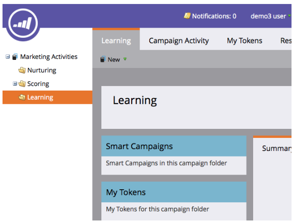

# Imposta e aggiungi una persona {#get-set-up-and-add-a-person}

Ci sono alcune cose da fare prima di iniziare le missioni.

## Passaggio 1: Accedi a Marketo {#step-log-in-to-marketo}

1. [Accedi a ](https://app.marketo.com) Marketing utilizzando le credenziali ricevute tramite e-mail.

   

## Passaggio 2: Creare una cartella di apprendimento {#step-create-a-learning-folder}

Creiamo una cartella per contenere tutto ciò che farai nelle missioni.

1. Vai all&#39;area **Attività di marketing**.

   

1. Fai clic sul menu a discesa **Nuovo** e seleziona **Nuova cartella campagna**.

   

1. Denomina la cartella &quot;Learning&quot; e fai clic su **Crea**.

   

1. La nuova cartella Learning verrà visualizzata nel menu a sinistra.

   

## Passaggio 3: Aggiungi te stesso come persona {#step-add-yourself-as-a-person}

Aggiungi te stesso come persona in Marketo in modo da poter inviare e-mail di test a te stesso in un secondo momento.

1. Passa all&#39;area **Database**.

   

1. Fai clic sull&#39;elenco a discesa **Nuovo** e seleziona **Nuova persona**.

   

1. Digita il tuo nome e cognome, indirizzo e-mail e nome società, quindi fai clic su **Crea** per aggiungerti come persona.

   

1. Per visualizzare le persone, aprire gli elenchi smart di sistema nel menu a sinistra, quindi fare clic su Tutte le persone.

   

1. Fare clic sulla scheda **Persone**. Dovresti vedere te stesso nel database.

   

## Configurazione completa {#set-up-complete}

Sei pronto a iniziare la tua prima missione!

  

[Missione 1: Invia un&#39;e-mail di bolla ►](/help/marketo/getting-started/quick-wins/send-an-email.md)
