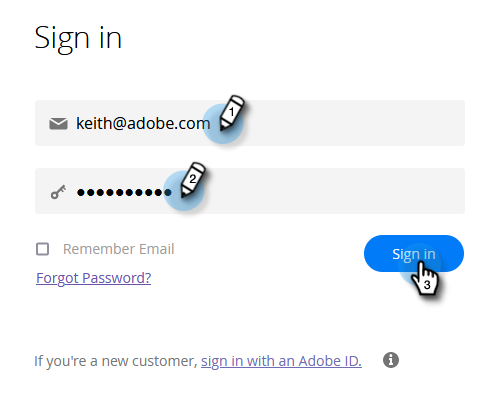

# Configurazione e aggiunta di una persona {#get-set-up-and-add-a-person}

Ci sono alcune cose da fare prima di iniziare le missioni.

## Passaggio 1: accedere a Marketo Engage {#step-log-in-to-marketo}

1. [Accedi a Marketo Engage](https://app.marketo.com){target="_blank"} utilizzando le credenziali ricevute tramite e-mail.

   

## Passaggio 2: creare una cartella di apprendimento {#step-create-a-learning-folder}

Creiamo una cartella in cui inserire tutto ciò che farai nelle missioni.

1. Passare all&#39;area **[!UICONTROL Marketing Activities]**.

   

1. Fare clic sul menu a discesa **[!UICONTROL New]** e selezionare **[!UICONTROL New Campaign Folder]**.

   

1. Assegnare alla cartella il nome &quot;Learning&quot; e fare clic su **[!UICONTROL Create]**.

   

1. Nel menu a sinistra verrà visualizzata la nuova cartella Apprendimento.

   

## Passaggio 3: aggiungiti come persona {#step-add-yourself-as-a-person}

Aggiungi te stesso/a come persona in Marketo in modo da poter inviare e-mail di prova a te stesso in un secondo momento.

1. Passare all&#39;area **[!UICONTROL Database]**.

   

1. Fare clic sul menu a discesa **[!UICONTROL New]** e selezionare **[!UICONTROL New Person]**.

   

1. Digita il tuo nome e cognome, l&#39;indirizzo e-mail e il nome della società, quindi fai clic su **[!UICONTROL Create]** per aggiungerti come persona.

   

   >[!CAUTION]
   >
   >* Assicurati che gli indirizzi e-mail contengano solo caratteri ASCII.
   >
   >* Marketo **non** supporta gli indirizzi e-mail che contengono emoticon.

1. Per visualizzare le tue persone, apri [!UICONTROL System Smart Lists] nel menu a sinistra, quindi fai clic su **[!UICONTROL All People]**.

   

1. Fare clic sulla scheda **[!UICONTROL People]**. Dovresti trovarti nel database.

   

## Configurazione completata {#set-up-complete}

Sei pronto per iniziare la tua prima missione!

  

[Missione 1: inviare un&#39;esplosione e-mail ►](/help/marketo/getting-started/quick-wins/send-an-email.md)
