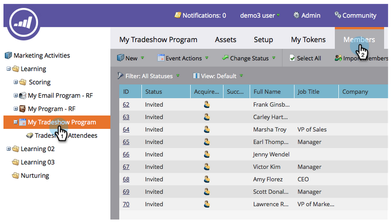

# Importare un elenco di persone {#import-a-list-of-people}

## Missione: Importa nel database un elenco di fogli di calcolo dei partecipanti alle fiere di commercio {#mission-import-a-spreadsheet-list-of-trade-show-attendees-into-your-database}

>[!PREREQUISITES]
>
>[Configurazione e aggiunta di una persona](/help/marketo/getting-started/quick-wins/get-set-up-and-add-a-person.md)

Questa esercitazione spiega come importare in Marketo le persone da un file di foglio di calcolo.

## Passaggio 1: Scaricare e modificare un foglio di calcolo {#step-download-and-edit-a-spreadsheet}

1. Per iniziare, scarica sul tuo computer il file del foglio di calcolo del tuo esercizio ([**fidelizzazione-attendees.csv**](/help/marketo/getting-started/assets/tradeshow-attendees.csv)).

   

   >[!NOTE]
   >
   >Quando importi una data, utilizza questo formato: **21/09/20** (mese/giorno/anno).

   >[!NOTE]
   >
   >Tutti i campi data/ora da importare vengono trattati come Ora centrale. Se si dispone di campi data/ora in un fuso orario diverso, è possibile utilizzare una formula Excel per trasformarla in Ora centrale (America/Chicago).

1. Aggiungere il proprio nome, cognome, indirizzo e-mail e titolo del processo, quindi salvare il file sul computer.

   

>[!NOTE]
>
>Inserisci il tuo vero indirizzo e-mail nel file CSV in modo da poter ricevere le e-mail di sviluppo che invierai nella prossima missione.

## Passaggio 2: Creare un programma {#step-create-a-program}

1. Vai all&#39;area **Attività di marketing**.

   

1. Seleziona la cartella **Apprendimento**, quindi in **Nuovo** fai clic su **Nuovo programma**.

   

1. **** Rinomina il programma &quot;Il mio programma di programma di programma&quot; e seleziona &quot;Evento&quot; per il tipo di  **programma**.

   

1. Seleziona **Tradeshow** per il **Canale** e fai clic su **Crea**.

   

>[!NOTE]
>
>I programmi evento si verificano in date specifiche. Ulteriori informazioni su [**Eventi**](/help/marketo/product-docs/demand-generation/events/understanding-events/understanding-event-programs.md).

## Passaggio 3: Importare il foglio di calcolo in Marketo {#step-import-your-spreadsheet-into-marketo}

1. In **Il mio programma di presentazione**, fai clic su **Nuovo** e seleziona **Nuova risorsa locale**.

   

1. Fare clic su **Elenco**.

   

1. **** Denomina l&#39;elenco &quot;Partecipanti al programma di lavoro&quot; e fai clic su  **Crea**.

   

1. Nell&#39;elenco **Partecipanti alla presentazione**, fai clic su **Elenca azioni** e seleziona **Importa elenco**.

   

   >[!CAUTION]
   >
   >Se utilizzi un tuo file CSV, accertati che sia codificato UTF-8, UTF-16, Shift-JIS o EUC-JP.

   >[!NOTE]
   >
   >Il limite di dimensione per i file CSV è di 100 MB.

1. **** Individua il file  **del foglio di calcolo** csvecolarità sul computer e fai clic su  **Avanti**.

   

   >[!NOTE]
   >
   >In modalità di importazione elenco, scegliere **Ignora nuove persone e aggiornamenti** significa che non si avrà alcun impatto sui record di persone esistenti o registrare alcuna attività. Utilizza questa modalità se desideri un elenco rapido e pre-filtrato statico delle persone esistenti da utilizzare nelle attività di marketing. Selezionando questa modalità:
   >
   > * Ignora la creazione di nuove persone
   > * Ignora aggiornamenti campo persona
   > * Ignora registrazione attività

1. Mappa i campi Colonna elenco sul rispettivo campo Marketo e fai clic su **Avanti**.

   

   >[!TIP]
   >
   >Per ottenere i migliori risultati di mappatura automatica, le intestazioni di colonna devono sempre corrispondere esattamente al campo (con distinzione tra maiuscole e minuscole). Se utilizzi campi personalizzati e non li vedi nell’elenco a discesa, torna indietro e [creali](/help/marketo/product-docs/administration/field-management/create-a-custom-field-in-marketo.md) in modo che possano diventare opzioni.

   >[!NOTE]
   >
   >Se esistono campi che non si desidera importare, selezionare **Ignora** nel menu a discesa Campo Marketo.

1. Seleziona **Il mio programma di presentazione** per il **programma di acquisizione**, quindi fai clic su **Importa**.

   

1. Attendi l’importazione delle persone, quindi chiudi la finestra a comparsa di avanzamento dell’importazione.

   

1. Di nuovo in **Il mio programma di presentazione**, fai clic sulla scheda **Membri** . Vedrete tutte le persone appena importate.

   

>[!NOTE]
>
>Puoi analizzare il successo del tuo programma monitorando l&#39;iscrizione al programma. Ulteriori informazioni su [**Programmi**](/help/marketo/product-docs/core-marketo-concepts/programs/creating-programs/understanding-programs.md).

## Missione completata {#mission-complete}

I partecipanti al vostro programma sono ora membri del vostro programma Marketo!

  

[◄ Missione 4: Risposta automatica e-mail](/help/marketo/getting-started/quick-wins/email-auto-response.md)

[Missione 6 Goccia, Asciugatura, Alimentazione ►](/help/marketo/getting-started/quick-wins/drip-drip-nurture.md)
