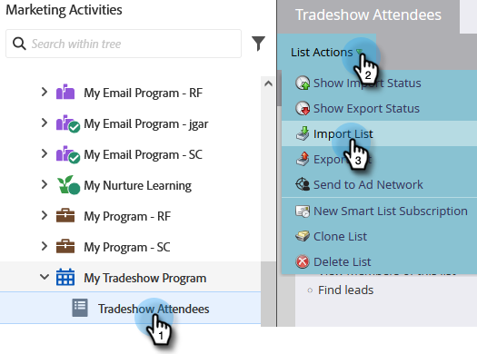

# Importa un elenco di persone {#import-a-list-of-people}

## Missione: importare nel database un elenco di fogli di calcolo dei partecipanti alle fiere {#mission-import-a-spreadsheet-list-of-trade-show-attendees-into-your-database}

>[!PREREQUISITES]
>
>[Configurazione e aggiunta di una persona](/help/marketo/getting-started/quick-wins/get-set-up-and-add-a-person.md){target="_blank"}

Questa esercitazione illustra come importare le persone da un file del foglio di calcolo in Marketo.

## Passaggio 1: Scaricare e modificare un foglio di calcolo {#step-download-and-edit-a-spreadsheet}

1. Per iniziare, scaricare il file del foglio di calcolo dell&#39;esercitazione ([**tradeshow-attendees.csv**](/help/marketo/getting-started/assets/tradeshow-attendees.csv){target="_blank"}) al computer.

   

   >[!NOTE]
   >
   >Quando importi una data, utilizza questo formato: **9/21/20** (mese/giorno/anno).

   >[!NOTE]
   >
   >Tutti i campi data/ora importati vengono trattati come ora centrale. Se sono presenti campi data/ora in un fuso orario diverso, è possibile utilizzare una formula di Excel per trasformarla in Ora centrale (America/Chicago).

1. Aggiungi nome, cognome, indirizzo e-mail effettivo (in modo da poter ricevere le e-mail di formazione che invierai nella prossima missione) e qualifica. Salva il file sul computer.

   

   >[!CAUTION]
   >
   >Marketo sì **non** supporta gli indirizzi e-mail che contengono emoji.

## Passaggio 2: creare un programma {#step-create-a-program}

1. Vai a **[!UICONTROL Attività di marketing]** area.

   

1. Seleziona il **Apprendimento** cartella, quindi in **[!UICONTROL Nuovo]** click **[!UICONTROL Nuovo programma]**.

   

1. **Nome** il programma &quot;My Tradeshow Program&quot; e selezionare &quot;Event&quot; per il **[!UICONTROL Tipo di programma]**.

   

1. Seleziona **[!UICONTROL Tradeshow]** per **[!UICONTROL Canale]** e fai clic su **[!UICONTROL Crea]**.

   

>[!NOTE]
>
>I programmi di eventi si verificano in date specifiche. Ulteriori informazioni su [**Eventi**](/help/marketo/product-docs/demand-generation/events/understanding-events/understanding-event-programs.md){target="_blank"}.

## Passaggio 3: importare il foglio di calcolo in Marketo {#step-import-your-spreadsheet-into-marketo}

1. In entrata **Il mio programma di fiere**, fai clic su **[!UICONTROL Nuovo]** e seleziona **[!UICONTROL Nuova risorsa locale]**.

   

1. Seleziona **[!UICONTROL Elenco]**.

   

1. **Nome** nell&#39;elenco Partecipanti alla fiera e fare clic su **[!UICONTROL Crea]**.

   

1. Nel tuo **[!UICONTROL Partecipanti a fiere]** , fare clic su **[!UICONTROL Azioni elenco]** e seleziona **[!UICONTROL Importa elenco]**.

   

   >[!CAUTION]
   >
   >Se utilizzi un file CSV, accertati che sia codificato in UTF-8, UTF-16, Shift-JIS o EUC-JP.

   >[!NOTE]
   >
   >Il limite di dimensione per i file CSV è di 100 MB.

1. **[!UICONTROL Sfoglia]** al **tradeshow-attendees.csv** file di foglio di calcolo sul computer e fare clic su **[!UICONTROL Successivo]**.

   

   >[!NOTE]
   >
   >In modalità di importazione elenco, scegliere **[!UICONTROL Ignora nuove persone e aggiornamenti]** significa che non influirai sui record persona esistenti o non registrerai alcuna attività. Utilizza questa modalità se desideri un elenco statico rapido e prefiltrato di persone esistenti da utilizzare nelle attività di marketing. Selezionando questa modalità:
   >
   > * Ignora creazione nuova persona
   > * Ignora aggiornamenti campo persona
   > * Ignora registrazione attività

1. Mappa il tuo [!UICONTROL Colonna elenco] ai rispettivi campi Marketo e fai clic su **[!UICONTROL Successivo]**.

   

   >[!TIP]
   >
   >Per ottenere i migliori risultati di mappatura automatica, le intestazioni di colonna devono sempre corrispondere esattamente al campo (distinzione maiuscole/minuscole). Se utilizzi campi personalizzati e non li vedi nel menu a discesa, torna indietro e [crearle](/help/marketo/product-docs/administration/field-management/create-a-custom-field-in-marketo.md){target="_blank"} quindi possono diventare delle opzioni.

   >[!NOTE]
   >
   >Se sono presenti campi che non si desidera importare, selezionare **Ignora** nel menu a discesa Campo Marketo.

1. Seleziona **Il mio programma di fiere** per **[!UICONTROL Programma di acquisizione]**, quindi fai clic su **[!UICONTROL Importa]**.

   

1. Attendi che le persone effettuino l&#39;importazione, quindi chiudi la finestra a comparsa di avanzamento dell&#39;importazione.

   

1. Torna in **Il mio programma di fiere**, fare clic su **[!UICONTROL Membri]** scheda. Vedrai tutte le persone appena importate.

   

>[!NOTE]
>
>Puoi analizzare il successo del programma tenendo traccia dell’iscrizione al programma. Ulteriori informazioni su [**Programmi**](/help/marketo/product-docs/core-marketo-concepts/programs/creating-programs/understanding-programs.md){target="_blank"}.

## Missione completata {#mission-complete}

I partecipanti alle fiere sono ora membri del programma Marketo.

  

[◄ Mission 4: risposta automatica e-mail](/help/marketo/getting-started/quick-wins/email-auto-response.md)

[Missione 6: gocciolamento, gocciolamento, ► di sviluppo](/help/marketo/getting-started/quick-wins/drip-drip-nurture.md)
