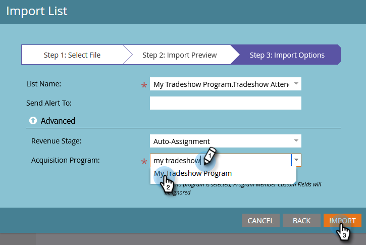

# Importare un elenco di persone {#import-a-list-of-people}

## Missione: importare nel database un elenco di fogli di calcolo dei partecipanti alle fiere {#mission-import-a-spreadsheet-list-of-trade-show-attendees-into-your-database}

>[!PREREQUISITES]
>
>[Configurare e aggiungere una persona](/help/marketo/getting-started/quick-wins/get-set-up-and-add-a-person.md){target="_blank"}

Questa esercitazione illustra come importare le persone da un file del foglio di calcolo in Marketo.

## Passaggio 1: scaricare e modificare un foglio di calcolo {#step-download-and-edit-a-spreadsheet}

1. Per iniziare, scarica il file del foglio di calcolo dell&#39;esercitazione ([**tradeshow-attendees.csv**](/help/marketo/getting-started/assets/tradeshow-attendees.csv){target="_blank"}) nel computer.

   

   >[!NOTE]
   >
   >Durante l&#39;importazione di una data, utilizza questo formato: **9/21/20** (mese/giorno/anno).

   >[!NOTE]
   >
   >Tutti i campi data/ora importati vengono trattati come ora centrale. Se sono presenti campi data/ora in un fuso orario diverso, puoi utilizzare una formula di Excel per trasformarla in Ora centrale (America/Chicago).

1. Aggiungi nome, cognome, indirizzo e-mail reale (in modo da poter ricevere le e-mail di nurturing che invierai nella prossima missione) e qualifica. Salva il file sul computer.

   

   >[!CAUTION]
   >
   >* Assicurati che gli indirizzi e-mail contengano solo caratteri ASCII.
   >
   >* Marketo **non** supporta gli indirizzi e-mail che contengono emoticon.
   >
   >* L&#39;importazione di valori `NULL` tramite CSV potrebbe generare un &quot;Modificare il valore dati&quot; per i campi numerici nel [registro attività](/help/marketo/product-docs/core-marketo-concepts/smart-lists-and-static-lists/managing-people-in-smart-lists/locate-the-activity-log-for-a-person.md){target="_blank"} di una persona, _anche se i campi sono già vuoti_. Se sono presenti [campagne avanzate](/help/marketo/product-docs/core-marketo-concepts/smart-campaigns/understanding-smart-campaigns.md){target="_blank"} che utilizzano il filtro &quot;Valore dati modificato&quot; o il trigger &quot;Modifiche al valore dati&quot;, le persone potrebbero essere idonee per tali campagne anche se i dati non vengono effettivamente modificati. Puoi utilizzare i [vincoli](/help/marketo/product-docs/core-marketo-concepts/smart-lists-and-static-lists/using-smart-lists/add-a-constraint-to-a-smart-list-filter.md){target="_blank"} per garantire che nessuno sia idoneo per tali campagne al momento dell&#39;importazione.

## Passaggio 2: creare un programma {#step-create-a-program}

1. Passa all&#39;area **[!UICONTROL Marketing Activities]**.

   

1. Seleziona la cartella **Apprendimento**, quindi in **[!UICONTROL New]** fai clic su **[!UICONTROL New Program]**.

   

1. **Assegna un nome** al programma &quot;Il mio programma fiera&quot; e seleziona &quot;Evento&quot; per **[!UICONTROL Program Type]**.

   

1. Seleziona **[!UICONTROL Tradeshow]** per **[!UICONTROL Channel]** e fai clic su **[!UICONTROL Create]**.

   

>[!NOTE]
>
>I programmi dell&#39;evento si verificano in date specifiche. Scopri di più sugli [**Eventi**](/help/marketo/product-docs/demand-generation/events/understanding-events/understanding-event-programs.md){target="_blank"}.

## Passaggio 3: importare il foglio di calcolo in Marketo {#step-import-your-spreadsheet-into-marketo}

1. In **Il mio programma fiera**, fai clic su **[!UICONTROL New]** e seleziona **[!UICONTROL New Local Asset]**.

   

1. Seleziona **[!UICONTROL List]**.

   

1. **Assegna un nome** all&#39;elenco &quot;Partecipanti alla fiera&quot; e fai clic su **[!UICONTROL Create]**.

   

1. Nell&#39;elenco **[!UICONTROL Tradeshow Attendees]**, fai clic su **[!UICONTROL List Actions]** e seleziona **[!UICONTROL Import List]**.

   

   >[!CAUTION]
   >
   >Se utilizzi un file CSV, accertati che sia codificato in UTF-8, UTF-16, Shift-JIS o EUC-JP.

   >[!NOTE]
   >
   >Il limite di dimensione per i file CSV è di 100 MB.

1. **[!UICONTROL Browse]** sull file del foglio di calcolo **tradeshow-attendees.csv** sul computer e fai clic su **[!UICONTROL Next]**.

   

   >[!NOTE]
   >
   >In modalità di importazione elenco, la scelta di **[!UICONTROL Skip new people and updates]** indica che non verrà influenzato alcun record persona esistente o non verranno registrate attività. Utilizza questa modalità se desideri un elenco statico rapido e prefiltrato di persone esistenti da utilizzare nelle attività di marketing. Selezionando questa modalità:
   >
   > * Ignora creazione nuova persona
   > * Ignora aggiornamenti campo persona
   > * Ignora registrazione attività

1. Mappa i campi [!UICONTROL List Column] ai rispettivi campi di Marketo e fai clic su **[!UICONTROL Next]**.

   

   >[!TIP]
   >
   >Per ottenere i migliori risultati di mappatura automatica, le intestazioni di colonna devono sempre corrispondere esattamente al campo (con distinzione maiuscole/minuscole). Se stai utilizzando campi personalizzati e non li vedi nel menu a discesa, torna indietro e [creali](/help/marketo/product-docs/administration/field-management/create-a-custom-field-in-marketo.md){target="_blank"} in modo che possano diventare opzioni.

   >[!NOTE]
   >
   >Se sono presenti campi che non desideri importare, seleziona **Ignora** nel menu a discesa Campo Marketo.

1. Seleziona **Il mio programma fiera** per **[!UICONTROL Acquisition Program]**, quindi fai clic su **[!UICONTROL Import]**.

   

1. Attendi l&#39;importazione delle persone, quindi chiudi la finestra a comparsa di avanzamento dell&#39;importazione.

   

1. Torna al **Il mio programma fiera**, fai clic sulla scheda **[!UICONTROL Members]**. Vedrai tutte le persone appena importate.

   

>[!NOTE]
>
>Puoi analizzare l&#39;esecuzione del programma tenendo traccia dell&#39;iscrizione al programma. Scopri di più sui [**Programmi**](/help/marketo/product-docs/core-marketo-concepts/programs/creating-programs/understanding-programs.md){target="_blank"}.

## Missione completata {#mission-complete}

I partecipanti alla fiera sono ora membri del programma Marketo.

  

[◄ Missione 4: e-mail di risposta automatica](/help/marketo/getting-started/quick-wins/email-auto-response.md)

[Missione 6: Drip, Drip, Nurturing ►](/help/marketo/getting-started/quick-wins/drip-drip-nurture.md)
