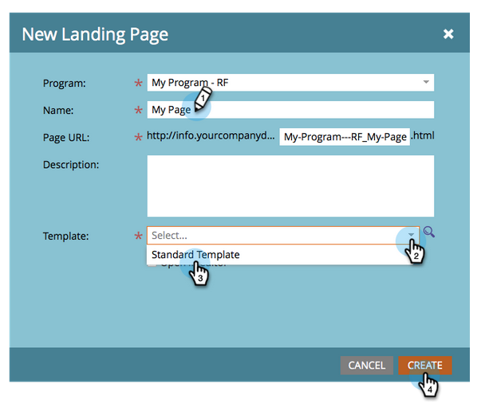

# Pagina di destinazione con un modulo {#landing-page-with-a-form}

## Missione: Crea una pagina di destinazione con un modulo per acquisire nuove persone. {#mission-create-a-landing-page-with-a-form-to-acquire-new-people}

>[!PREREQUISITES]
>
>[Configurazione e aggiunta di una persona](/help/marketo/getting-started/quick-wins/get-set-up-and-add-a-person.md)

## PASSAGGIO 1: Creare un programma {#step-create-a-program}

1. Vai all&#39;area **Attività di marketing**.

   

1. Seleziona la cartella **Learning** creata nella [precedente vittoria rapida](/help/marketo/getting-started/quick-wins/send-an-email.md).

   

1. In **Nuovo**, fai clic su **Nuovo programma**.

   

1. Inserisci un programma **Nome**, seleziona un **Canale** e fai clic su **Crea**.

   >[!NOTE]
   >
   >Includi le iniziali alla fine del programma Nome per renderlo univoco.

   

   >[!NOTE]
   >
   >Un programma è una specifica iniziativa di marketing. Il **canale** è destinato a essere il meccanismo di consegna, ad esempio Webinar, Sponsorship o Online Ad. Puoi visualizzare diverse opzioni di canale nel menu a discesa, a seconda di ciò che è disponibile nella tua istanza. Puoi anche [creare il tuo canale](/help/marketo/product-docs/administration/tags/create-a-program-channel.md).

   

Ben fatto! Ora che abbiamo creato un programma, andiamo avanti e creiamo dei contenuti.

## PASSAGGIO 2: Creare un modulo {#step-create-a-form}

1. Con il programma selezionato, fai clic su **Nuovo** e poi su **Nuova risorsa locale**.

   

1. Selezionare **Modulo**.

   

1. Immettere un modulo **Nome** e fare clic su **Crea**.

   

   >[!NOTE]
   >
   >Assicurati che la casella **Apri nell&#39;editor** sia selezionata. In caso contrario, è necessario fare clic sulla scheda **Modifica modulo** .

   >[!TIP]
   >
   >Non vede l’editor di moduli? Il browser probabilmente ha bloccato la finestra. Abilita i pop-up da [app.marketo.com](https://app.marketo.com/) nel browser e fai clic su Modifica bozza nella barra dei menu superiore.

1. Seleziona il campo **Indirizzo e-mail** e seleziona **È richiesto**.

   

1. Fare clic su **Avanti**.

   

1. Fai clic sulle frecce per scorrere i temi. Selezionane uno.

   

1. Fare clic su **Avanti**.

   

1. Nella sezione Pagina di ringraziamento , seleziona **External URL** per **Follow Up With**.

   

1. Inserisci l’URL.

   

   >[!NOTE]
   >
   >La pagina di completamento è la posizione in cui il visitatore viene reindirizzato dopo aver compilato il modulo. L’URL esterno è un’opzione ma ce ne sono altre. Vedere [Imposta una pagina di ringraziamento per il modulo](/help/marketo/product-docs/demand-generation/forms/creating-a-form/set-a-form-thank-you-page.md).

1. Fare clic su **Fine**.

   

1. Fare clic su **Approva e chiudi**.

   

   Super! Ora avete un programma con un modulo dentro. Andiamo avanti e creiamo una pagina.

   

## PASSAGGIO 3: Creare una pagina di destinazione e aggiungere il modulo {#step-create-a-landing-page-and-add-your-form}

1. Con il programma selezionato, fai clic su **Nuovo**, quindi su **Nuova risorsa locale**.

   

1. Seleziona **Pagina di destinazione**.

   

1. Inserisci una pagina **Nome**, seleziona un modello e fai clic su **Crea**.

   >[!NOTE]
   >
   >Puoi avere un modello diverso da quello nella nostra schermata, va bene, scegli uno e continua.

   

1. Una volta aperto l’editor della pagina di destinazione, trascina l’elemento Modulo nell’area di lavoro.

   

1. Trova e seleziona il modulo e fai clic su **Inserisci**.

   

1. Trascinare il modulo nella posizione desiderata.

   

1. Tutte le modifiche vengono salvate automaticamente. Chiudere la scheda/finestra dell’editor moduli.

   

   Ottimo lavoro! Ora è disponibile una pagina di destinazione con un modulo al suo interno. Approviamo la tua pagina per renderla live.

## PASSAGGIO 4: Approva la tua pagina di destinazione {#step-approve-your-landing-page}

1. Seleziona la pagina di destinazione e in **Azioni pagina di destinazione** fai clic su **Approva**.

   >[!NOTE]
   >
   >L’approvazione della pagina di destinazione la renderà attiva e disponibile per l’accesso su Internet.

   

   Perfetto! Vedete il segno di spunta verde sopra?

   

## PASSAGGIO 5: Test del modulo {#step-test-your-form}

1. Seleziona la pagina di destinazione e fai clic su **Visualizza pagina approvata**.

   

1. Compila il modulo con le informazioni che sai essere univoche e fai clic su **Invia**.

   

1. Passa all&#39;area **Database**.

   

1. Cercare l’indirizzo e-mail univoco utilizzato durante la compilazione del modulo.

   

   Eccolo! Hai creato una nuova pagina di destinazione con un modulo al suo interno e l’hai utilizzata per generare una nuova persona.

   

## Missione Completa! {#mission-complete}

  

[◄ Invia un&#39;e-mail di avviso](/help/marketo/getting-started/quick-wins/send-an-email.md)

[Punteggio semplice ►](/help/marketo/getting-started/quick-wins/simple-scoring.md)
