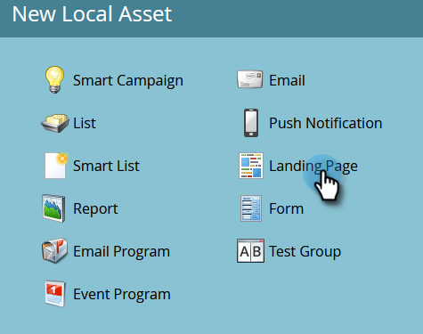
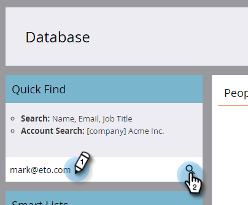

# Pagina di destinazione con un modulo {#landing-page-with-a-form}

## Missione: Crea una pagina di destinazione con un modulo per acquisire nuove persone. {#mission-create-a-landing-page-with-a-form-to-acquire-new-people}

>[!PREREQUISITES]
>
>[Configurazione e aggiunta di una persona](/help/marketo/getting-started/quick-wins/get-set-up-and-add-a-person.md)

## PASSAGGIO 1: Creare un programma {#step-create-a-program}

1. Vai a **Attività di marketing** area.

   

1. Seleziona la **Apprendimento** cartella creata in [vittoria rapida precedente](/help/marketo/getting-started/quick-wins/send-an-email.md){target=&quot;_blank&quot;}. Sotto **Nuovo**, fai clic su **Nuovo programma**.

   

1. Inserire un programma **Nome**, seleziona un **Canale** e fai clic su **Crea**.

   

   >[!TIP]
   >
   >Includi le iniziali alla fine del nome del programma per renderlo univoco.

   >[!NOTE]
   >
   >Un programma è una specifica iniziativa di marketing. La **canale** è destinato a essere il meccanismo di consegna, come Webinar, Sponsorship o Online Ad. Puoi visualizzare diverse opzioni di canale nel menu a discesa, a seconda di ciò che è disponibile nella tua istanza. È inoltre possibile [creare un canale personalizzato](/help/marketo/product-docs/administration/tags/create-a-program-channel.md){target=&quot;_blank&quot;}.

Ben fatto! Ora che abbiamo creato un programma, andiamo avanti e creiamo dei contenuti.

## PASSAGGIO 2: Creare un modulo {#step-create-a-form}

1. Con il programma selezionato, fai clic sul pulsante **Nuovo** a discesa e seleziona **Nuova risorsa locale**.

   

1. Seleziona **Modulo**.

   

1. Immettere un modulo **Nome** e fai clic su **Crea**.

   

   >[!NOTE]
   >
   >Assicurati che **Apri in editor** casella selezionata. In caso contrario, dovrai fare clic sul pulsante **Modifica modulo** scheda .

   >[!TIP]
   >
   >Non vede l’editor di moduli? Il browser probabilmente ha bloccato la finestra. Abilita pop-up da `app.marketo.com` nel browser e fai clic su Modifica bozza nella barra dei menu superiore.

1. Seleziona la **Indirizzo e-mail** campo e controllo **Obbligatorio**.

   

1. Fai clic su **Successivo**.

   

1. Fai clic sulle frecce per scorrere i temi. Selezionane uno.

   

1. Fai clic su **Successivo**.

   

1. Nella sezione Pagina di ringraziamento , seleziona **External URL** per **Segui con**.

   

1. Inserisci l’URL.

   

   >[!NOTE]
   >
   >La pagina di completamento è la posizione in cui il visitatore viene reindirizzato dopo aver compilato il modulo. L’URL esterno è un’opzione ma ce ne sono altre. Vedi [Imposta la pagina di ringraziamento del modulo](/help/marketo/product-docs/demand-generation/forms/creating-a-form/set-a-form-thank-you-page.md){target=&quot;_blank&quot;}.

1. Fai clic su **Fine**.

   

1. Fai clic su **Approva e chiudi**.

   

   Fantastico! Ora avete un programma con un modulo dentro. Andiamo avanti e creiamo una pagina.

## PASSAGGIO 3: Creare una pagina di destinazione e aggiungere il modulo {#step-create-a-landing-page-and-add-your-form}

1. Con il programma selezionato, fai clic su **Nuovo** e poi **Nuova risorsa locale**.

   

1. Seleziona **Pagina di destinazione**.

   

1. Immettere una pagina **Nome**, seleziona un modello e fai clic su **Crea**.

   >[!NOTE]
   >
   >Puoi avere un modello diverso da quello nella nostra schermata, va bene, scegli uno e continua.

   

1. Una volta aperto l’editor della pagina di destinazione, trascina l’elemento Modulo sull’area di lavoro.

   

1. Trova e seleziona il modulo e fai clic su **Inserisci**.

   

1. Trascinare il modulo nella posizione desiderata.

   

1. Tutte le modifiche vengono salvate automaticamente. Chiudere la scheda/finestra dell’editor moduli.

   

   Ottimo lavoro! Ora è disponibile una pagina di destinazione con un modulo al suo interno. Approviamo la tua pagina per renderla live.

## PASSAGGIO 4: Approva la tua pagina di destinazione {#step-approve-your-landing-page}

1. Seleziona la pagina di destinazione e fai clic su **Approva bozza**.

   

   >[!NOTE]
   >
   >L’approvazione della pagina di destinazione la renderà attiva e disponibile per l’accesso su Internet.

   Perfetto! Vedete il segno di spunta verde sopra?

   

## PASSAGGIO 5: Test del modulo {#step-test-your-form}

1. Seleziona la pagina di destinazione e fai clic su **Visualizza pagina approvata**.

   

1. Compila il modulo con le informazioni che sai essere univoche e fai clic su **Invia**.

   

1. Vai a **Database** area.

   

1. Cercare l’indirizzo e-mail univoco utilizzato durante la compilazione del modulo.

   

   Eccolo! Hai creato una nuova pagina di destinazione con un modulo al suo interno e l’hai utilizzata per generare una nuova persona.

   

## Missione Completa! {#mission-complete}

  

[◄ Missione 1: Invia un&#39;e-mail di avviso](/help/marketo/getting-started/quick-wins/send-an-email.md)

[Missione 3: Punteggio semplice ►](/help/marketo/getting-started/quick-wins/simple-scoring.md)
