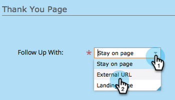
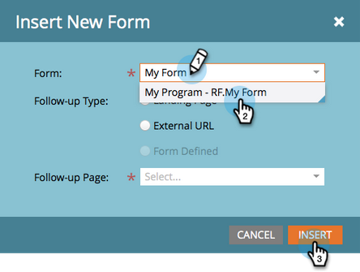

# Pagina di destinazione con un modulo {#landing-page-with-a-form}

## Missione: crea una pagina di destinazione con un modulo per acquisire nuove persone. {#mission-create-a-landing-page-with-a-form-to-acquire-new-people}

>[!PREREQUISITES]
>
>[Configurazione e aggiunta di una persona](/help/marketo/getting-started/quick-wins/get-set-up-and-add-a-person.md)

## PASSAGGIO 1: creare un programma {#step-create-a-program}

1. Vai a **[!UICONTROL Attività di marketing]** area.

   

1. Seleziona la **Apprendimento** cartella creata in [vittoria rapida precedente](/help/marketo/getting-started/quick-wins/send-an-email.md){target="_blank"}. Sotto **[!UICONTROL Nuovo]**, fai clic su **[!UICONTROL Nuovo programma]**.

   

1. Immetti un programma **[!UICONTROL Nome]**, seleziona un **[!UICONTROL Canale]** e fai clic su **[!UICONTROL Crea]**.

   

   >[!TIP]
   >
   >Includi le iniziali alla fine del nome del programma per renderlo univoco.

   >[!NOTE]
   >
   >Un programma è una specifica iniziativa di marketing. Il **channel** deve essere il meccanismo di consegna, ad esempio webinar, sponsorizzazione o annunci online. Puoi visualizzare diverse opzioni di canale nel menu a discesa, a seconda di ciò che è disponibile nella tua istanza. È inoltre possibile [crea un tuo canale](/help/marketo/product-docs/administration/tags/create-a-program-channel.md){target="_blank"}.

Ben fatto! Ora che abbiamo creato un programma, andiamo avanti e creiamo alcuni contenuti.

## PASSAGGIO 2: creare un modulo {#step-create-a-form}

1. Con il programma selezionato, fai clic su **[!UICONTROL Nuovo]** a discesa e selezionare **[!UICONTROL Nuova risorsa locale]**.

   

1. Seleziona **[!UICONTROL Modulo]**.

   

1. Immetti un modulo **[!UICONTROL Nome]** e fai clic su **[!UICONTROL Crea]**.

   

   >[!NOTE]
   >
   >Assicurarsi che **[!UICONTROL Apri nell’editor]** è selezionata. In caso contrario, sarà necessario fare clic sul pulsante **[!UICONTROL Modifica modulo]** scheda.

   >[!TIP]
   >
   >L’editor moduli non è visualizzato? Probabilmente il browser ha bloccato la finestra. Abilita popup da `app.marketo.com` nel browser e fare clic su Modifica bozza nella barra dei menu superiore.

1. Seleziona la **[!UICONTROL Indirizzo e-mail]** campo e assegno **[!UICONTROL E&#39; Necessario]**.

   

1. Clic **[!UICONTROL Successivo]**.

   

1. Fare clic sulle frecce per scorrere i temi. Selezionane uno.

   

1. Clic **[!UICONTROL Successivo]**.

   

1. Nella sezione Pagina di ringraziamento selezionare **[!UICONTROL URL esterno]** per **[!UICONTROL Completa con]**.

   

1. Immetti l’URL.

   

   >[!NOTE]
   >
   >Nella pagina di completamento il visitatore viene reindirizzato dopo la compilazione del modulo. L’URL esterno è un’opzione, ma ce ne sono altre. Consulta [Imposta una pagina di ringraziamento modulo](/help/marketo/product-docs/demand-generation/forms/creating-a-form/set-a-form-thank-you-page.md){target="_blank"}.

1. Clic **[!UICONTROL Fine]**.

   

1. Clic **[!UICONTROL Approva e chiudi]**.

   

   Fantastico! Ora è disponibile un programma con un modulo. Andiamo avanti e creiamo una pagina.

## PASSAGGIO 3: creare una pagina di destinazione e aggiungere il modulo {#step-create-a-landing-page-and-add-your-form}

1. Con il programma selezionato, fai clic su **[!UICONTROL Nuovo]** a discesa e selezionare **[!UICONTROL Nuova risorsa locale]**.

   

1. Seleziona **[!UICONTROL Pagina di destinazione]**.

   

1. Inserisci una pagina **[!UICONTROL Nome]**, seleziona un modello e fai clic su **[!UICONTROL Crea]**.

   >[!NOTE]
   >
   >Potresti avere un modello diverso da quello della schermata, non c&#39;è problema, selezionane uno e continua.

   

1. Una volta aperto l’editor della pagina di destinazione, trascina [!UICONTROL Modulo] nell&#39;area di lavoro.

   

1. Trovare e selezionare il modulo e fare clic su **[!UICONTROL Inserisci]**.

   

1. Trascinare il modulo nella posizione desiderata.

   

1. Tutte le modifiche vengono salvate automaticamente. Chiudi la scheda/finestra dell’editor di moduli.

   

   Ottimo lavoro! Ora disponi di una pagina di destinazione con un modulo. Approviamo la pagina per renderla live.

## PASSAGGIO 4: Approvare la pagina di destinazione {#step-approve-your-landing-page}

1. Seleziona la pagina di destinazione e fai clic su **[!UICONTROL Approva bozza]**.

   

   >[!NOTE]
   >
   >L’approvazione della pagina di destinazione la renderà live e disponibile per l’accesso a Internet.

   Perfetto! Vedi il segno di spunta verde sopra?

   

## PASSAGGIO 5: Test del modulo {#step-test-your-form}

1. Seleziona la pagina di destinazione e fai clic su **[!UICONTROL Visualizza pagina approvata]**.

   

1. Compila il modulo con informazioni che sai essere univoche e fai clic su **[!UICONTROL Invia]**.

   

1. Vai a **[!UICONTROL Database]** area.

   

1. Cerca l’indirizzo e-mail univoco utilizzato durante la compilazione del modulo.

   

   Eccolo! Hai creato una nuova pagina di destinazione contenente un modulo e lo hai utilizzato per generare una nuova persona.

   

## Missione completata! {#mission-complete}

  

[Missione ◄ 1: inviare un messaggio e-mail](/help/marketo/getting-started/quick-wins/send-an-email.md)

[Missione 3: ► di punteggio semplice](/help/marketo/getting-started/quick-wins/simple-scoring.md)
