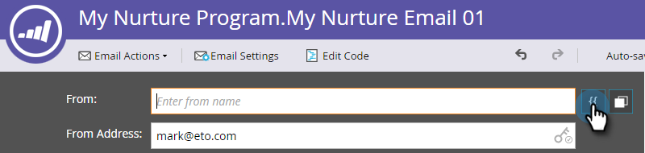

# Personalizzazione di un’e-mail {#personalize-an-email}

## Missione: rendi le e-mail personali aggiungendo token di dati {#mission-make-your-emails-personal-by-adding-data-tokens}

>[!PREREQUISITES]
>
>* [Configurazione e aggiunta di una persona](/help/marketo/getting-started/quick-wins/get-set-up-and-add-a-person.md){target="_blank"}
>* [Invia un&#39;esplosione e-mail](/help/marketo/getting-started/quick-wins/send-an-email.md){target="_blank"}
>* [Goccia, Goccia, Alimentazione](/help/marketo/getting-started/quick-wins/drip-drip-nurture.md){target="_blank"}

## Passaggio 1: selezionare un messaggio e-mail da personalizzare {#step-select-an-email-to-personalize}

1. Seleziona una delle e-mail di sviluppo create in [vittoria rapida precedente](/help/marketo/getting-started/quick-wins/drip-drip-nurture.md){target="_blank"} e fai clic su **[!UICONTROL Crea bozza]**.

   

   >[!NOTE]
   >
   >In questo modo viene creata una copia dell’e-mail come bozza. Ricordati di approvare la bozza per far sì che le modifiche vengano pubblicate.

Se non hai attivato un blocco popup, l’editor e-mail si aprirà in una nuova scheda/finestra. In caso contrario, fare clic su **[!UICONTROL Crea bozza]** due volte.

## Passaggio 2: rendi il venditore il mittente {#step-make-the-salesperson-the-sender}

1. Seleziona la **[!UICONTROL Da]** campo, evidenziazione e **eliminare** il nome corrente.

   

1. Fai clic su **Token** a destra del **[!UICONTROL Da]** campo.

   

1. Trova e seleziona la **`{{lead.Lead Owner First Name}}`** token.

   

1. Digita il nome della tua azienda e un trattino per **Valore predefinito** per assicurarti che venga visualizzato qualcosa nel caso in cui il nome del rappresentante commerciale non sia disponibile. Clic **Inserisci**.

   

1. Premi la barra spaziatrice nella **[!UICONTROL Da]** verificare che il cursore lampeggi uno spazio dopo il token appena inserito. Quindi fai clic su **Token** di nuovo.

   

1. Trova e seleziona la **`{{lead.Lead Owner Last Name}}`** token.

   

1. Digita &quot;Vendite&quot; per il **Valore predefinito** e fai clic su **Inserisci**.

   

## Passaggio 3: aggiungi il nome del lead all’e-mail {#step-add-the-leads-name-to-the-email}

1. Seleziona la sezione modificabile superiore, fai clic sull’icona a forma di ingranaggio e seleziona **[!UICONTROL Modifica]**.

   

1. Aggiungi uno spazio dopo &quot;Hello&quot; e posiziona il cursore davanti alla virgola, quindi fai clic sul pulsante **Inserisci token** icona.

   

1. Trova e seleziona la **`{{lead.First Name}}`** token.

   

1. Immetti &quot;Amico&quot; (o qualsiasi etichetta desideri) nel **[!UICONTROL Valore predefinito]** e fai clic su **[!UICONTROL Inserisci]**.

   

   >[!TIP]
   >
   >Includi sempre un valore predefinito per i token; in questo modo il valore predefinito verrà visualizzato nell’e-mail se manca parte delle informazioni personali.

1. Clic **[!UICONTROL Salva]**.

   

1. Sotto **[!UICONTROL Azioni e-mail]** e seleziona **[!UICONTROL Approva e chiudi]**.

   

>[!TIP]
>
>Vuoi un rapido aggiornamento su come inviarti l’e-mail? Consulta [Invia un&#39;esplosione e-mail](/help/marketo/getting-started/quick-wins/send-an-email.md){target="_blank"}.

### Missione completata {#mission-complete}

Congratulazioni, hai personalizzato la tua e-mail!

  

[Missione ◄ 6: gocciolamento, gocciolamento, crescita](/help/marketo/getting-started/quick-wins/drip-drip-nurture.md)

[Missione 8: avvisare il rappresentante commerciale ►](/help/marketo/getting-started/quick-wins/alert-the-sales-rep.md)
