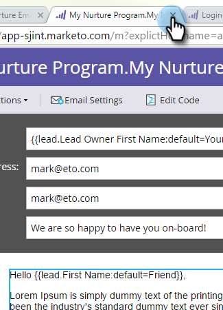

# Personalizzare un’e-mail {#personalize-an-email}

## Missione: Rendere le e-mail personali aggiungendo token dati {#mission-make-your-emails-personal-by-adding-data-tokens}

>[!PREREQUISITES]
>
>* [Configurazione e aggiunta di una persona](/help/marketo/getting-started/quick-wins/get-set-up-and-add-a-person.md){target=&quot;_blank&quot;}
>* [Invia un&#39;e-mail di avviso](/help/marketo/getting-started/quick-wins/send-an-email.md){target=&quot;_blank&quot;}
>* [Asciugatura, Asciugatura, Alimentazione](/help/marketo/getting-started/quick-wins/drip-drip-nurture.md){target=&quot;_blank&quot;}

## Passaggio 1: Selezionare un’e-mail da personalizzare {#step-select-an-email-to-personalize}

1. Seleziona una delle e-mail di nutrizione create nel [vittoria rapida precedente](/help/marketo/getting-started/quick-wins/drip-drip-nurture.md){target=&quot;_blank&quot;} e fai clic su **Modifica bozza**.

   

   >[!NOTE]
   >
   >Viene creata una copia dell’e-mail come bozza. È necessario approvare la bozza affinché le modifiche diventino attive.

Se non hai attivato un blocco dei popup, l’editor e-mail si aprirà in una nuova scheda/finestra. In caso contrario, fai clic su **Modifica bozza** due volte.

## Passaggio 2: Rendi il venditore il mittente {#step-make-the-salesperson-the-sender}

1. Seleziona la **Da** campo, evidenziazione e **delete** il nome corrente.

   

1. Fai clic sul pulsante **Token** a destra della **Da** campo .

   

1. Trova e seleziona la **`{{lead.Lead Owner First Name}}`** token.

   

1. Digita il nome della tua azienda e un trattino per **Valore predefinito** per assicurarsi che venga visualizzato qualcosa nel caso in cui il nome del rappresentante di vendita non sia disponibile. Fai clic su **Inserisci**.

   

1. Premi la barra spaziatrice nel **Da** verificare che il cursore lampeggi uno spazio dopo il token appena inserito. Quindi fai clic sul pulsante **Token** icona di nuovo.

   

1. Trova e seleziona la **`{{lead.Lead Owner Last Name}}`** token.

   

1. Digitare &quot;Vendite&quot; per **Valore predefinito** e fai clic su **Inserisci**.

   

## Passaggio 3: Aggiungi il nome del lead all’e-mail {#step-add-the-leads-name-to-the-email}

1. Seleziona la sezione superiore modificabile, fai clic sull’icona a forma di ingranaggio e seleziona **Modifica**.

   

1. Aggiungi uno spazio dopo &quot;Ciao&quot; e posiziona il cursore davanti alla virgola, quindi fai clic sul **Inserisci token** icona.

   

1. Trova e seleziona la **`{{lead.First Name}}`** token.

   

1. Inserisci &quot;Amico&quot; (o qualsiasi etichetta che desideri) nel **Valore predefinito** campo e fai clic su **Inserisci**.

   

   >[!TIP]
   >
   >Includi sempre un valore predefinito per i token; in questo modo, il valore predefinito verrà visualizzato nell’e-mail se manca parte delle informazioni personali.

1. Fai clic su **Salva**.

   

1. Chiudi la scheda/finestra dell’editor e-mail.

   

1. Sotto **Azioni e-mail**, seleziona **Approva bozza**.

   

>[!TIP]
>
>Ti serve un aggiornamento rapido su come inviarti l’e-mail? Vedi [Invia un&#39;e-mail di avviso](/help/marketo/getting-started/quick-wins/send-an-email.md){target=&quot;_blank&quot;}.

### Missione completata {#mission-complete}

Congratulazioni, hai personalizzato la tua e-mail!

  

[◄ Missione 6: Asciugatura, Asciugatura, Alimentazione](/help/marketo/getting-started/quick-wins/drip-drip-nurture.md)

[Missione 8 Avvisare il rappresentante commerciale ►](/help/marketo/getting-started/quick-wins/alert-the-sales-rep.md)
