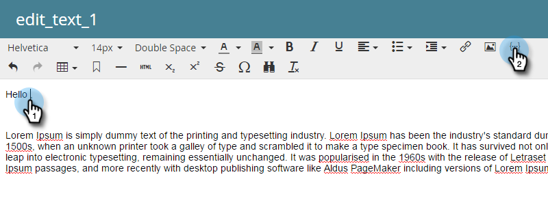
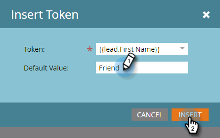

# Personalizzare un’e-mail {#personalize-an-email}

## Missione: rendere le e-mail personali aggiungendo token di dati {#mission-make-your-emails-personal-by-adding-data-tokens}

>[!PREREQUISITES]
>
>* [Configurare e aggiungere una persona](/help/marketo/getting-started/quick-wins/get-set-up-and-add-a-person.md){target="_blank"}
>* [Inviare più e-mail](/help/marketo/getting-started/quick-wins/send-an-email.md){target="_blank"}
>* [Drip, Drip, Norture](/help/marketo/getting-started/quick-wins/drip-drip-nurture.md){target="_blank"}

## Passaggio 1: selezionare un messaggio e-mail da personalizzare {#step-select-an-email-to-personalize}

1. Seleziona una delle e-mail di nurturing creata nella [nei risultati rapidi precedenti](/help/marketo/getting-started/quick-wins/drip-drip-nurture.md){target="_blank"} e fai clic su **[!UICONTROL Create draft]**.

   

   >[!NOTE]
   >
   >In questo modo viene creata una copia dell&#39;e-mail come bozza. Ricordati di approvare la bozza per far sì che le modifiche vengano pubblicate.

Se non hai attivato un blocco pop-up, l&#39;editor e-mail si aprirà in una nuova scheda/finestra. In caso contrario, fai clic due volte su **[!UICONTROL Create Draft]**.

## Passaggio 2: rendere il venditore il mittente {#step-make-the-salesperson-the-sender}

1. Seleziona il campo **[!UICONTROL From]**, evidenzia e **elimina** il nome corrente.

   

1. Fai clic sull&#39;icona **Token** a destra del campo **[!UICONTROL From]**.

   

1. Trova e seleziona il token **`{{lead.Lead Owner First Name}}`**.

   

1. Digita il nome della tua azienda e un trattino per il **Valore predefinito** per garantire che venga visualizzato qualcosa nel caso in cui il nome del rappresentante di vendita non sia disponibile. Fai clic su **Inserisci**.

   

1. Premi la barra spaziatrice nel campo **[!UICONTROL From]**, assicurandoti che il cursore lampeggi uno spazio dopo il token appena inserito. Quindi fai di nuovo clic sull&#39;icona **Token**.

   

1. Trova e seleziona il token **`{{lead.Lead Owner Last Name}}`**.

   

1. Digita &quot;Vendite&quot; per il **Valore predefinito** e fai clic su **Inserisci**.

   

## Passaggio 3: aggiungere il nome del lead all&#39;e-mail {#step-add-the-leads-name-to-the-email}

1. Seleziona la sezione modificabile superiore, fai clic sull&#39;icona ingranaggio e seleziona **[!UICONTROL Edit]**.

   

1. Aggiungi uno spazio dopo &quot;Hello&quot; e posiziona il cursore davanti alla virgola, quindi fai clic sull&#39;icona **Inserisci token**.

   

1. Trova e seleziona il token **`{{lead.First Name}}`**.

   

1. Immetti &quot;Amico&quot; (o qualsiasi etichetta desiderata) nel campo **[!UICONTROL Default Value]** e fai clic su **[!UICONTROL Insert]**.

   

   >[!TIP]
   >
   >Includi sempre un valore predefinito per i token; in questo modo il valore predefinito verrà visualizzato nell&#39;e-mail se manca parte delle informazioni personali.

1. Fai clic su **[!UICONTROL Save]**.

   

1. In **[!UICONTROL Email Actions]**, seleziona **[!UICONTROL Approve and Close]**.

   

>[!TIP]
>
>Vuoi un rapido aggiornamento su come inviarti l&#39;e-mail? Consulta [Inviare più e-mail ](/help/marketo/getting-started/quick-wins/send-an-email.md){target="_blank"}.

### Missione completata {#mission-complete}

Congratulazioni, hai personalizzato la tua e-mail!

  

[◄ Missione 6: Drip, Drip, Nurture](/help/marketo/getting-started/quick-wins/drip-drip-nurture.md)

[Missione 8: avvisare il rsponsabile delle vendite ►](/help/marketo/getting-started/quick-wins/alert-the-sales-rep.md)
