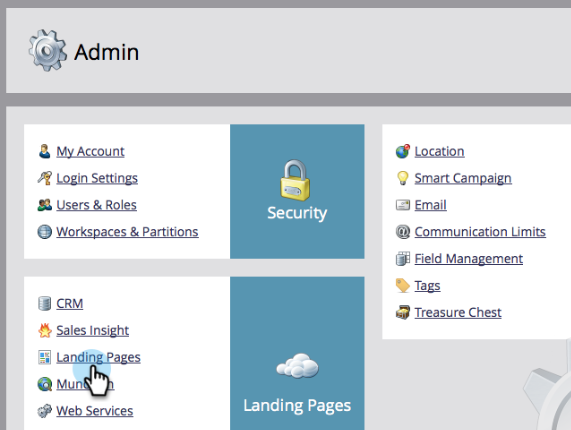

# Reindirizzare una pagina di destinazione {#redirect-a-landing-page}

## Missione: reindirizzare una pagina di destinazione a una pagina web diversa {#mission-redirect-a-landing-page-to-a-different-web-page}

>[!NOTE]
>
>**Autorizzazioni amministratore richieste**

>[!PREREQUISITES]
>
>* [Pagina di destinazione con un modulo](/help/marketo/getting-started/quick-wins/landing-page-with-a-form.md){target="_blank"}
>* [Personalizzare l’URL della pagina di destinazione con un CNAME](/help/marketo/product-docs/demand-generation/landing-pages/landing-page-actions/customize-your-landing-page-urls-with-a-cname.md){target="_blank"}

## Passaggio 1: avviare una nuova regola di reindirizzamento {#step-start-a-new-redirect-rule}

1. Vai a **[!UICONTROL Amministratore]** area.

   

1. Vai a **[!UICONTROL Pagine di destinazione]**.

   

1. Fai clic su **[!UICONTROL Regole]** , quindi fai clic su **[!UICONTROL Nuovo]** e **[!UICONTROL Nuova regola di reindirizzamento]**.

   

## Passaggio 2: definire la regola di reindirizzamento {#step-define-the-redirect-rule}

1. Fai clic sul primo **[!UICONTROL URL originale]** e selezionare il proprio Marketo CNAME.

   

   >[!NOTE]
   >
   >Ricorda, puoi reindirizzare solo le pagine di destinazione che iniziano con il tuo Marketo [CNAME](/help/marketo/product-docs/demand-generation/landing-pages/landing-page-actions/customize-your-landing-page-urls-with-a-cname.md){target="_blank"}.

1. Fai clic sul secondo **[!UICONTROL URL originale]** e seleziona la pagina di destinazione da reindirizzare.

   

1. Per **[!UICONTROL URL di reindirizzamento]** seleziona la pagina a cui desideri reindirizzare e fai clic su **[!UICONTROL Crea]**.

   

## Missione completata {#mission-complete}

Congratulazioni! Hai reindirizzato correttamente una pagina di destinazione.

  

[◄ Mission 9: aggiornamento dei dati dei lead](/help/marketo/getting-started/quick-wins/update-person-data.md)
