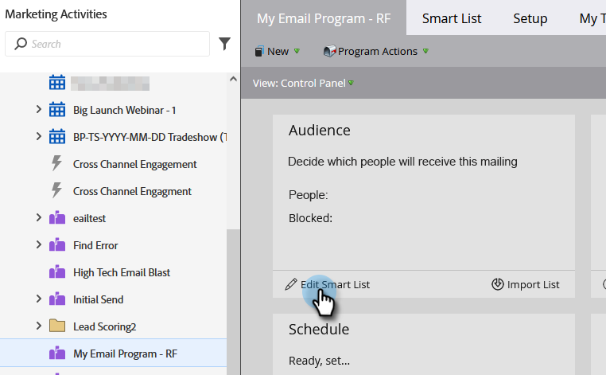
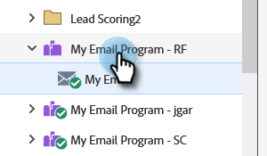

# Inviare un’e-mail {#send-an-email}

È la prima cosa che tutti vogliono fare. Inviamo un’e-mail da Marketo!

>[!PREREQUISITES]
>
>[Configurazione e aggiunta di una persona](/help/marketo/getting-started/quick-wins/get-set-up-and-add-a-person.md){target="_blank"}

## Creare un programma e-mail {#create-an-email-program}

1. Vai all&#39;area **[!UICONTROL Attività di marketing]**.

   

1. Seleziona la cartella **[!UICONTROL Apprendimento]**. Fai clic sul menu a discesa **[!UICONTROL Nuovo]** e seleziona **[!UICONTROL Nuovo programma]**.

   

1. Immetti un **[!UICONTROL Nome]** e seleziona **[!UICONTROL E-mail]** per **[!UICONTROL Tipo di programma]**.

   >[!TIP]
   >
   >Aggiungere le iniziali alla fine del nome del programma per renderlo univoco.

   

1. In **[!UICONTROL Canale]**, seleziona **[!UICONTROL Invia e-mail]** e fai clic su **[!UICONTROL Crea]**.

   

## Definire il pubblico {#define-your-audience}

1. Fai clic su **[!UICONTROL Modifica elenco avanzato]** nella sezione [!UICONTROL Pubblico].

   

1. Trova e trascina il filtro [!UICONTROL Indirizzo e-mail] nell&#39;area di lavoro.

   

   >[!TIP]
   >
   >Utilizza la funzione **[!UICONTROL Ricerca]** per trovare più facilmente i filtri.

1. Trova e seleziona il tuo indirizzo e-mail.

   

   >[!NOTE]
   >
   >Se l&#39;e-mail non viene compilata automaticamente, è possibile che ti sia dimenticato di [Configurare e aggiungere un lead.](/help/marketo/getting-started/quick-wins/get-set-up-and-add-a-person.md){target="_blank"}

   >[!NOTE]
   >
   >In questo esempio ti richiediamo di inviare l’e-mail solo a te stesso, ma puoi personalizzare il pubblico come ritieni opportuno.

1. Torna alla scheda del programma principale e fai clic sull&#39;icona di aggiornamento per **[!UICONTROL Persona]**.

   

   Dovresti vedere il conteggio delle persone salire a 1. Sei tu!

## Creare un messaggio e-mail {#create-an-email}

1. Nella sezione E-mail, fai clic su **[!UICONTROL Nuovo messaggio e-mail]**.

   

1. Immetti un **[!UICONTROL Nome]**, seleziona un **Modello** e fai clic su **[!UICONTROL Crea]**.

   

1. Si aprirà la finestra dell’editor e-mail. Inserisci un oggetto che non superi i 50 caratteri (scelta consigliata).

   

   >[!NOTE]
   >
   >Se hai un blocco popup, fai clic su **[!UICONTROL Modifica bozza]** per accedere all&#39;editor e-mail.

1. Seleziona l&#39;area da modificare, fai clic sull&#39;icona a forma di ingranaggio a destra, quindi seleziona **[!UICONTROL Modifica]** (puoi anche fare doppio clic sulla sezione modificabile da modificare).

   

1. Immettere il contenuto desiderato e fare clic su **[!UICONTROL Salva]**.

   

1. Fai clic sul menu a discesa **[!UICONTROL Azioni e-mail]** e seleziona **[!UICONTROL Approva e chiudi]**.

   

   >[!TIP]
   >
   >Vuoi inviarti un rapido esempio per vedere come si presenta il tuo messaggio e-mail prima di avviarlo? Seleziona **[!UICONTROL Invia campione]** nel menu qui sopra, oppure fai clic su **[!UICONTROL Azioni e-mail]** e quindi su [**[!UICONTROL Invia campione]**](/help/marketo/product-docs/email-marketing/general/creating-an-email/send-a-sample-email.md){target="_blank"}.

1. Seleziona il Programma e-mail nella struttura a sinistra.

   

1. Nel riquadro [!UICONTROL Pianificazione], imposta il giorno di avvio per l&#39;e-mail su **[!UICONTROL Oggi]**.

   

   >[!NOTE]
   >
   >Ulteriori informazioni su [Fuso orario destinatario](/help/marketo/product-docs/email-marketing/email-programs/email-program-actions/scheduling-with-recipient-time-zone/schedule-email-programs-with-recipient-time-zone.md){target="_blank"} e [Inizio intestazione](/help/marketo/product-docs/email-marketing/email-programs/email-program-actions/head-start-for-email-programs.md){target="_blank"}.

1. Seleziona un orario futuro di almeno 15 minuti.

   

   >[!TIP]
   >
   >Il fuso orario predefinito non è vostro? Scopri come [aggiornarla qui](/help/marketo/product-docs/administration/settings/select-your-language-locale-and-time-zone.md){target="_blank"}.

1. Fai clic su **[!UICONTROL Approva programma]** sotto il riquadro [!UICONTROL Approvazione] e l&#39;operazione è terminata.

   

Dovresti ricevere l’e-mail poco dopo il giorno/l’ora pianificata.

## Missione completata! {#mission-complete}

  

[◄ Configurazione e aggiunta di una persona](/help/marketo/getting-started/quick-wins/get-set-up-and-add-a-person.md)

[Missione 2: pagina di destinazione con ► modulo](/help/marketo/getting-started/quick-wins/landing-page-with-a-form.md)
