# Inviare un’e-mail {#send-an-email}

È la prima cosa che tutti vogliono fare. Inviamo un’e-mail da Marketo!

>[!PREREQUISITES]
>
>[Configurazione e aggiunta di una persona](/help/marketo/getting-started/quick-wins/get-set-up-and-add-a-person.md){target="_blank"}

## Creare un programma e-mail {#create-an-email-program}

1. Passare all&#39;area **[!UICONTROL Marketing Activities]**.

   

1. Seleziona la cartella **[!UICONTROL Learning]**. Fare clic sul menu a discesa **[!UICONTROL New]** e selezionare **[!UICONTROL New Program]**.

   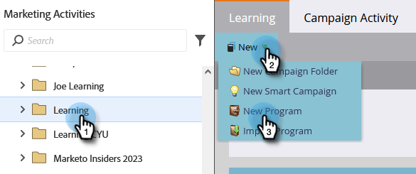

1. Immettere **[!UICONTROL Name]** e selezionare **[!UICONTROL Email]** per **[!UICONTROL Program Type]**.

   >[!TIP]
   >
   >Aggiungere le iniziali alla fine del nome del programma per renderlo univoco.

   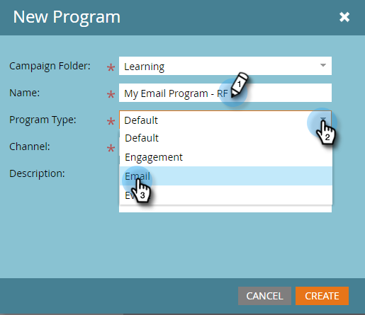

1. In **[!UICONTROL Channel]**, selezionare **[!UICONTROL Email Send]** e fare clic su **[!UICONTROL Create]**.

   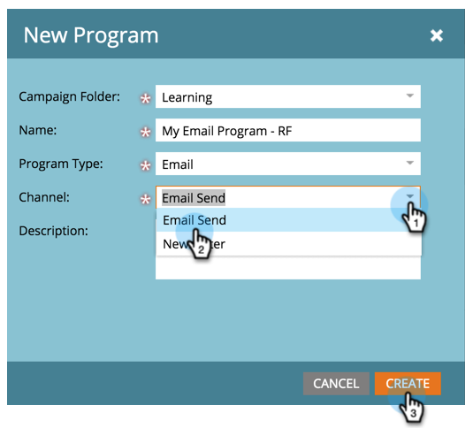

## Definire il pubblico {#define-your-audience}

1. Fare clic su **[!UICONTROL Edit Smart List]** sotto il riquadro [!UICONTROL Audience].

   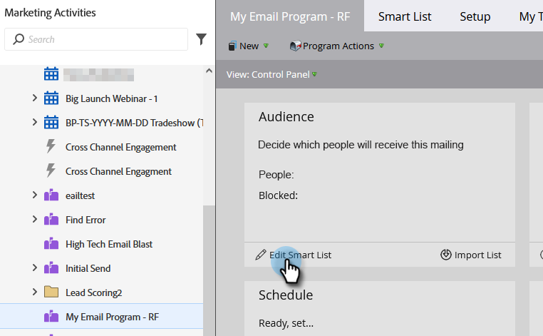

1. Trovare e trascinare il filtro [!UICONTROL Email Address] nell&#39;area di lavoro.

   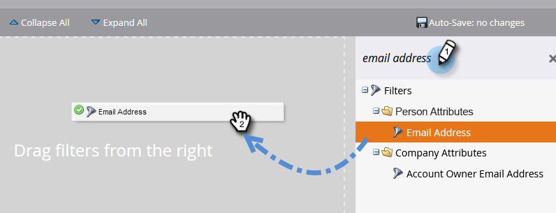

   >[!TIP]
   >
   >Utilizzare la funzione **[!UICONTROL Search]** per trovare più facilmente i filtri.

1. Trova e seleziona il tuo indirizzo e-mail.

   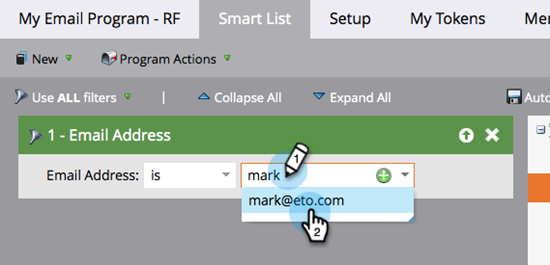

   >[!NOTE]
   >
   >Se l&#39;e-mail non viene compilata automaticamente, è possibile che ti sia dimenticato di [Configurare e aggiungere un lead.](/help/marketo/getting-started/quick-wins/get-set-up-and-add-a-person.md){target="_blank"}

   >[!NOTE]
   >
   >In questo esempio ti richiediamo di inviare l’e-mail solo a te stesso, ma puoi personalizzare il pubblico come ritieni opportuno.

1. Tornare alla scheda del programma principale e fare clic sull&#39;icona di aggiornamento per **[!UICONTROL Person]**.

   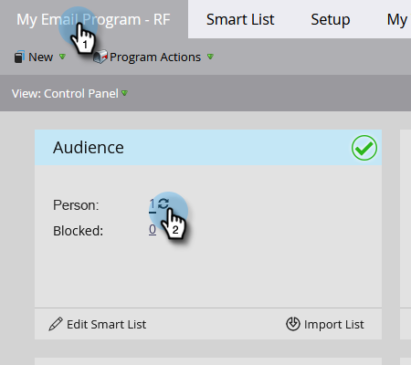

   Dovresti vedere il conteggio delle persone salire a 1. Sei tu!

## Creare un messaggio e-mail {#create-an-email}

1. Nel riquadro E-mail fare clic su **[!UICONTROL New Email]**.

   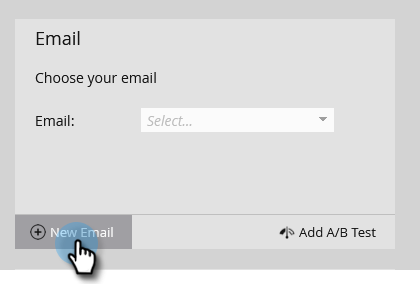

1. Immettere un **[!UICONTROL Name]**, selezionare un **Modello** e fare clic su **[!UICONTROL Create]**.

   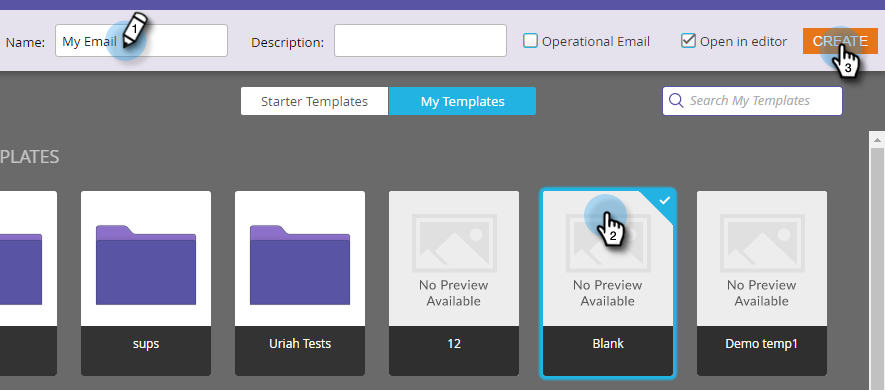

1. Si aprirà la finestra dell’editor e-mail. Inserisci un oggetto che non superi i 50 caratteri (scelta consigliata).

   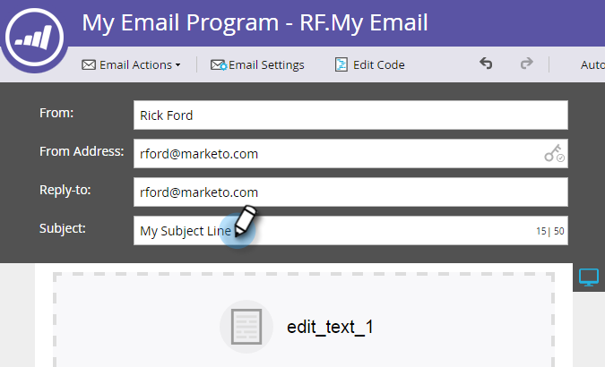

   >[!NOTE]
   >
   >Se si dispone di un blocco popup, fare clic su **[!UICONTROL Edit Draft]** per accedere all&#39;editor di posta elettronica.

1. Selezionare l&#39;area da modificare, fare clic sull&#39;icona a forma di ingranaggio a destra, quindi selezionare **[!UICONTROL Edit]**. È inoltre possibile fare doppio clic sulla sezione modificabile da modificare.

   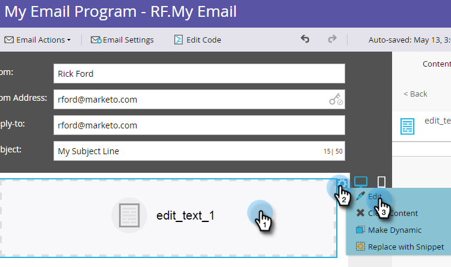

1. Immettere il contenuto desiderato e fare clic su **[!UICONTROL Save]**.

   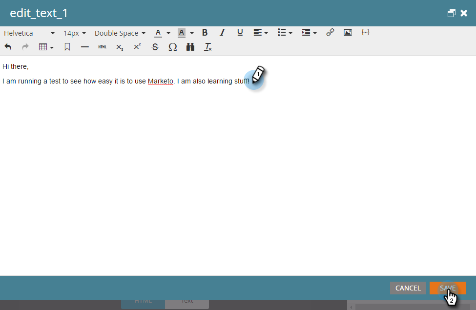

1. Fare clic sul menu a discesa **[!UICONTROL Email Actions]** e selezionare **[!UICONTROL Approve and Close]**.

   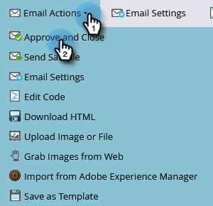

   >[!TIP]
   >
   >Vuoi inviarti un rapido esempio per vedere come si presenta il tuo messaggio e-mail prima di avviarlo? Selezionare **[!UICONTROL Send Sample]** nel menu precedente oppure fare clic su **[!UICONTROL Email Actions]** e quindi su [**[!UICONTROL Send Sample]**](/help/marketo/product-docs/email-marketing/general/creating-an-email/send-a-sample-email.md){target="_blank"}.

1. Seleziona il Programma e-mail nella struttura a sinistra.

   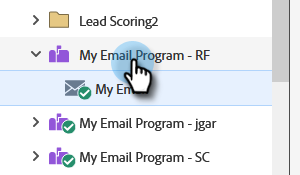

1. Nella sezione [!UICONTROL Schedule], imposta il giorno di avvio per l&#39;e-mail su **[!UICONTROL Today]**.

   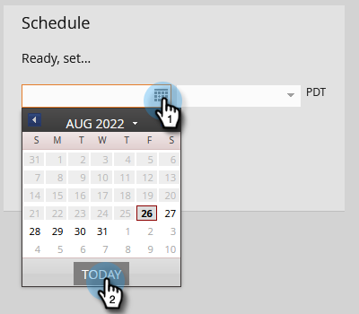

   >[!NOTE]
   >
   >Ulteriori informazioni su [Fuso orario destinatario](/help/marketo/product-docs/email-marketing/email-programs/email-program-actions/scheduling-with-recipient-time-zone/schedule-email-programs-with-recipient-time-zone.md){target="_blank"} e [Inizio intestazione](/help/marketo/product-docs/email-marketing/email-programs/email-program-actions/head-start-for-email-programs.md){target="_blank"}.

1. Seleziona un orario futuro di almeno 15 minuti.

   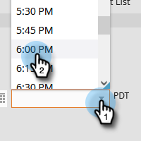

   >[!TIP]
   >
   >Il fuso orario predefinito non è vostro? Scopri come [aggiornarla qui](/help/marketo/product-docs/administration/settings/change-time-zone.md){target="_blank"}.

1. Fare clic su **[!UICONTROL Approve Program]** sotto il riquadro [!UICONTROL Approval]. Operazione completata.

   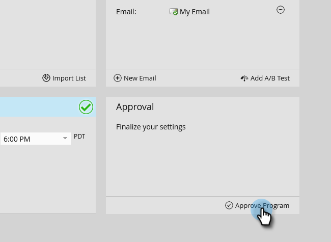

Dovresti ricevere l’e-mail poco dopo il giorno/l’ora pianificata.

## Missione completata! {#mission-complete}

  

[◄ Configurazione e aggiunta di una persona](/help/marketo/getting-started/quick-wins/get-set-up-and-add-a-person.md)

[Missione 2: pagina di destinazione con modulo ►](/help/marketo/getting-started/quick-wins/landing-page-with-a-form.md)
