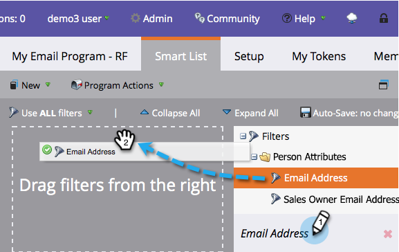

# Invia un messaggio e-mail {#send-an-email}

È la prima cosa che tutti vogliono fare. Inviiamo una email da Marketo!

>[!NOTE]
>
>**FYI**
>
>Marketo sta standardizzando la lingua tra tutte le iscrizioni, pertanto è possibile che nell&#39;abbonamento siano presenti lead/lead e persone in docs.marketo.com. Questi termini significano la stessa cosa; non influisce sulle istruzioni dell&#39;articolo. Ci sono anche altri cambiamenti. [Ulteriori](http://docs.marketo.com/display/DOCS/Updates+to+Marketo+Terminology)informazioni.

>[!PREREQUISITES]
>
>* [Configurazione e aggiunta di una persona](get-set-up-and-add-a-person.md)

>

## Creare un programma e-mail {#create-an-email-program}

1. Andate all&#39;area **Attività** di marketing.

   

1. Selezionate la cartella **Learning** . Fare clic sul menu a **discesa Nuovo** e selezionare **Nuovo programma**.

   

1. Immettete un **Name **e selezionate **E-mail** per Tipo di **programma.**

   >[!TIP]
   >
   >Aggiungete le iniziali alla fine del nome del programma per renderlo univoco.

   

1. In **Canale, **selezionate Invia** per **e-mail e fate clic su** Crea **.** **

   ** 

   **

## Definire il pubblico {#define-your-audience}

1. Fate clic su **Modifica elenco** avanzato sotto la sezione Pubblico.

   

1. Individuate e trascinate il filtro Indirizzo e-mail nell’area di lavoro.

   

   >[!TIP]
   >
   >Utilizzate **Cerca** nella parte superiore dell&#39;elenco Filtri per trovare più facilmente il filtro.

1. Individuate e selezionate il vostro indirizzo e-mail.

   

   >[!NOTE]
   >
   >**Promemoria**
   >
   >
   >Se l’e-mail non viene compilata automaticamente, potreste aver dimenticato di [impostarla e aggiungere un lead.](get-set-up-and-add-a-person.md)

   >[!NOTE]
   >
   >In questo esempio, è possibile inviare l&#39;e-mail solo a se stessi, ma è possibile personalizzare l&#39;audience nel modo desiderato.

1. Tornate alla scheda del programma principale e fate clic sull&#39;icona di aggiornamento per **Persona**.

   

   Dovresti vedere il numero di persone salire fino a 1. Sei tu!

## Creare un messaggio e-mail {#create-an-email}

1. Nella sezione E-mail, fate clic su **Nuova e-mail**.

   

1. Immettete un **nome**, selezionate un **modello** e fate clic su*** Crea*.

   

1. Viene aperta la finestra dell’editor e-mail. Immettete un oggetto con un massimo di 50 caratteri (consigliato).

   

   >[!NOTE]
   >
   >Se disponete di un blocco dei pop-up, fate clic su **Modifica bozza** per accedere all’editor e-mail.

1. Selezionate l&#39;area da modificare, fate clic sull&#39;icona a forma di ingranaggio a destra, quindi selezionate **Edit ** (potete anche fare doppio clic sulla sezione modificabile).

   

1. Inserite il contenuto desiderato e fate clic su **Salva**.

   

1. Le modifiche verranno salvate automaticamente. Chiudete la scheda o la finestra dell’editor.

   

1. Fate clic sul menu a discesa Azioni **e-** mail e selezionate **Approva**.

   

   >[!TIP]
   >
   >Desiderate inviarvi un esempio rapido per vedere l&#39;aspetto dell&#39;e-mail prima di avviarla? Selezionate **Invia esempio** nel menu sopra, oppure fate clic su Azioni **e-** mail e quindi su [**Invia esempio**](../../product-docs/email-marketing/general/creating-an-email/send-a-sample-email.md).

1. Selezionate il programma e-mail nella struttura a sinistra.

   

1. Nella sezione Pianificazione, impostate il giorno di avvio per l’e-mail su **Oggi.**

   

1. Selezionate un&#39;ora che dovrà durare almeno 15 minuti.

   

   >[!TIP]
   >
   >Il fuso orario predefinito non è tuo? Scopri come [aggiornarlo qui](https://docs.marketo.com/display/DOCS/Select+Your+Language,+Locale+and+Time+Zone#SelectYourLanguage,LocaleandTimeZone-ChangeUserLanguage,Locale&amp;Timezone).

1. Fai clic su **Approva programma** nella sezione Approvazione e hai finito!

   

Dovreste ricevere l&#39;e-mail poco dopo il giorno/l&#39;ora pianificata.

  

[◄ Imposta e aggiungi una pagina di](get-set-up-and-add-a-person.md) destinazione lead [con un modulo ►](landing-page-with-a-form.md)