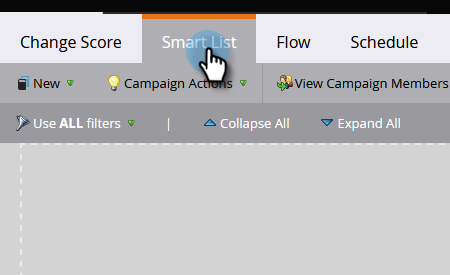
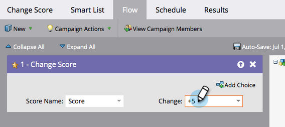
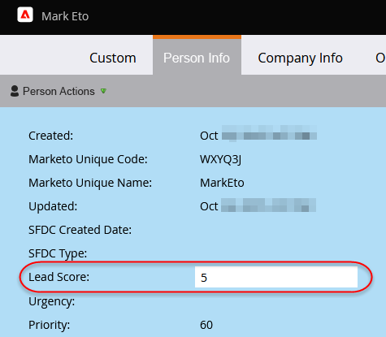

# Punteggio semplice {#simple-scoring}

>[!PREREQUISITES]
>
>* [Configurazione e aggiunta di una persona](/help/marketo/getting-started/quick-wins/get-set-up-and-add-a-person.md){target=&quot;_blank&quot;}
>* [Pagina di destinazione con un modulo](/help/marketo/getting-started/quick-wins/landing-page-with-a-form.md){target=&quot;_blank&quot;}

## Passaggio 1: Creare una campagna di valutazione {#step-create-a-scoring-campaign}

1. Vai a **Attività di marketing** area.

   

1. Fai clic con il pulsante destro del mouse sul **Apprendimento** e fai clic su **Nuova cartella campagna**.

   

1. Denomina la cartella della campagna &quot;Punteggio&quot; e fai clic su **Crea**.

   

   >[!NOTE]
   >
   >Se disponi già di una cartella Punteggio, assegna un nome diverso a questa, ad esempio Punteggio 1. I nomi delle cartelle devono essere univoci.

1. Fai clic con il pulsante destro del mouse sul **Punteggio** e seleziona **Nuova campagna Smart**.

   

1. Denomina la campagna &quot;Cambia punteggio&quot; e fai clic su **Crea**.

   

1. Fai clic sul pulsante **Elenco avanzato** scheda .

   

   Vogliamo che questa campagna venga eseguita ogni volta che una persona compila il tuo **Modulo di richiesta di prova**.

1. Trova e trascina **Riempie il modulo** attivarsi sull&#39;area di lavoro sinistra.

   

1. Seleziona **Modulo personale**.

   

   >[!NOTE]
   >
   >Se hai completato la [Pagina di destinazione con un modulo](/help/marketo/getting-started/quick-wins/landing-page-with-a-form.md){target=&quot;_blank&quot;} vittoria rapida, è necessario disporre del modulo. Se per il modulo è stato utilizzato un nome diverso, selezionarlo.

1. Fai clic sul pulsante **Flusso** scheda .

   

1. Trascina **Cambia punteggio** scorrere l&#39;azione sull&#39;area di lavoro sinistra.

   

1. Puoi digitare qualsiasi valore da aggiungere al punteggio della persona. Immetti &quot;+5&quot; nel campo **Modifica** campo .

   

   >[!TIP]
   >
   >Le campagne di punteggio sono fondamentali per la fornitura di persone di alta qualità alle vendite. Leggi [**Guida definitiva al punteggio lead**](https://www.marketo.com/definitive-guides/lead-scoring/){target=&quot;_blank&quot;}.

1. Fai clic sul pulsante **Pianificazione** e **Attiva** pulsante .

   

1. Fai clic su **Attiva** nella schermata di conferma.

   

>[!NOTE]
>
>Una volta attivata, questa campagna viene eseguita ogni volta che una persona compila il modulo. La campagna continuerà a essere in esecuzione finché non viene disattivata.

## Passaggio 2: Compilare il modulo {#step-fill-out-the-form}

1. Seleziona la pagina di destinazione creata nella [Pagina di destinazione con un modulo](/help/marketo/getting-started/quick-wins/landing-page-with-a-form.md){target=&quot;_blank&quot;} vittoria rapida.

   

1. Fai clic su **Anteprima**. La pagina di destinazione viene aperta in una nuova scheda.

   

1. Compila il modulo con il tuo nome, cognome e indirizzo e-mail, quindi fai clic su **Invia**.

   

   >[!NOTE]
   >
   >Usa lo stesso nome e indirizzo e-mail che hai usato quando ti sei inserito per la prima volta come persona per applicare l&#39;aumento del punteggio &quot;+5&quot;.

## Passaggio 3: Visualizza le informazioni sulla persona {#step-view-the-person-info}

1. Passare all&#39;area Database.

   

1. Cercare l’indirizzo e-mail utilizzato durante la compilazione del modulo.

   

1. Fai doppio clic sulla persona.

   

I dettagli della persona verranno aperti in una nuova scheda o finestra. Vedi come il tuo punteggio è aumentato di 5 punti per compilare il modulo?

## Missione Completa! {#mission-complete}

  

[◄ Missione 2: Pagina di destinazione con un modulo](/help/marketo/getting-started/quick-wins/landing-page-with-a-form.md)

[Missione 4: Risposta automatica tramite e-mail ►](/help/marketo/getting-started/quick-wins/email-auto-response.md)
