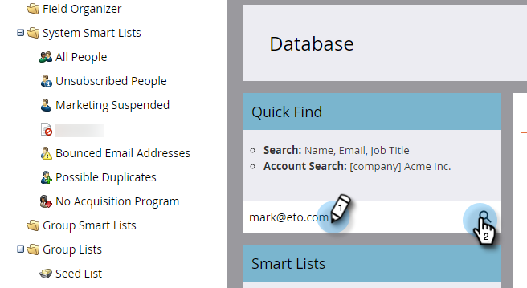
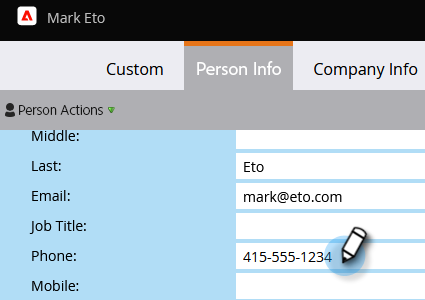

# Aggiornare i dati persona {#update-person-data}

## Missione: aggiornare le informazioni di contatto di una persona o altri dati {#mission-update-a-persons-contact-info-or-other-data}

>[!PREREQUISITES]
>
>* [Configurare e aggiungere una persona](/help/marketo/getting-started/quick-wins/get-set-up-and-add-a-person.md){target="_blank"}
>* [Importa un elenco di persone](/help/marketo/getting-started/quick-wins/import-a-list-of-people.md){target="_blank"}

Immaginiamo che alla tua recente fiera, una persona ti abbia fornito alcune informazioni di contatto aggiuntive. Ecco come aggiornare i dati personali.

## Trova la persona da aggiornare {#find-the-person-you-need-to-update}

1. Vai a [!UICONTROL Database].

   

1. Cerca il nome o l’indirizzo e-mail della persona.

   >[!TIP]
   >
   >L’utilizzo dell’indirizzo e-mail per la ricerca risulterà più veloce.

   

1. Fare doppio clic per aprire i dettagli della persona.

   

   >[!TIP]
   >
   >In Marketo sono disponibili diversi modi per aggiornare i dati personali. Vedere [Importare un elenco di persone](/help/marketo/getting-started/quick-wins/import-a-list-of-people.md){target="_blank"} e [Modificare il valore dei dati](/help/marketo/product-docs/core-marketo-concepts/smart-campaigns/flow-actions/change-data-value.md){target="_blank"}.

## Aggiornare i dati della persona {#update-the-person-data}

1. Digita le nuove informazioni ricevute, quindi chiudi la scheda.

>[!CAUTION]
>
>* Assicurati che gli indirizzi e-mail contengano solo caratteri ASCII.
>
>* Marketo **non** supporta gli indirizzi e-mail che contengono emoticon.

>[!NOTE]
>
>Dopo aver modificato i dati, gli elenchi smart e le campagne smart riconosceranno immediatamente le nuove informazioni.

## Missione completata {#mission-complete}

Bel lavoro! Hai aggiornato i dati della tua persona.

  

[◄ Missione 8: avvisare il rappresentante commerciale](/help/marketo/getting-started/quick-wins/alert-the-sales-rep.md)

[Missione 10: reindirizzare una pagina di destinazione ►](/help/marketo/getting-started/quick-wins/redirect-a-landing-page.md)
