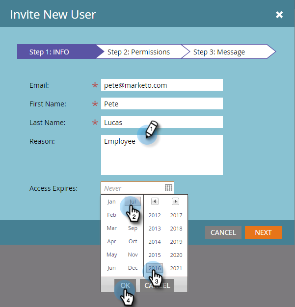
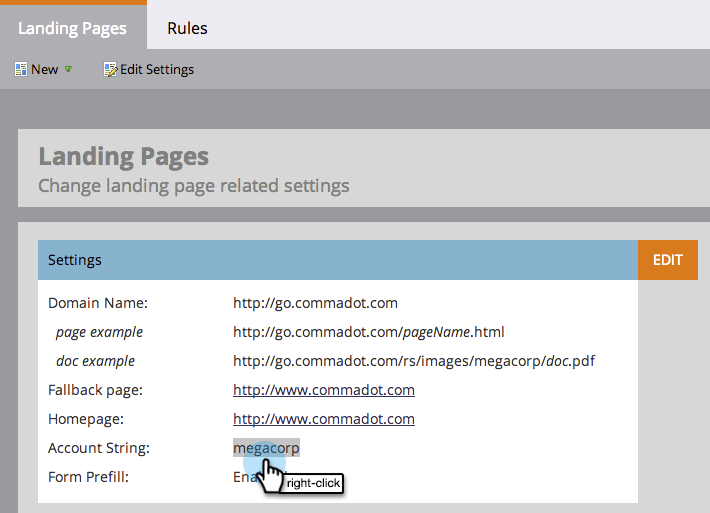

# Passaggi di installazione {#setup-steps}

**Benvenuta a Marketo!**

Prima di iniziare a utilizzare Marketo, devi completare alcuni passaggi.

Questi passaggi includono:

* alcune impostazioni di base dell&#39;account
* branding degli URL della pagina di destinazione e collegamenti e-mail per migliorare l’affidabilità e il recapito messaggi
* sincronizzazione del CRM
* aggiunta di codice di tracciamento al sito web aziendale

>[!NOTE]
>
>Devi eseguire questi passaggi solo se la tua azienda è **nuova di Marketo**. In caso contrario, la configurazione potrebbe essere già eseguita.

Alcuni passaggi richiedono l&#39;aiuto del team IT.

>[!TIP]
>
>Se [stampi questa checklist](/help/marketo/getting-started/setup-steps/setup-checklist.md), puoi disattivare gli elementi quando li completi.

## Accedi e crea altri utenti di Marketo {#log-in-and-create-additional-marketo-users}

1. Accedi a Marketo [qui](https://app.marketo.com/) utilizzando le credenziali ricevute tramite e-mail.

   

Congratulazioni! Ora sei a Marketo e puoi iniziare a esplorare. Potresti invitare i tuoi colleghi del team marketing a unirti a te. Per farlo, aggiungi nuovi utenti.

Vai all&#39;area **Amministratore**.

>[!TIP]
>
>Mentre sei qui, puoi fare clic su **Il mio account** per modificare le impostazioni del tuo account e della tua posizione, nonché impostare un nuovo nome di abbonamento.

>[!NOTE]
>
>**Autorizzazioni amministratore richieste**

Fai clic su **Utenti e ruoli**.

Fare clic su **Invita nuovo utente**.

Compila l’indirizzo e-mail, il nome e il cognome del collega.

Facoltativamente, inserisci un motivo per l’invito e una data di scadenza dell’accesso, utilizzando il selettore del calendario. Fare clic su **OK**.

Fare clic su **Avanti**.

>[!TIP]
>
>Una data di scadenza è ottima per i soggetti esterni o i consulenti a breve termine, ai quali Marketo deve accedere solo per un breve periodo di tempo.

>[!NOTE]
>
>All&#39;arrivo della data di scadenza, l&#39;utente riceve una notifica di scadenza e l&#39;account è bloccato.

Seleziona un ruolo e fai clic su **Avanti**. Gli utenti standard possono accedere a tutte le aree eccetto Amministratore.

>[!NOTE]
>
>Oltre ai cinque ruoli incorporati, puoi anche creare ruoli personalizzati. Ulteriori informazioni su [Gestione di ruoli utente e autorizzazioni](/help/marketo/product-docs/administration/users-and-roles/managing-user-roles-and-permissions.md).

Puoi modificare il testo dell’invito. Fare clic su **Invia**.

Il nuovo utente è ora elencato nella scheda Utenti e deve ricevere un messaggio e-mail con un collegamento per creare una password e un accesso. Il prossimo passo!

## Impostare i contatti di supporto autorizzati {#set-up-your-authorized-support-contacts}

Potresti aver ricevuto un&#39;e-mail dall&#39;assistenza Marketo che indica di essere l&#39;amministratore dell&#39;assistenza clienti Marketo per la tua azienda. In tal caso, puoi impostare **contatti di supporto autorizzati** per il tuo team. Solo i contatti di supporto autorizzati possono contattare direttamente l&#39;Assistenza clienti Marketo tramite il [Portale di supporto Marketo](https://support.marketo.com).

>[!NOTE]
>
>Il numero di contatti di supporto che è possibile creare dipende dal pacchetto acquistato. Questo limite è specificato nell&#39;e-mail dal supporto Marketo.

I documenti di contatto per il supporto autorizzato sono stati spostati nella community di Marketo. Vedi [questo articolo](https://nation.marketo.com/t5/Knowledgebase/Managing-Authorized-Support-Contacts/ta-p/254341).

>[!NOTE]
>
>Nell’elenco vengono visualizzate solo le persone che hanno effettuato l’accesso alla community Marketo. Se non riesci a trovare la persona, accertati che effettui prima l’accesso alla community .

## Personalizzare gli URL della pagina di destinazione con un CNAME {#customize-your-landing-page-urls-with-a-cname}

>[!NOTE]
>
>Sei un cliente di Launch Pack? Puoi saltare questo passaggio. Il tuo consulente ti fornirà un documento sulle istruzioni di configurazione IT durante la chiamata di avvio.

>[!NOTE]
>
>**Autorizzazioni amministratore richieste**

Scegli un CNAME per le pagine di destinazione. Alcuni esempi:

    * **go**.[CompanyDomain].com
    * **www2**.[CompanyDomain].com
    * **lp**.[CompanyDomain].com

>[!TIP]
>
>La tenga bassa! Gli URL più brevi sono più facili da ricordare. Suggeriamo di &quot;andare&quot; come dominio.

La prima parte (in grassetto) è il simbolo `[LandingPageCNAME]`. Ne avrai bisogno nel passaggio 5.

Per recuperare la stringa account da sostituire con il CNAME della pagina di destinazione, passa all’area Amministratore.

Fai clic su **Pagine di destinazione**.

Copia la stringa account dalle impostazioni della pagina di destinazione.

Questo è il `[AccountString]`. Salvala. Sarà necessario assegnarlo all&#39;IT nel passaggio 5.

Configura le impostazioni del dominio in modo che le pagine di destinazione utilizzino il dominio della tua azienda invece di quello di Marketo (dove sono ospitate).

## Assicurati il recapito messaggi e-mail {#ensure-email-deliverability}

>[!NOTE]
>
>Sei un cliente di Launch Pack? Puoi saltare questo passaggio. Il tuo consulente ti fornirà un documento sulle istruzioni di configurazione IT durante la chiamata di avvio.

Puoi adottare diverse misure per garantire che le e-mail raggiungano il maggior numero possibile di persone.

    1. **Marchio i tuoi collegamenti di tracciamento**. Puoi scegliere un CNAME per utilizzare il tuo dominio (invece di quello di Marketo) nei collegamenti che includi nelle e-mail da Marketo. Questo rafforza il branding del dominio e aumenta la fiducia e il recapito con i destinatari.
    1. **Aggiungi Marketo al tuo inserire nell&#39;elenco Consentiti e-mail aziendale.** È consigliabile inviare e-mail di test agli account di test prima di inviare e-mail alle persone effettive. inserire nell&#39;elenco Consentiti Marketo puoi impedire che le e-mail di test vengano bloccate o contrassegnate come spam.
    1. **Impostare SPF e DKIM.** Queste tecnologie assicurano ai destinatari che le e-mail Marketo non sono spam. Per evitare che i filtri anti-spam dei destinatari rifiutino le e-mail di Marketo, segui questi passaggi per [Configurare una SPF e DKIM per la consegna delle e-mail](/help/marketo/product-docs/email-marketing/deliverability/set-up-spf-and-dkim-for-your-email-deliverability.md).
    1. **Imposta un record MX per il dominio.** Un record MX ti consente di ricevere la posta al dominio da cui invii l’e-mail per elaborare le risposte e rispondere automaticamente. Se invii dal dominio aziendale, probabilmente questo è già configurato. In caso contrario, puoi solitamente impostare per la mappatura sul record MX del dominio aziendale.
    1. **Impostazioni consigliate per l’indirizzo Da.** È necessario utilizzare un dominio e-mail valido, esistente e funzionante nell’indirizzo Da in tutte le campagne e-mail. Può essere utile configurare un sottodominio del dominio aziendale anziché inviare dal dominio aziendale. Questo assicurerà che i problemi del tuo flusso di posta aziendale non influiscano sul tuo flusso di posta Marketo e viceversa. Inoltre, l’invio di messaggi da something@nonexistentdomain.com comporterà il filtraggio o il blocco delle e-mail. Qualsiasi dominio utilizzato nell&#39;indirizzo Da del mittente deve avere un account postmaster@ valido e funzionante e abusare di@.
    Se utilizzi Google Apps per ospitare l&#39;e-mail aziendale, non potrai creare e-mail abusive@ o postmaster@ sotto il tuo dominio. Per aggirare questo problema, è necessario creare gruppi denominati &quot;abuso&quot; e &quot;postmaster&quot;. Gli utenti che sono membri di questi gruppi riceveranno e-mail inviate a tali indirizzi (ad esempio, postmaster@domain.com). Istruzioni dettagliate per la creazione dei gruppi sono disponibili [qui](https://support.google.com/a/answer/33343#adminconsole).

Scegli un CNAME per i collegamenti di tracciamento e-mail (scegli uno che sia _diverso_ dalla pagina di destinazione CNAME scelta al passaggio 3). Alcuni esempi:

    * go2.[CompanyDomain].com
    * em.[CompanyDomain].com
    * wow.[CompanyDomain].com

La prima parte è il CNAME di tracciamento e-mail, `[EmailTrackingCNAME]`. Sarà necessario assegnarlo all&#39;IT nel passaggio 5.

>[!CAUTION]
>
>I CNAME e-mail e pagina di destinazione devono essere diversi. Inoltre, evita CNAME come &quot;track&quot; o &quot;link&quot;. È spesso contrassegnato come spam

Per trovare il collegamento di tracciamento Marketo, vai all&#39;area **Amministratore**.

Fare clic su **Email**.

Copia il collegamento di tracciamento dalle impostazioni e-mail.

Il collegamento di tracciamento si trova nel modulo: `mkto-[a-z][4 digits].com`.

Questo è il tuo `[MktoTrackingLink]`. Salvala. Sarà necessario assegnarlo all&#39;IT nel passaggio 5.

Raccogli i domini &quot;Da&quot;. Crea un elenco di tutti i domini &quot;Da&quot; (come in, `[Sender]@[FromDomain].com`) che intendi utilizzare per l’invio di e-mail da Marketo. Per la maggior parte, ce n&#39;è solo uno.

Ad esempio, &#39;marketo.com,&#39; &#39;info.marketo.com,&#39;. Si tratta di `[FromDomain1]`,`[FromDomain2]`, ecc. Salvatele. Sarà necessario assegnarle all&#39;IT nel passaggio 5.

Ora hai tutte le informazioni necessarie per inviare la tua richiesta all&#39;IT!

## Chiedi all&#39;IT di configurare i protocolli {#ask-it-to-configure-protocols}

>[!NOTE]
>
>Sei un cliente di Launch Pack? Puoi saltare questo passaggio. Il tuo consulente ti fornirà un documento sulle istruzioni di configurazione IT durante la chiamata di avvio.

Una volta raccolte tutte le informazioni necessarie, puoi inviare una richiesta all’IT. È possibile utilizzare il testo seguente come modello, sostituendo il testo in grassetto con le proprie informazioni.

[Includi un collegamento a questo articolo](/help/marketo/getting-started/setup-steps/configure-protocols-for-marketo.md).

Incolla questo testo nell’e-mail e sostituisci i segnaposto con grassetto:

>[!NOTE]
>
>Per determinare il testo da sostituire ai segnaposto, vedere i passaggi 3 e 4 di cui sopra. Ricorda che `[LandingPageCNAME]` e `[EmailTrackingCNAME]` devono essere diversi.

`---------------------------------------------`

Gentile amministratore IT,

Il nostro team marketing sta ora utilizzando la piattaforma Marketo per comunicare con il nostro personale. Per garantire il recapito messaggi e-mail di livello elevato, è necessario apportare le seguenti modifiche:

`1)` Per le pagine di destinazione, aggiungi una voce DNS (CNAME) per  **[LandingPageCNAME]**.**[CompanyDomain]**.com, che punta a  **[AccountString]**.mktoweb.com.

`2)` Per i nostri collegamenti di tracciamento in e-mail, aggiungi una voce DNS (CNAME) per  **[EmailTrackingCNAME]**.**[CompanyDomain]**.com, che punta a  **[MktoTrackingLink]**.

`3)` Inserire nell&#39;elenco Consentiti Marketo.

    * Se utilizziamo gli indirizzi IP nel nostro Inserire nell&#39;elenco Consentiti e-mail, aggiungi gli IP elencati di seguito: 
    199.15.212.0/22
    
    192.28.144.0/20
    
    192.28.160.0/19
    
    185.28.196.0/22
    
    130.248.172.0/24
    
    130.248.173.0/24
    
    103.237.104.0/22
    
    94.236.119.0/26

NOTA: Contatta il Supporto Marketo se desideri che un elenco abbreviato di IP sia inserire nell&#39;elenco Consentiti specifico al tuo ambiente.

    * Se il nostro sistema anti-spam utilizza i domini Da, aggiungi questi:

**`[FromDomain1]`**
**`[FromDomain2]`**

`4)` Dobbiamo configurare SPF e DKIM in modo che Marketo sia autorizzato a inviare e-mail firmate per nostro conto.

`a.` Per configurare SPF, aggiungi la seguente riga alle voci DNS:

IN TXT **[Da dominio]**:  v=spf1 mx ip4:**[IP aziendale]**
 include: mktomail.com ~all

Se nella voce DNS è già presente un record SPF, è sufficiente aggiungere quanto segue:

include:mktomail.com

`[`Sostituisci  **da** dominio con l&#39;e-mail dal dominio (ad esempio: company.com) e  **** CorpIPcon l&#39;indirizzo IP del server e-mail aziendale (ad es: 255.255.255.255).  Se desideri inviare e-mail da più domini tramite Marketo, devi chiedere al personale IT di aggiungere questa riga per ogni dominio (su una riga).`]`

`b.` Per DKIM, crea record di risorse DNS per ogni dominio che desideri configurare. Di seguito sono riportati i record host e i valori TXT per ogni dominio per cui firmeremo:

**`[DKIMDomain1]`**: Il record host è  **`[HostRecord1]`** e il valore TXT è  **[TXTValue1]**.

**`[DKIMDomain2]`**: Il record host è  **`[HostRecord2]`** e il valore TXT è  **`[TXTValue2]`**.

`[`Copia  **** HostRecord e  **** TXTValueper ogni  **** DKIMDomainconfigurato dopo aver seguito le  [istruzioni qui](/help/marketo/product-docs/email-marketing/deliverability/set-up-a-custom-dkim-signature.md). Non dimenticare di verificare ogni dominio in **Amministratore > E-mail > DKIM** dopo che il personale IT ha completato questo passaggio.`]`

`5)` Dobbiamo assicurarci che ci sia un record MX valido per i nostri domini FROM  **[FromDomain1]**,  **[FromDomain2]**, ecc. Può confermare? In caso contrario, configura la mappatura sul record MX del dominio aziendale. Questo ci permetterà di elaborare risposte/autoresponders ai nostri messaggi Marketo.

Fammi sapere quando hai completato questi passaggi, in modo da poter completare il processo di configurazione con Marketo.

Grazie! Tu sei il migliore!

Amore,

**`[Your Name]`**

`---------------------------------------------`

Invia l&#39;e-mail all&#39;IT. Comprendiamo che può essere necessario un po&#39; di tempo per l&#39;IT per completare queste attività. Puoi continuare con il Passaggio 7, ma ricorda che devi tornare al Passaggio 6 per completare la configurazione di Marketo.

## Completare La Configurazione Di Marketo Al Termine Dell&#39;IT {#complete-your-marketo-setup-after-it-finishes}

Una volta che l’IT ha completato le proprie attività, segui questi passaggi per aggiungere la pagina di destinazione e i CNAME per e-mail e per attivare la firma DKIM.

Vai all&#39;area **Amministratore** per aggiungere il CNAME della pagina di destinazione

Seleziona Pagine di destinazione e fai clic su **Modifica** nell’area Impostazioni.

Immetti il nuovo nome di dominio nel campo Nome di dominio per le pagine di destinazione. Deve essere nella forma seguente:

`[LandingPageCNAME].[CompanyDomain].com`

Nel campo Pagina di fallback , immetti l’URL a cui gli utenti dovranno accedere se una pagina di destinazione non è disponibile. Puoi utilizzare la pagina Home dell’azienda se non hai una pagina di fallback. Nel campo Homepage , inserisci il sito web dell’azienda.

Nell’area Amministratore, seleziona E-mail per aggiungere il tuo CNAME e-mail

Scorri verso il basso e fai clic su **Modifica**.

Nel campo Dominio , immetti il dominio di tracciamento e-mail. Deve essere nella forma seguente:

`[EmailTrackingCNAME].[CompanyDomain].com`. Fare clic su **Salva**.

## Integrare il CRM {#integrate-your-crm}

Questo è probabilmente il passo più emozionante della tua configurazione - è il momento di riempire Marketo con tutti i lead e i contatti che hai memorizzato nel tuo CRM!

Scegli tra le seguenti opzioni, a seconda del CRM utilizzato dalla tua azienda.

    * [Integrare Marketo con Salesforce.com](/help/marketo/product-docs/crm-sync/salesforce-sync/understanding-the-salesforce-sync.md)
    * [Integrare Marketo con Microsoft Dynamics](/help/marketo/product-docs/crm-sync/microsoft-dynamics-sync/understanding-the-microsoft-dynamics-sync.md)

>[!NOTE]
>
>Per completare questi passaggi, è necessaria l’assistenza dell’amministratore CRM della tua azienda.

## Aggiungi il codice di tracciamento al tuo sito web {#add-tracking-code-to-your-website}

>[!NOTE]
>
>Sei un cliente di Launch Pack? Puoi saltare questo passaggio. Il tuo consulente ti fornirà le istruzioni di codice Munchkin nel documento sulle istruzioni di configurazione IT.

Marketo dispone di JavaScript di tracciamento personalizzato (denominato Munchkin) che è possibile utilizzare per monitorare le attività delle persone su qualsiasi pagina web. Munchkin è richiesto per integrare il tuo sito web in Marketo. Segui questi passaggi per [Aggiungere codice di tracciamento Munchkin al tuo sito web](/help/marketo/product-docs/administration/additional-integrations/add-munchkin-tracking-code-to-your-website.md).

>[!NOTE]
>
>Esperienza con HTML necessaria per aggiungere il codice di tracciamento.

Tutti i tuoi passaggi di configurazione sono finiti. L&#39;unica cosa rimasta è tuffarsi e usare Marketo!
