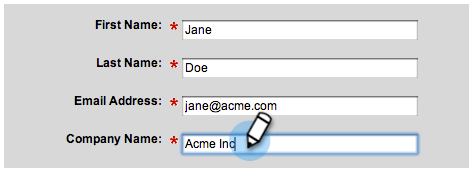

# Procedura di installazione {#setup-steps}

**Benvenuti a Marketo!**

Prima di iniziare a utilizzare Marketo, devi completare alcuni passaggi.

Questi passaggi includono:

* alcune impostazioni di base dell&#39;account
* personalizzazione degli URL della pagina di destinazione e dei collegamenti e-mail per migliorare l’affidabilità e la recapito
* sincronizzazione di CRM
* aggiunta di codice di tracciamento al sito Web aziendale

>[!NOTE]
>
>È necessario eseguire questi passaggi solo se la società è **nuova a Marketo**. In caso contrario, la configurazione potrebbe essere già effettuata.

Alcuni passaggi richiedono l&#39;aiuto del team IT.

>[!TIP]
>
>Se si [stampa questa lista di controllo](/help/marketo/getting-started/setup-steps/setup-checklist.md), è possibile disattivare gli elementi al termine del loro completamento.

1. Accedi e crea altri utenti di Marketo

1. Accedete a Marketo [qui](https://app.marketo.com/) utilizzando le credenziali ricevute per e-mail.

   

Congratulazioni! Ora sei in Marketo e puoi iniziare a esplorare. Potresti voler invitare i tuoi colleghi del team di marketing a unirti a te. A tale scopo, potete aggiungere nuovi utenti.

Andate all&#39;area **Admin**.

>[!TIP]
>
>Mentre siete qui, potete fare clic su **My Account** per cambiare le impostazioni di account e posizione, nonché impostare un nuovo nome di iscrizione.

>[!NOTE]
>
>**Autorizzazioni amministratore richieste**

Fare clic su **Utenti e ruoli**.

Fare clic su **Invita nuovo utente**.

Compila l’indirizzo e-mail, il nome e il cognome del collega.

Facoltativamente, immettete un motivo per l’invito e una data di scadenza dell’accesso, utilizzando il selettore del calendario. Fare clic su **OK**.

Fare clic su **Next**.

>[!TIP]
>
>Una data di scadenza è ottima per le parti interessate esterne a breve termine o per i consulenti, che hanno bisogno di Markeche di accedere solo per un breve periodo di tempo.

>[!NOTE]
>
>Quando arriva la data di scadenza, l&#39;utente riceve la notifica di scadenza e l&#39;account è bloccato.

Selezionate un ruolo e fate clic su **Next**. Gli utenti standard hanno accesso a tutte le aree eccetto Amministratore.

>[!NOTE]
>
>Oltre ai cinque ruoli predefiniti, potete anche creare ruoli personalizzati. Ulteriori informazioni su [Gestione di ruoli utente e autorizzazioni](/help/marketo/product-docs/administration/users-and-roles/managing-user-roles-and-permissions.md).

Potete modificare il testo dell’invito. Fare clic su **Send**.

Il nuovo utente è ora elencato nella scheda Utenti e deve ricevere un messaggio e-mail con un collegamento per creare una password e un login. Il prossimo passo!

1. Impostazione dei contatti di supporto autorizzati

   Potreste aver ricevuto un messaggio e-mail dall&#39;Assistenza clienti di Marketo in cui si dichiara di essere l&#39;amministratore dell&#39;Assistenza clienti di Marketo per la società. In tal caso, potete impostare **contatti di supporto autorizzati** per il team. Solo i contatti di supporto autorizzati possono contattare direttamente l&#39;Assistenza clienti di Marketo tramite il [Portale di supporto di Marketo](https://support.marketo.com).

   >[!NOTE]
   >
   >Il numero di contatti di supporto che è possibile creare dipende dal pacchetto acquistato. Questo limite è specificato nel messaggio e-mail inviato dal supporto tecnico di Marketo.

   I documenti di contatto per il supporto autorizzato sono stati spostati nella community di Marketo. Consultate [questo articolo](https://nation.marketo.com/t5/Knowledgebase/Managing-Authorized-Support-Contacts/ta-p/254341).

   >[!NOTE]
   >
   >Nell&#39;elenco vengono visualizzate solo le persone che hanno eseguito l&#39;accesso alla community di Marketo. Se non riesci a trovare la persona, accertati che acceda prima alla community.

1. Personalizzare gli URL della pagina di destinazione con un CNAME

   >[!NOTE]
   >
   >Sei un cliente di Launch Pack? Potete saltare questo passaggio. Il consulente fornirà un documento sulle istruzioni di configurazione IT durante la chiamata di attivazione.

   >[!NOTE]
   >
   >**Autorizzazioni amministratore richieste**

   Scegliete un CNAME per le pagine di destinazione. Alcuni esempi:

   * **vai**.[CompanyDomain].com
   * **www2**.[CompanyDomain].com
   * **lp**.[CompanyDomain].com

   >[!TIP]
   >
   >Tenetela bassa! URL più brevi sono più facili da ricordare. Suggeriamo di &quot;andare&quot; come dominio.

   La prima parte (in grassetto) è la `[LandingPageCNAME]`. Ne avrete bisogno al Punto 5.

   Per recuperare la stringa account che sostituirete con il CNAME della pagina di destinazione, passate all’area Amministrazione.

   

   Fare clic su **Pagine di destinazione**.

   

   Copiate la stringa account dalle impostazioni della pagina di destinazione.

   

   Questo è il `[AccountString]`. Salvatelo. Dovrai darla al reparto IT al punto 5.

Configurate le impostazioni del dominio in modo che le pagine di destinazione utilizzino il dominio della società invece di quello di Marketo (dove sono ospitate).

1. Garantire la distribuzione delle e-mail

   >[!NOTE]
   >
   >Sei un cliente di Launch Pack? Potete saltare questo passaggio. Il consulente fornirà un documento sulle istruzioni di configurazione IT durante la chiamata di attivazione.

   Potete prendere diverse misure per garantire che le e-mail raggiungano il maggior numero possibile di persone.

   1. **Aggiungi i tuoi collegamenti** di tracciamento. Potete scegliere un CNAME per utilizzare il vostro dominio (invece di quello di Marketo) nei collegamenti che includete nelle e-mail da Marketo. Questo rafforza il marchio del dominio e aumenta la fiducia e la recapito con i destinatari.
   1. **Aggiungi Marketo al tuo inserire nell&#39;elenco Consentiti e-mail aziendale .** È consigliabile inviare e-mail di prova agli account di prova prima di inviare e-mail agli utenti effettivi.   Marketo, potete impedire che le e-mail di prova vengano bloccate o contrassegnate come spam.
   1. **Configurare SPF e DKIM.** Queste tecnologie assicurano ai destinatari che le e-mail Marketo non sono spam. Per evitare che i filtri anti-spam dei destinatari rifiutino le e-mail di Marketo, segui questi passaggi per [Configurare un SPF e un DKIM per la distribuzione delle e-mail](/help/marketo/product-docs/email-marketing/deliverability/set-up-spf-and-dkim-for-your-email-deliverability.md).
   1. **Configurate un record MX per il vostro dominio.** Un record MX consente di ricevere la posta al dominio da cui si invia l&#39;e-mail per elaborare le risposte e rispondere automaticamente. Se invii dal dominio aziendale, probabilmente hai già configurato questo. In caso contrario, in genere puoi impostare la mappatura sul record MX del dominio aziendale.
   1. **Impostazioni consigliate per l&#39;indirizzo Da.** È necessario utilizzare un dominio e-mail valido, esistente e funzionante nell&#39;indirizzo Da in tutte le campagne e-mail. Può essere utile configurare un sottodominio del dominio aziendale anziché inviarlo dal dominio aziendale. In questo modo i problemi del flusso di posta aziendale non avranno alcun impatto sul flusso di posta Marketo e viceversa. Inoltre, l&#39;invio di posta elettronica da something@nonexistentdomain.com causerà il filtraggio o il blocco delle e-mail. Qualsiasi dominio utilizzato nell&#39;indirizzo Da del mittente deve avere un account postmaster@ valido e funzionante e abusare@.
Se utilizzate Google Apps per ospitare le e-mail aziendali, non potrete creare e-mail abusive@ o postmaster@ all&#39;interno del vostro dominio. Per ovviare a questo problema, dovete creare gruppi denominati &quot;abuso&quot; e &quot;postmaster&quot;. Gli utenti membri di questi gruppi riceveranno e-mail inviate a tali indirizzi (ad esempio, postmaster@domain.com). Per istruzioni dettagliate sulla creazione dei gruppi, consultate [qui](https://support.google.com/a/answer/33343#adminconsole).

   Scegliete un CNAME per i collegamenti di tracciamento e-mail (scegliete uno che sia _diverso_ dalla pagina di destinazione CNAME scelta al Punto 3). Alcuni esempi:

   * go2.[CompanyDomain].com
   * em.[CompanyDomain].com
   * wow.[CompanyDomain].com

   La prima parte è il CNAME di tracciamento e-mail, `[EmailTrackingCNAME]`. Sarà necessario assegnarlo al reparto IT al punto 5.

   >[!CAUTION]
   >
   >I CNAME per e-mail e pagina di destinazione devono essere diversi. Inoltre, evitate CNAME come &quot;track&quot; o &quot;link&quot;. È spesso contrassegnato come spam

   Per trovare il collegamento di tracciamento Marketo, vai all&#39;area **Admin**.

   

   Fare clic su **E-mail**.

   

   Copiate il Collegamento tracciamento dalle impostazioni e-mail.

   Il collegamento di tracciamento si trova nel modulo: `mkto-[a-z][4 digits].com`.

   

   Questo è il tuo `[MktoTrackingLink]`. Salvatelo. Dovrai darla al reparto IT al punto 5.

   Raccogli domini &quot;Da&quot;. Elenca tutti i domini &quot;Da&quot; (come in, `[Sender]@[FromDomain].com`) che intendi utilizzare per inviare e-mail da Marketo. Per la maggior parte, ce n&#39;è solo uno.

   Ad esempio, &#39;marketo.com,&#39; &#39;info.marketo.com,&#39;. Si tratta di `[FromDomain1]`,`[FromDomain2]`, ecc. Salvatele. Dovrai distribuirli all&#39;IT al punto 5.

   Ora hai tutte le informazioni necessarie per inviare la tua richiesta all&#39;IT!

1. Chiedi all&#39;IT di configurare i protocolli

   >[!NOTE]
   >
   >Sei un cliente di Launch Pack? Potete saltare questo passaggio. Il consulente fornirà un documento sulle istruzioni di configurazione IT durante la chiamata di attivazione.

   Una volta raccolte tutte le informazioni necessarie, potete inviare una richiesta all’IT. Potete utilizzare il testo seguente come modello, sostituendo il testo in grassetto con le vostre informazioni.

   [Includete un collegamento a questo articolo](/help/marketo/getting-started/setup-steps/configure-protocols-for-marketo.md).

   Incollate questo testo nell’e-mail e sostituite i segnaposto con i bordi:

   >[!NOTE]
   >
   >Per determinare il testo da sostituire ai segnaposto, vedere i passaggi 3 e 4 precedenti. Tenere presente che `[LandingPageCNAME]` e `[EmailTrackingCNAME]` devono essere diversi.

`---------------------------------------------`

Gentile amministratore IT,

Il nostro team marketing utilizza ora la piattaforma Marketo per comunicare con le persone. Per garantire la massima recapito delle e-mail, è necessario apportare le seguenti modifiche:

`1)` Per le pagine di destinazione, aggiungi una voce DNS (CNAME) per  **[LandingPageCNAME]**.**[CompanyDomain]**.com, che punta a  **[AccountString]**.mktoweb.com.

`2)` Per i nostri collegamenti di tracciamento nell&#39;e-mail, aggiungi una voce DNS (CNAME) per  **[EmailTrackingCNAME]**.**[CompanyDomain]**.com, che punta a  **[MktoTrackingLink]**.

`3)`   Marketo.

    * Se utilizziamo gli indirizzi IP nel nostro Inserire nell&#39;elenco Consentiti e-mail, aggiungi gli IP elencati di seguito:
    199.15.212.0/22
    
    192.28.144.0/20
    
    192.28.160.0/19
    
    185.28.196.0/22
    
    130.248.172.0/24
    
    130.248.173.0/24
    
    103.237.104.0/22
    
    94.236.119.0/26

NOTA: Rivolgiti al supporto di Marketo se desideri un elenco abbreviato di IP per  inserì nell&#39;elenco Consentiti specifico al tuo ambiente.

    * Se il nostro sistema anti-spam utilizza Da domini, aggiungi questi:

**`[FromDomain1]`**
**`[FromDomain2]`**

`4)` Dobbiamo configurare SPF e DKIM in modo che Marketo sia autorizzato a inviare e-mail firmate per nostro conto.

`a.` Per configurare SPF, aggiungete la seguente riga alle voci DNS:

IN TXT **[Da dominio]**:  v=spf1 mx ip4:**[IP aziendale]**
 includere: mktomail.com ~all

Se disponiamo già di un record SPF esistente nella nostra voce DNS, aggiungeteci semplicemente quanto segue:

include:mktomail.com

`[`Sostituisci  **da** dominio con l’e-mail dal dominio (ad esempio: company.com) e  **** CorpIP con l’indirizzo IP del server e-mail aziendale (ad esempio: 255.255.255.255).  Se invii e-mail da più domini tramite Marketo, devi far aggiungere questa riga al personale IT per ogni dominio (su una sola riga).`]`

`b.` Per DKIM, creare record di risorse DNS per ogni dominio che si desidera impostare. Di seguito sono riportati i record host e i valori TXT per ciascun dominio per il quale verranno firmati:

**`[DKIMDomain1]`**: Record host è  **`[HostRecord1]`** e il valore TXT è  **[TXTValue1]**.

**`[DKIMDomain2]`**: Record host è  **`[HostRecord2]`** e il valore TXT è  **`[TXTValue2]`**.

`[`Copiate  **** HostRecordand  **** TXTValueper ciascun  **** DKIMDomainaina configurato dopo aver seguito le  [istruzioni qui](/help/marketo/product-docs/email-marketing/deliverability/set-up-a-custom-dkim-signature.md). Non dimenticare di verificare ogni dominio in **Amministratore > E-mail > DKIM** dopo che il personale IT ha completato questo passaggio.`]`

`5)` È necessario assicurarsi che esista un record MX valido per i nostri domini FROM  **[FromDomain1]**,  **[FromDomain2]**, ecc. Può confermare? In caso contrario, configurare per la mappatura sul nostro record MX del dominio aziendale. In questo modo sarà possibile elaborare le risposte/autoresponders ai nostri invii Marketo.

Fammi sapere quando hai completato questi passaggi, così posso completare il processo di configurazione con Marketo.

Grazie! Sei il migliore!

Amore,

**`[Your Name]`**

`---------------------------------------------`

Invia l&#39;e-mail all&#39;IT. Sappiamo che l&#39;IT può richiedere un po&#39; di tempo per completare queste attività. Puoi continuare fino al Passaggio 7, ma ricorda che devi tornare al Passaggio 6 per completare la configurazione di Marketo.

1. Completare La Configurazione Del Marketo Al Termine Dell&#39;IT

   Una volta completate le attività, l&#39;IT può seguire i passaggi seguenti per aggiungere la pagina di destinazione e i CNAME per e-mail e per attivare la firma DKIM.

   Vai all&#39;area **Admin** per aggiungere il CNAME della pagina di destinazione

   

   Selezionare Pagine di destinazione e fare clic su **Modifica** nell&#39;area Impostazioni.

   

   Immettete il nuovo nome di dominio nel campo Nome dominio per le pagine di destinazione. Deve essere nel modulo:

   `[LandingPageCNAME].[CompanyDomain].com`

   

   Nel campo della pagina di fallback, immettete l’URL a cui dovranno passare gli utenti se una pagina di destinazione non è disponibile. Potete utilizzare la home page della società se non disponete di una pagina di fallback. Nel campo Homepage, inserite il sito Web della società.

   

   Nell’area Admin, seleziona E-mail per aggiungere il CNAME per l’e-mail

   

   Scorrete verso il basso e fate clic su **Modifica**.

   

   Nel campo Dominio, immetti il dominio di tracciamento e-mail. Deve essere nel modulo:

   `[EmailTrackingCNAME].[CompanyDomain].com`. Fare clic su **Salva**.

   

1. Invia un URL per i modelli pagina di destinazione e e-mail

   I nostri creativi progettisti possono fornirvi e-mail e modelli personalizzati per le pagine di destinazione che consentono di avviare i programmi di marketing in modo semplice e rapido. È necessario fornire loro alcune informazioni in modo che possano corrispondere ai modelli per il sito Web e il logo della società.

   >[!NOTE]
   >
   >Questi modelli personalizzati sono disponibili solo per i clienti di Launch Pack.

   Fare clic sul modulo [Struttura del modello di marketing e generare ](https://pages2.marketo.com/CESubmit-URL-ForTemplates.html). Compila le informazioni sulla tua azienda.

   

   Per l’URL della pagina di destinazione, immettete un URL di esempio dal sito Web della società che mostra colori, logo e stile della società. La maggior parte dei clienti utilizza una pagina Contatti che include un modulo.

   

   Per CNAME, immetti il CNAME della pagina di destinazione selezionato al punto 3 (`[LandingPageCNAME]`). Invia la tua richiesta.

   

   >[!NOTE]
   >
   >I modelli non possono essere completati finché l&#39;IT non crea un record DNS per il CNAME della pagina di destinazione.

   È tutto! I nuovi modelli verranno visualizzati in Marketo Design Studio in 3-5 giorni lavorativi.

1. Integrare CRM

   Questo è probabilmente il passo più emozionante della tua configurazione: è ora di riempire Marketo con tutti i lead e i contatti che hai memorizzato nel CRM!

   Scegli tra le opzioni seguenti, a seconda del CRM utilizzato dalla tua azienda.

   * [Integrare Marketo con Salesforce.com](/help/marketo/product-docs/crm-sync/salesforce-sync/understanding-the-salesforce-sync.md)
   * [Integrare Marketo con Microsoft Dynamics](/help/marketo/product-docs/crm-sync/microsoft-dynamics-sync/understanding-the-microsoft-dynamics-sync.md)

   >[!NOTE]
   >
   >Per completare questi passaggi, è necessario l&#39;assistenza dell&#39;amministratore CRM della società.

## 9. Aggiungi codice di tracciamento al tuo sito Web {#add-tracking-code-to-your-website}

>[!NOTE]
>
>Sei un cliente di Launch Pack? Potete saltare questo passaggio. Il vostro consulente vi fornirà le istruzioni del codice Munchkin nel documento delle istruzioni di configurazione IT.

Marketo dispone di JavaScript di tracciamento personalizzato (denominato Munchkin) che potete utilizzare per monitorare le attività delle persone su qualsiasi pagina Web. Munchkin è richiesto per integrare il tuo sito web in Marketo. Seguire i passaggi riportati di seguito per [Aggiungere il codice di tracciamento Munchkin al sito Web](/help/marketo/product-docs/administration/additional-integrations/add-munchkin-tracking-code-to-your-website.md).

>[!NOTE]
>
>Fate esperienza con HTML richiesto per aggiungere il codice di tracciamento.

Tutti i passaggi di configurazione sono finiti. Resta solo da tuffarsi e usare Marketo!
