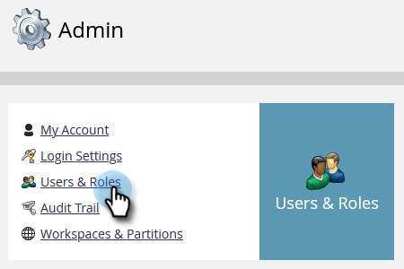
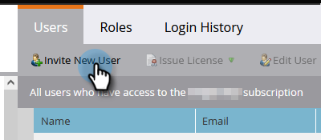

# Passaggi di configurazione {#setup-steps}

**Benvenuto nel Marketo Engage!**

Prima di iniziare a utilizzare Marketo, segui alcuni passaggi da completare.

Questi passaggi includono:

* Configurazione account di base
* Personalizzare gli URL della pagina di destinazione e i collegamenti e-mail per migliorare l’affidabilità e il recapito messaggi
* Sincronizzazione del CRM in corso
* Aggiunta di codice di tracciamento al sito Web aziendale

>[!NOTE]
>
>Devi eseguire questi passaggi solo se l’azienda è **nuovo in Marketo**. In caso contrario, la configurazione potrebbe essere già stata eseguita.

Alcuni passaggi richiedono l’aiuto del team IT.

>[!TIP]
>
>Se [stampa questo elenco di controllo](/help/marketo/getting-started/setup/setup-checklist.md){target="_blank"}, è possibile disattivare gli elementi mentre vengono completati.

## Accedi e crea altri utenti Marketo {#log-in-and-create-additional-marketo-users}

Accedi a Marketo [qui](https://app.marketo.com/){target="_blank"} utilizzando le credenziali ricevute tramite e-mail.

Congratulazioni! Ora sei in Marketo e puoi iniziare a esplorare. Potresti voler invitare i tuoi colleghi del team marketing a unirti a te. Per farlo, aggiungi nuovi utenti.

Vai a **[!UICONTROL Amministratore]** area.

>[!TIP]
>
>Mentre sei qui, puoi fare clic su **[!UICONTROL Il mio account]** per modificare le impostazioni dell&#39;account e della posizione, nonché impostare un nuovo nome di abbonamento.

>[!NOTE]
>
>**Autorizzazioni amministratore richieste**

Clic **[!UICONTROL Utenti e ruoli]**.

Clic **[!UICONTROL Invita nuovo utente]**.

Compila l’indirizzo e-mail, il nome e il cognome del tuo collega. _L&#39;impostazione di una data di scadenza di accesso è facoltativa_. Clic **[!UICONTROL Successivo]**.

>[!TIP]
>
>Una data di scadenza è ideale per le parti interessate esterne a breve termine o per i consulenti che necessitano dell’accesso a Marketo solo per un breve periodo.

>[!NOTE]
>
>Quando arriva la data di scadenza, l’utente riceve una notifica di scadenza e l’account viene bloccato.

Seleziona un ruolo e fai clic su **[!UICONTROL Successivo]**. Gli utenti standard hanno accesso a tutte le aree eccetto Admin.

>[!NOTE]
>
>Oltre ai cinque ruoli incorporati, puoi anche creare ruoli personalizzati. Ulteriori informazioni su [Gestione di ruoli utente e autorizzazioni](/help/marketo/product-docs/administration/users-and-roles/managing-user-roles-and-permissions.md){target="_blank"}.

È possibile modificare il testo dell&#39;invito. Clic **Invia**.

Il nuovo utente è ora elencato in **[!UICONTROL Utenti]** e dovrebbe ricevere un’e-mail con un collegamento per creare una password e un accesso. Passaggio successivo

## Impostare I Contatti Autorizzati Per Il Supporto {#set-up-your-authorized-support-contacts}

È possibile che tu abbia ricevuto un&#39;e-mail da Marketo Support in cui si dichiara di essere l&#39;Amministratore dell&#39;Assistenza clienti Marketo per la tua azienda. In tal caso, è possibile impostare **contatti per il supporto autorizzato** per il tuo team. Solo i contatti del supporto autorizzato possono contattare l&#39;Assistenza clienti Marketo direttamente tramite [Portale di supporto Marketo](https://support.marketo.com){target="_blank"}.

>[!NOTE]
>
>Il numero di contatti di supporto che è possibile creare è determinato dal pacchetto acquistato. Questo limite è specificato nell’e-mail inviata dal supporto Marketo.

I documenti di contatto per il supporto autorizzato sono stati spostati nella community di Marketo. Consulta [questo articolo](https://nation.marketo.com/t5/Knowledgebase/Managing-Authorized-Support-Contacts/ta-p/254341){target="_blank"}.

>[!NOTE]
>
>Nell&#39;elenco vengono visualizzate solo le persone che hanno effettuato l&#39;accesso alla community di Marketo. Se non riesci a trovare la persona, accertati che prima acceda alla community.

## Personalizzare gli URL della pagina di destinazione con un CNAME {#customize-your-landing-page-urls-with-a-cname}

>[!NOTE]
>
>Sei cliente di Launch Pack? Puoi saltare questo passaggio. Il tuo consulente ti fornirà un documento con le istruzioni per la configurazione IT durante la tua chiamata di avvio.

>[!NOTE]
>
>**Autorizzazioni amministratore richieste**

Scegli un CNAME per le pagine di destinazione. Alcuni esempi:

    * **vai**.[DominioSocietà].com
    * **www2**.[DominioSocietà].com
    * **lp**.[DominioSocietà].com

>[!TIP]
>
>Sii breve! Gli URL più brevi sono più facili da ricordare. Consigliamo di usare &quot;go&quot; come dominio.

La prima parte (in grassetto) è `[LandingPageCNAME]`. Ne avrai bisogno al punto 5.

Per recuperare l’ID Munchkin che sostituirai con il CNAME della pagina di destinazione, passa all’area Amministratore.

Clic **Il mio account**.

Copia il [!UICONTROL Stringa account] dalle impostazioni della pagina di destinazione.

Questo è il `[Munchkin ID]`. Salvatela. Sarà necessario consegnarlo al reparto IT nel passaggio 5.

Configura le impostazioni del dominio in modo che le pagine di destinazione utilizzino il dominio della tua azienda invece di quello di Marketo (dove sono ospitate).

## Garantire il recapito dei messaggi e-mail {#ensure-email-deliverability}

>[!NOTE]
>
>Sei cliente di Launch Pack? Puoi saltare questo passaggio. Il tuo consulente ti fornirà un documento con le istruzioni per la configurazione IT durante la tua chiamata di avvio.

Puoi adottare diverse misure per garantire che le e-mail raggiungano il maggior numero possibile di persone.

* **Personalizzare i collegamenti di tracciamento**. Puoi scegliere un CNAME per utilizzare il tuo dominio (anziché quello di Marketo) nei collegamenti che includi nelle e-mail da Marketo. Questo rafforza il branding del dominio e aumenta la fiducia e il recapito messaggi con i destinatari.
* **Aggiungi Marketo al tuo elenco Consentiti di e-mail aziendale per l e-mail.** È buona prassi comune inviare e-mail di test agli account di test prima di inviare e-mail alle persone effettive. di inserire nell&#39;elenco Consentiti Marketo, puoi evitare che le e-mail di test vengano bloccate o contrassegnate come spam.
* **Configurare SPF e DKIM.** Queste tecnologie garantiscono ai destinatari che le e-mail Marketo non siano spam. Per evitare che i filtri anti-spam dei destinatari rifiutino le e-mail Marketo, segui questi passaggi per [Configurare SPF e DKIM per il recapito messaggi e-mail](/help/marketo/product-docs/email-marketing/deliverability/set-up-spf-and-dkim-for-your-email-deliverability.md).
* **Imposta un record MX per il dominio.** Un record MX ti consente di ricevere e-mail al dominio da cui stai inviando l’e-mail per elaborare le risposte e i risponditori automatici. Se invii dal dominio aziendale, probabilmente lo hai già configurato. In caso contrario, puoi in genere impostare la mappatura sul record MX del dominio aziendale.
* **Impostazioni consigliate per l&#39;indirizzo Da.** Devi utilizzare un dominio e-mail valido, esistente e funzionante nell’Indirizzo mittente in tutte le campagne e-mail. Può essere utile configurare un sottodominio del dominio aziendale piuttosto che inviare dati dal dominio aziendale. In questo modo i problemi del flusso di posta aziendale non influiranno sul flusso di posta Marketo e viceversa. Inoltre, l&#39;invio di posta da `something@nonexistentdomain.com` causerà il filtraggio o il blocco delle e-mail. Qualsiasi dominio utilizzato nell&#39;indirizzo mittente deve avere un account postmaster@ valido e funzionante e un account abusivo@.

Se utilizzi le app Google per l’hosting dell’e-mail aziendale, non potrai creare e-mail di abuso@ o postmaster@ nel tuo dominio. Per ovviare a questo problema, è necessario creare gruppi denominati &quot;abuso&quot; e &quot;postmaster&quot;. Gli utenti che sono membri di questi gruppi riceveranno e-mail inviate a tali indirizzi (ad esempio, postmaster@domain.com). Per istruzioni dettagliate sulla creazione dei gruppi, consulta [qui](https://support.google.com/a/answer/33343#adminconsole){target="_blank"}.

Scegli un CNAME per i collegamenti di tracciamento e-mail (scegli un CNAME) _diverso_ dalla pagina di destinazione CNAME scelta nel passaggio 3). Alcuni esempi:

* vai2.[DominioSocietà].com
* em.[DominioSocietà].com
* wow![DominioSocietà].com

La prima parte è il CNAME di tracciamento e-mail, `[EmailTrackingCNAME]`. Sarà necessario somministrarlo al reparto IT nel passaggio 5.

>[!CAUTION]
>
>I CNAME per e-mail e pagina di destinazione devono essere diversi. Inoltre, evita CNAME come &quot;track&quot; o &quot;link&quot;. Viene spesso segnalato come spam

Per trovare il collegamento di tracciamento di Marketo, vai al **[!UICONTROL Amministratore]** area.

Clic **[!UICONTROL E-mail]**.

Copia il [!UICONTROL Collegamento di tracciamento] dalle impostazioni e-mail.

Il [!UICONTROL Collegamento di tracciamento] è nel formato: `mkto-[a-z][4 digits].com`.

Questo è il tuo `[MktoTrackingLink]`. Salvatela. Sarà necessario consegnarlo al reparto IT nel passaggio 5.

Raccogli i domini &quot;Da&quot;. Crea un elenco di tutti i domini &quot;Da&quot; (come in, `[Sender]@[FromDomain].com`) che intendi utilizzare per inviare e-mail da Marketo. Per la maggior parte, ce n&#39;è solo uno.

Ad esempio, &#39;marketo.com&#39; &#39;info.marketo.com&#39;. Questi sono `[FromDomain1]`,`[FromDomain2]`, ecc. Salvateli. Dovrai assegnarli al reparto IT nel passaggio 5.

Ora disponi di tutte le informazioni necessarie per inviare la richiesta al reparto IT.

## Chiedi all&#39;IT di configurare i protocolli {#ask-it-to-configure-protocols}

>[!NOTE]
>
>Sei cliente di Launch Pack? Puoi saltare questo passaggio. Il tuo consulente ti fornirà un documento con le istruzioni per la configurazione IT durante la tua chiamata di avvio.

Una volta raccolte tutte le informazioni necessarie, puoi inviare una richiesta al reparto IT. È possibile utilizzare il testo seguente come modello, sostituendo il testo in grassetto con le proprie informazioni.

[Includi un collegamento a questo articolo](/help/marketo/getting-started/setup/configure-protocols-for-marketo.md).

Incolla questo testo nell’e-mail e sostituisci i segnaposto in grassetto:

>[!NOTE]
>
>Vedere i passaggi 3 e 4 per determinare il testo da sostituire ai segnaposto. Ricorda che `[LandingPageCNAME]` e `[EmailTrackingCNAME]` deve essere diverso.

`----------------------------------------------`

Gentile Amministratore IT,

Il team Marketing utilizza la piattaforma Marketo per comunicare con il personale. Per garantire un recapito messaggi e-mail ottimale, è necessario apportare le seguenti modifiche:

`1)` Per le nostre pagine di destinazione, aggiungi una voce DNS (CNAME) per **[LandingPageCNAME]**.**[DominioSocietà]**.com, puntando a **[ID Munchkin]**.mktoweb.com.

`2)` Per i collegamenti di tracciamento nelle e-mail, aggiungi una voce DNS (CNAME) per **[EmailTrackingCNAME]**.**[DominioSocietà]**.com, puntando a **[MktoTrackingLink]**.

`3)` Inserire nell&#39;elenco Consentiti Marketo.

    * Se utilizziamo gli indirizzi IP nel nostro Elenco Consentiti di e-mail, aggiungi gli IP elencati di seguito:
    199.15.212.0/22
    
    192.28.144.0/20
    
    192.28.160.0/19
    
    185.28.196.0/22
    
    130.248.172.0/24
    
    130.248.173.0/24
    
    103.237.104.0/22
    
    94.236.119.0/26

>[!NOTE]
>
>Contatta il supporto Marketo inserire nell&#39;elenco Consentiti se desideri un elenco abbreviato di IP da specifici per il tuo ambiente.

    * Se il nostro sistema antispam utilizza i domini From, aggiungi questi:

**`[FromDomain1]`**
**`[FromDomain2]`**

`4)` È necessario configurare SPF e DKIM in modo che Marketo sia autorizzata a inviare e-mail firmate per nostro conto.

`a.` Per configurare SPF, aggiungi la seguente riga alle voci DNS:

IN TXT **[Da dominio]**: v=spf1 mx ip4:**[IP aziendali]**
 include: mktomail.com ~tutti

Se disponiamo già di un record SPF nella voce DNS, è sufficiente aggiungervi quanto segue:

include:mktomail.com

`[`Sostituisci **Da dominio** con il tuo indirizzo e-mail dal dominio (ad esempio: company.com) e **CorpIP** con l&#39;indirizzo IP del server di posta elettronica aziendale (ad esempio: 255.255.255.255).  Se intendi inviare e-mail da più domini tramite Marketo, il tuo staff IT dovrebbe aggiungere questa riga per ciascun dominio (su una riga).`]`

`b.` Per DKIM, crea i record di risorse DNS per ogni dominio che desideri impostare. Di seguito sono riportati i record host e i valori TXT per ogni dominio per cui firmeremo:

**`[DKIMDomain1]`**: il record host è **`[HostRecord1]`** e il valore TXT è **[TXTValue1]**.

**`[DKIMDomain2]`**: il record host è **`[HostRecord2]`** e il valore TXT è **`[TXTValue2]`**.

`[`Copia il **RecordHost** e **TXTValue** per ogni **DKIMDomain** hai impostato dopo aver seguito le [istruzioni](/help/marketo/product-docs/email-marketing/deliverability/set-up-a-custom-dkim-signature.md). Non dimenticare di verificare ogni dominio in **Amministratore > E-mail > DKIM** dopo che il personale IT ha completato questo passaggio.`]`

`5)` Dobbiamo assicurarci che ci sia un record MX valido per i nostri domini FROM **[FromDomain1]**, **[FromDomain2]**, ecc. Può confermare? In caso contrario, configuralo per eseguire il mapping al record MX del dominio aziendale. In questo modo sarà possibile elaborare le risposte e i risponditori automatici alle nostre comunicazioni Marketo.

Fatemi sapere quando avete completato questi passaggi, in modo che io possa completare il processo di configurazione con Marketo.

Grazie! Sei il migliore!

Amore,

**`[Your Name]`**

`----------------------------------------------`

Invia l&#39;e-mail al reparto IT. Sappiamo che il completamento di queste attività può richiedere del tempo all&#39;IT. È possibile continuare con il passaggio 7, ma è necessario tornare al passaggio 6 per completare la configurazione di Marketo.

## Completare l&#39;installazione di Marketo al termine dell&#39;IT {#complete-your-marketo-setup-after-it-finishes}

Una volta completate le attività, segui questi passaggi per aggiungere la pagina di destinazione e i CNAME e-mail e per attivare la firma DKIM.

Vai a **[!UICONTROL Amministratore]** area per aggiungere il CNAME della pagina di destinazione

Seleziona le pagine di destinazione e fai clic su **[!UICONTROL Modifica]** nel [!UICONTROL Impostazioni] area.

Immetti il nuovo nome di dominio nel campo **[!UICONTROL Nome di dominio per le pagine di destinazione]**. Il modulo dovrebbe essere:

`[LandingPageCNAME].[CompanyDomain].com`

In **[!UICONTROL Fallback]** pagina, immetti l’URL a cui desideri che le persone accedano se una pagina di destinazione non è disponibile. Se non disponi di una pagina di fallback, puoi utilizzare la home page dell’azienda. In **[!UICONTROL Homepage]** , immettere il sito Web della società.

In [!UICONTROL Amministratore] area, seleziona **[!UICONTROL E-mail]** per aggiungere il CNAME e-mail

Scorri verso il basso fino a [!UICONTROL Domini di branding]. Seleziona il dominio e fai clic su **[!UICONTROL Modifica]**.

Nel campo Dominio, immetti il dominio di tracciamento e-mail. Il modulo dovrebbe essere:

`[EmailTrackingCNAME].[CompanyDomain].com`. Clic **[!UICONTROL Salva]**.

## Integrare il CRM {#integrate-your-crm}

Questo è probabilmente il passaggio più emozionante della tua configurazione: è ora di riempire Marketo con tutti quei lead e contatti che hai memorizzato nel tuo CRM!

Scegli una delle seguenti opzioni, a seconda del sistema di gestione delle relazioni con i clienti utilizzato dalla tua azienda.

    * [Integrare Marketo con [!DNL Salesforce.com]](/help/marketo/product-docs/crm-sync/salesforce-sync/understanding-the-salesforce-sync.md)
    * [Integrare Marketo con [!DNL Microsoft Dynamics]](/help/marketo/product-docs/crm-sync/microsoft-dynamics-sync/understanding-the-microsoft-dynamics-sync.md)

>[!NOTE]
>
>Per completare questi passaggi, è necessario l’assistenza dell’amministratore del sistema di gestione delle relazioni con i clienti della tua azienda.

## Aggiungi codice di tracciamento al tuo sito web {#add-tracking-code-to-your-website}

>[!NOTE]
>
>Sei un [!DNL Launch Pack] cliente? Puoi saltare questo passaggio. Il tuo consulente ti fornirà [!DNL Munchkin] le istruzioni di codice nel documento delle istruzioni di configurazione IT.

Marketo dispone di JavaScript di tracciamento personalizzato (denominato [!DNL Munchkin]) che è possibile utilizzare per tenere traccia delle attività delle persone su qualsiasi pagina web. [!DNL Munchkin] è richiesto per integrare il sito web in Marketo. Segui questi passaggi per [Aggiungi [!DNL Munchkin] Codice di tracciamento per il sito web](/help/marketo/product-docs/administration/additional-integrations/add-munchkin-tracking-code-to-your-website.md){target="_blank"}.

>[!NOTE]
>
>Per aggiungere il codice di tracciamento è necessaria un’esperienza con HTML.

## Aspettative di prestazioni {#performance-expectations}

Quali sono le aspettative in termini di prestazioni di Marketo? Può variare a seconda delle dimensioni e della complessità delle campagne di marketing. Ma puoi aspettarti livelli di prestazioni pari a quelli descritti nella colonna &quot;Standard&quot; in diverse tabelle presenti nella sezione [Descrizione del prodotto Marketo Engage](https://helpx.adobe.com/legal/product-descriptions/adobe-marketo-engage---product-description.html){target="_blank"}. The "Performance" and "Performance Plus" columns refer to performance tier packages that provide [higher performance levels](https://nation.marketo.com/t5/product-documents/marketo-engage-performance-tiers/ta-p/328835){target="_blank"}.

Tutti i passaggi di configurazione sono terminati. L&#39;unica cosa che rimane è tuffarsi e usare Marketo!
