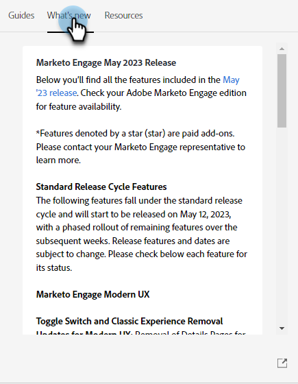

# Help Center {#help-center}

Help Center di Adobe Marketo Engage funge da sede centralizzata per ricevere assistenza. Oltre a effettuare il collegamento a varie risorse (ad esempio, [documentazione del prodotto](/help/marketo/home.md){target="_blank"}, [informazioni sulla versione](/help/marketo/release-notes/current.md){target="_blank"}, la [community di Marketing Nation](https://nation.marketo.com/){target="_blank"}), puoi accedere a utili procedure dettagliate interne al prodotto organizzate per livello di esperienza.

## Come accedere {#how-to-access}

Dopo aver effettuato l’accesso a Marketo Engage, fai clic sull’icona Aiuto.

### Guide {#guides}

Le guide fungono da procedure dettagliate rapide per le funzioni più comuni.

1. Fai clic sulla guida desiderata per visualizzarla.

   

1. Fai clic su **Introduzione**.

   

1. Seleziona **Avanti** per continuare.

   

1. Fai clic su **Fine** per uscire dalla procedura dettagliata.

   

   >[!TIP]
   >
   >Esci dalla guida in qualsiasi momento facendo clic su **Ignora**.

### Novità {#whats-new}

La scheda Novità contiene tutti i dettagli dell’ultima versione di Marketo Engage.

>[!TIP]
>
>Fai clic sull’icona a forma di freccia in basso per visualizzare la pagina in Experience League.

### Risorse {#resources}

La scheda Risorse consente di accedere in modo rapido e diretto a vari modi per ottenere ulteriore guida all’istanza di Marketo Engage.

