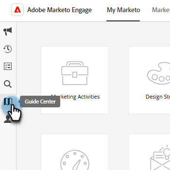

# Help Center {#help-center}

Help Center di Adobe Marketo Engage funge da sede centralizzata per ricevere assistenza. Oltre a effettuare il collegamento a varie risorse (ad esempio, [documentazione del prodotto](/help/marketo/home.md){target="_blank"}, [informazioni sulla versione](/help/marketo/release-notes/current.md){target="_blank"}, la [community di Marketing Nation](https://nation.marketo.com/){target="_blank"}), puoi accedere a utili procedure dettagliate interne al prodotto organizzate per livello di esperienza.

## Come accedere {#how-to-access}

Esistono due esperienze diverse, a seconda che l’abbonamento sia già stato migrato a Identity Management System (IMS) di Adobe.

### Migrazione IMS precedente a Adobe {#pre-adobe-ims-integration}

Questi passaggi sono per gli utenti di Marketo Engage che _non_ hanno ancora eseguito la migrazione a [IMS di Adobe](/help/marketo/product-docs/administration/marketo-with-adobe-identity/adobe-identity-management-overview.md){target="_blank"}.

[Accedi](https://login.marketo.com/){target="_blank"} a Marketo Engage e fai clic sull’icona Guida.

#### Guide {#guides}

Le guide fungono da procedure dettagliate rapide per le funzioni più comuni.

1. Fai clic sulla guida desiderata per visualizzarla.

   

1. Fai clic su **Introduzione**.

   

1. Seleziona **Avanti** per continuare.

   

1. Fai clic su **Fine** per uscire dalla procedura dettagliata.

   

   >[!TIP]
   >
   >Esci dalla guida in qualsiasi momento facendo clic su **Ignora**.

#### Novità {#whats-new}

La scheda Novità di contiene i dettagli della versione di Marketo Engage più recente.

>[!TIP]
>
>Fai clic sull’icona a forma di freccia in basso per visualizzare la pagina in Experience League.

#### Risorse {#resources}

La scheda Risorse consente di accedere in modo rapido e diretto a vari modi per ottenere ulteriore guida all’istanza di Marketo Engage.

### Migrazione IMS successiva a Adobe {#post-adobe-ims-integration}

Questi passaggi sono per gli utenti di Marketo Engage che hanno già eseguito la migrazione a [IMS di Adobe](/help/marketo/product-docs/administration/marketo-with-adobe-identity/adobe-identity-management-overview.md){target="_blank"}.

[Accedi](https://experience.adobe.com/){target="_blank"} a Marketo Engage e fai clic sull’icona Guida.

Verrà visualizzato l’Help Center. Fai clic su una delle risorse  della guida elencate da portare alla rispettiva area. Puoi anche eseguire la ricerca per termini specifici.

Le guide (precedentemente parte di Help Center prima della migrazione a IMS di Adobe) ora si trovano nell’area di navigazione a sinistra.

Il Centro assistenza dispone di due schede, Guide e Novità. Le guide fungono da procedure dettagliate rapide per le funzioni più comuni di Marketo Engage. Fai clic su una guida desiderata o esegui la ricerca per una guida specifica.

La scheda Novità di contiene i dettagli della versione di Marketo Engage più recente.

