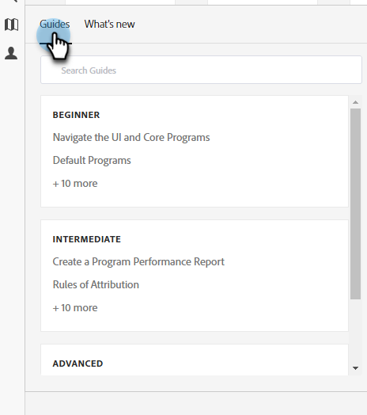

# Centro assistenza {#help-center}

L&#39;Help Center di Adobe Marketo Engage funge da sede centralizzata per l&#39;assistenza. Oltre a effettuare il collegamento a varie risorse (ad esempio, [documentazione del prodotto](/help/marketo/home.md){target="_blank"}, [informazioni sulla versione](/help/marketo/release-notes/current.md){target="_blank"}, [Community delle nazioni di marketing](https://nation.marketo.com/){target="_blank"}), puoi accedere a utili procedure dettagliate interne al prodotto organizzate per livello di esperienza.

## Come accedere {#how-to-access}

Esistono due esperienze diverse, a seconda che l’abbonamento sia già stato migrato ad Adobe Identity Management System (IMS).

### Migrazione IMS precedente ad Adobe {#pre-adobe-ims-integration}

Questi passaggi sono per gli utenti di Marketo Engage che hanno _non_ ancora eseguito la migrazione ad [Adobe IMS](/help/marketo/product-docs/administration/marketo-with-adobe-identity/adobe-identity-management-overview.md){target="_blank"}.

[Accedi](https://login.marketo.com/){target="_blank"} a Marketo Engage e fai clic sull&#39;icona Aiuto.

#### Guide {#guides}

Le guide fungono da procedure dettagliate rapide per le funzioni più comuni.

1. Fai clic sulla guida desiderata per visualizzarla.

   

1. Fai clic su **Inizia**.

   

1. Fai clic su **Avanti** per continuare.

   

1. Fare clic su **Fine** per uscire dalla procedura dettagliata.

   

   >[!TIP]
   >
   >Uscire dalla guida in qualsiasi momento facendo clic su **Ignora**.

#### Novità {#whats-new}

La scheda Novità contiene i dettagli dell’ultima versione di Marketo Engage.

>[!TIP]
>
>Fai clic sull’icona a forma di freccia in basso per visualizzare la pagina in Experience League.

#### Risorse {#resources}

La scheda Risorse consente di accedere in modo rapido e diretto a vari modi per ottenere ulteriore assistenza sull’istanza di Marketo Engage.

### Migrazione IMS post-Adobe {#post-adobe-ims-integration}

Questi passaggi sono per gli utenti di Marketo Engage che sono già stati trasferiti a [Adobe IMS](/help/marketo/product-docs/administration/marketo-with-adobe-identity/adobe-identity-management-overview.md){target="_blank"}.

[Accedi](https://experience.adobe.com/){target="_blank"} a Marketo Engage e fai clic sull&#39;icona Aiuto.

Verrà visualizzato il Centro assistenza. Fai clic su una delle risorse dell’Aiuto elencate da portare alla rispettiva area. Puoi anche cercare termini specifici.

Le guide (precedentemente parte di Help Center prima della migrazione Adobe IMS) ora si trovano nell’area di navigazione a sinistra.

Il Centro assistenza dispone di due schede, Guide e Novità. Le guide fungono da procedure dettagliate rapide per le funzioni più comuni di Marketo Engage. Fare clic su una Guida desiderata o cercare una Guida specifica.

La scheda Novità contiene i dettagli dell’ultima versione di Marketo Engage.

