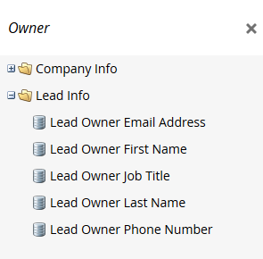
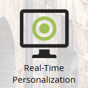

# Aggiornamenti alla terminologia di Marketo {#updates-to-marketo-terminology}

Stiamo apportando alcuni cambiamenti alla nostra piattaforma, che influiranno su ciò che alcune cose si chiamano. Se disponi di una nuova istanza di Marketo a partire da marzo 2016, o se la tua azienda si è rinnovata dopo luglio 2016, potresti visualizzare la nuova terminologia ora.

Anche se nella documentazione di Marketo potrebbero essere presenti termini diversi, è comunque garantito che tutti gli articoli verranno presto aggiornati in base a tali modifiche. Tutte le istruzioni sono le stesse.

Allora, cosa è cambiato?

## Il lead ora è la persona {#lead-is-now-person}

Il cambiamento più importante è la ridenominazione di Lead/Lead per persona/persona.

<table> 
 <colgroup> 
  <col> 
  <col> 
 </colgroup> 
 <tbody> 
  <tr> 
   <td><strong>Old</strong></td> 
   <td><strong>Nuovo</strong></td> 
  </tr> 
  <tr> 
   <td> 
    
 
      
    
</td> 
   <td> 
    
 
      
    
</td> 
  </tr> 
 </tbody> 
</table>

In alcuni casi, la parola &quot;Lead&quot; viene semplicemente rimossa.

<table> 
 <colgroup> 
  <col> 
  <col> 
 </colgroup> 
 <tbody> 
  <tr> 
   <td><strong>Old</strong></td> 
   <td><strong>Nuovo</strong></td> 
  </tr> 
  <tr> 
   <td> 
    
 
      
    
</td> 
   <td> 
    
 
     

 
    
</td> 
  </tr> 
 </tbody> 
</table>

Lead e Persona **sono la stessa cosa**.

## Token {#tokens}

I token con la parola lead **non cambiano**. Ci scusiamo per ogni confusione; tuttavia, la modifica di tutti i token in base alla nuova terminologia potrebbe interrompere l&#39;uso di molti token. Quindi vedrete ancora token come &quot;`{{lead.First Name}}`&quot;. Non esistono token specifici per una persona.

>[!NOTE]
>
>*è* presente un token denominato &quot;Note sulla persona&quot;, ma tale token è sempre presente. In genere viene utilizzato per un campo di descrizione in CRM, se disponibile.

## Gestione dei campi {#field-management}

I campi contenenti il termine Lead sono stati sostituiti con Persona oppure la parola Lead è stata eliminata. Un&#39;eccezione notevole, tuttavia, è rappresentata dal campo &quot;Proprietario principale&quot;. Ora è noto come &quot;Proprietario vendite&quot;.

<table> 
 <colgroup> 
  <col> 
  <col> 
 </colgroup> 
 <tbody> 
  <tr> 
   <td><strong>Old</strong></td> 
   <td><strong>Nuovo</strong></td> 
  </tr> 
  <tr> 
   <td> 
    
 
      
    
</td> 
   <td> 
    
 
      
    
</td> 
  </tr> 
 </tbody> 
</table>

>[!NOTE]
>
>Per un elenco completo dei nomi di campo interessati, visitare questo [articolo di supporto](https://nation.marketo.com/docs/DOC-4218#jive_content_id_Field_Names_and_Tokens).

## La personalizzazione in tempo reale (RTP) ora è la personalizzazione Web {#real-time-personalization-rtp-is-now-web-personalization}

<table> 
 <colgroup> 
  <col> 
  <col> 
 </colgroup> 
 <tbody> 
  <tr> 
   <td><strong>Old</strong></td> 
   <td><strong>Nuovo</strong></td> 
  </tr> 
  <tr> 
   <td> 
    
 
      
    
</td> 
   <td> 
    
 
      
    
</td> 
  </tr> 
 </tbody> 
</table>

Oltre alla modifica del nome, ora è composta da quattro app separate:

| ** [Personalizzazione Web](https://docs.marketo.com/display/DOCS/Web+Personalization+-+RTP)* | Dispone di una propria sezione nella schermata principale |
|---|---|
| ** [Marketing Web basato su account](https://docs.marketo.com/display/DOCS/Account-Based+Web+Marketing)** | Accessibile tramite il riquadro Personalizzazione Web |
| ** [Retargeting personalizzato](https://docs.marketo.com/display/DOCS/Website+Retargeting)* | Accessibile tramite il riquadro Personalizzazione Web |
| ** [Predictive Content](https://docs.marketo.com/display/DOCS/Predictive+Content)* | Dispone di una propria sezione nella schermata principale |

>[!NOTE]
>
>Le sezioni visibili nella schermata iniziale rifletteranno i moduli acquistati.

Grazie per la pazienza dimostrata durante questo aggiornamento.
