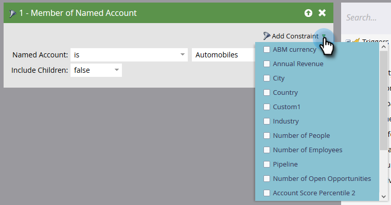

# Filtri account {#account-filters}

Identificazione e coinvolgimento di Account denominati e delle persone al loro interno mediante nuovi filtri incentrati sull&#39;account.

## Filtri ABM {#abm-filters}

1. Selezionate la campagna intelligente e fate clic su **Smart List**.

   

1. Fare clic su **+** per espandere la cartella **Filtri account**.

   

1. Trascinate i filtri che desiderate usare sul quadro.

   

## Membro dell&#39;elenco dei conti {#member-of-account-list}

Per utilizzare questo filtro, fate clic sull&#39;elenco a discesa dell&#39;account.

...e scegliete gli elenchi di account desiderati.

>[!NOTE]
>
>Per il filtro Elenco membri account, esiste un solo qualificatore: &quot;is&quot; - I qualificatori aggiuntivi (ad esempio &quot;is not&quot; e &quot;is any&quot;) non sono disponibili.

## Membro dell&#39;account denominato {#member-of-named-account}

1. Scegliete un qualificatore. Si riferisce a uno o più account denominati specifici o a uno qualsiasi di quelli denominati.

   

1. Fate clic sul menu a discesa dell&#39;account denominato.

   

1. Scegliete gli account denominati desiderati.

   

1. Se si utilizza il qualificatore &quot;is any&quot;, è possibile utilizzare [limits](/help/marketo/product-docs/core-marketo-concepts/smart-lists-and-static-lists/using-smart-lists/add-a-constraint-to-a-smart-list-filter.md) per limitare i risultati della ricerca. Aggiungetene quanti ne vorreste!

   

1. Impostate &quot;Includi elementi figlio&quot; su false se desiderate che i membri vengano inclusi solo dall’account di primo livello singolo. Selezionate true se desiderate che i membri siano inclusi in tutti gli account figlio.

   

>[!MORELIKETHIS]
>
>[Triggers account](/help/marketo/product-docs/account-based-marketing/engage/account-triggers.md)
