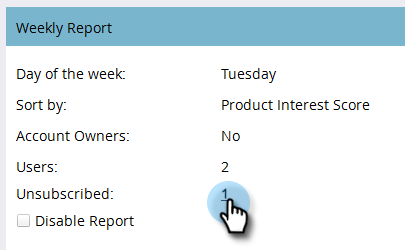

# Impostazione report ABM {#abm-report-setup}

Il rapporto sulle vendite di ABM è un messaggio e-mail settimanale personalizzato inviato al team dell&#39;account.

## Impostazione rapporto {#report-setup}

1. Fate clic su **Admin**.

   

1. Fate clic su **ABM**.

   

1. In Rapporto settimanale, fate clic su **Modifica**.

   

1. Fate clic sul menu a discesa **Giorno** e selezionate il giorno della settimana in cui i destinatari dovranno ricevere il messaggio e-mail.

   

1. Per determinare il layout del messaggio e-mail, fate clic sul menu a discesa **Ordina per** ed effettuate una selezione.

   

1. Selezionate la casella **Utenti** , quindi fate clic sul menu a discesa e selezionate chi desiderate ricevere il messaggio e-mail.

   

   >[!NOTE]
   >
   >Le notifiche verranno inviate solo ai proprietari dell&#39;account o ai membri del team.

1. Fate clic su **Salva**.

   

Ed è tutto!

## Come annullare l’iscrizione {#how-to-unsubscribe}

A ogni rapporto viene fornita l&#39;opzione di rifiuto. Per farlo, fai clic su **Annulla sottoscrizione** nella parte inferiore dell’e-mail.

## Come effettuare l’iscrizione {#how-to-resubscribe}

1. Fate clic su **Admin**.

   

1. Fate clic su **ABM**.

   

1. In Rapporto settimanale, fate clic sul numero elencato come Non iscritto.

   

1. Fate clic sul menu a discesa Utenti.

   

1. Selezionate di nuovo l’utente a cui desiderate ricevere i messaggi e-mail e fate clic su **Ripristina sottoscrizione**.

   

