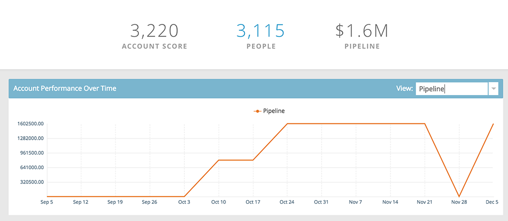

# Informazioni sull&#39;account denominato {#named-account-insights}

Il Pannello account denominato fornisce una visualizzazione a 360 gradi di un account di destinazione.

## Dashboard {#dashboard}

Il dashboard aggrega le informazioni chiave a livello di account da tutte le persone all&#39;interno di un account denominato, evitando in tal modo la necessità di andare a ciascuna persona per valutare i propri progressi. Puoi approfondire l&#39;attività dell&#39;e-mail utilizzando [Informazioni e-mail](/help/marketo/product-docs/reporting/email-insights/filtering-in-email-insights.md#account-based-marketing).

>[!NOTE]
>
>I grafici mostrano le informazioni degli ultimi 90 giorni.

**Coinvolgimento account nel** tempoFate clic sul menu a  **** discesa Visualizzatori a destra per cambiare il contenuto visualizzato. Oltre al punteggio account, puoi visualizzare per Ricavi totali...

...o Pipeline.

<table> 
 <tbody> 
  <tr> 
   <td><strong>Punteggio account</strong></td> 
   <td>
Consulta il coinvolgimento settimanale in base a tutti i punteggi dell'account creati in Amministratore. È possibile confrontare questi punteggi di account uno accanto all'altro. Per determinare il coinvolgimento settimanale, prendiamo il massimo impegno da qualsiasi giorno della settimana.
</td> 
  </tr> 
  <tr> 
   <td><strong>Pipeline</strong></td> 
   <td>Vedere la pipeline nel tempo. Per determinare la pipeline nel tempo per settimana, prendiamo la pipeline l'ultimo giorno.</td> 
  </tr> 
  <tr> 
   <td><strong>Entrate</strong></td> 
   <td>Visualizza le entrate nel tempo. Per determinare le entrate nel tempo per settimana, prendiamo la somma di tutte le entrate vinte in quella settimana.</td> 
  </tr> 
 </tbody> 
</table>

**Momenti interessanti**

A disposizione degli utenti di Marketing Sales Insight, puoi vedere i momenti interessanti raggruppati a livello di account.

**Principali persone**

Queste persone vengono calcolate in base alle priorità che si basano sulla recency o l&#39;urgenza mostrate dalle persone di account denominati (come [Best Bets](/help/marketo/product-docs/marketo-sales-insight/msi-for-salesforce/features/stars-and-flames/priority-urgency-relative-score-and-best-bets.md) in Sales Insight), o Punteggi definiti dall&#39;utente. **La** priorità è disponibile solo per gli utenti di Marketing Sales Insight.

**Include gli elementi figlio**

Fare clic su **Include Children** per visualizzare e scegliere gli account figlio dell&#39;account denominato selezionato e visualizzare le relative analisi aggregate.

>[!NOTE]
>
>Quando selezionate gli account, potete scegliere di selezionare tutti oppure di selezionare singolarmente fino a 100.

## Gerarchia {#hierarchy}

Vedere dove vive l&#39;account denominato selezionato in relazione alla sua gerarchia.

## Opportunità {#opportunities}

Panoramica di tutte le opportunità aperte a livello di account, per aiutare i team di marketing a concentrarsi sulla chiusura di opportunità specifiche.

## Persone potenziali {#potential-people}

La corrispondenza lead-to-account utilizza una logica sfocata per trovare corrispondenze deboli che possono essere risolte nella scheda Persone potenziali.

>[!NOTE]
>
>Per aggiungere una delle persone elencate, selezionatele e fate clic su **Aggiungi persone**.

## Utilizzata da {#used-by}

Questa scheda mostra quali campagne intelligenti, campagne Web, elenchi smart o rapporti fanno attualmente riferimento a specifici account o elenchi di account denominati specifici.

## Account Team {#account-team}

Visualizza i membri del team dell&#39;account, aggiungi/rimuovi membri, persino assegna un proprietario dell&#39;account in questa scheda.

>[!NOTE]
>
>Fate clic sul menu a discesa **Azioni team account** per aggiungere o rimuovere membri dell&#39;account o per assegnare un proprietario dell&#39;account.

## Indicatori ICP {#icp-indicators}

Visualizzare gli indicatori ICP selezionati per l&#39;esportazione quando [il modello è stato sintonizzato](/help/marketo/product-docs/account-based-marketing/account-profiling/account-profiling-ranking-and-tuning.md#model-tuning).

