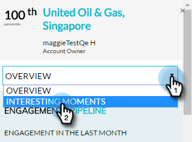

# Panoramica del plug-in di Account Insight {#account-insight-plug-in-overview}

Account Insight è un plug-in Chrome che presenta ABM fruibili e informazioni di account ai team di vendita, consentendo loro di interagire con più efficacia con gli account.

>[!NOTE]
>
>**Disponibilità**
>
>Account Insight è incluso per tutti i clienti che hanno sia ABM che Marketo Sales Insight. Per i clienti che dispongono solo di ABM, Account Insight è disponibile come componente aggiuntivo acquistato. Ogni cliente è limitato a 250 postazioni per l&#39;Account Insight. Per informazioni, contattate il rappresentante commerciale. Non è disponibile per i clienti che non dispongono di ABM.

>[!CAUTION]
>
>Il plug-in Account Insight non funziona nelle sottoscrizioni con l&#39;opzione [SSO-only](http://docs.marketo.com/display/DOCS/Restrict+User+Login+to+SSO+Only) (Single Sign-On) abilitata.
>
>Il contesto CRM funziona per Salesforce quando si avvia il plug-in da un account, un lead o un contatto. Il contesto CRM non funziona per Dynamics quando si avvia il plug-in da un account, lead o contatto. Per gli utenti di Dynamics, si consiglia di utilizzare il plug-in Account Insight.

## Account denominati {#named-accounts}

Consultate i conti denominati in ordine di classificazione tra loro. Questo elenco è disponibile solo per i proprietari di account. Il supporto del team di account sarà disponibile a breve.

Per visualizzare i dettagli di un account denominato, fate clic sul suo nome...

...e viene visualizzata la panoramica.

Visualizzare momenti interessanti utilizzando il menu a discesa.

Scorri verso il basso per visualizzare le puntate migliori. Anche qui ci sono momenti interessanti, insieme alle persone coinvolte.

Fare clic sul nome di una persona...

...e visualizzarne l&#39;attività.

È inoltre possibile passare dalla visualizzazione Partecipazione alla tubazione.

Per uscire dall&#39;account denominato, fate clic sulla X in alto a destra.

## Feed attività {#activity-feed}

Il feed di attività mostra l&#39;attività recente, risalendo a sette giorni fa.

Fate clic sul menu a discesa **Filtro** per filtrare in base a diversi tipi di attività.\

È possibile fare clic su diversi elementi. Fate clic sull&#39;account denominato per visualizzarne i dettagli. Fate clic sul nome dell&#39;utente per visualizzarne l&#39;attività. Fai clic su Altre attività per vedere, beh, altre attività.

Roba fantastica!

>[!MORELIKETHIS]
>
>* [Impostazione di Account Insight](set-up-account-insight.md)

>

