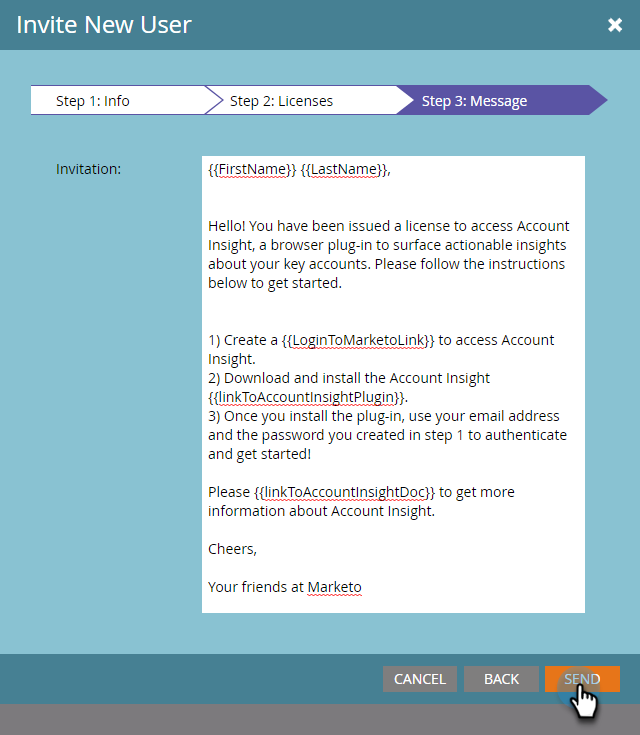

# Invitare gli utenti ad accedere a Visione account {#invite-users-to-access-account-insight}

Seguite questi passaggi per consentire agli utenti di accedere a Account Insight.

1. Fate clic su **Admin**.

   

1. Fate clic su **Utenti e ruoli** nella struttura. Quindi fate clic sulla scheda **Sales Users** (Utenti **di vendita) e** Invite New Sales User (Invita nuovo utentedi vendita).

   

   Esistono due modi per invitare gli utenti: Per CRM o per e-mail. In questo esempio utilizzeremo Invite da CRM.

   >[!NOTE]
   >
   >Quando inviti nuovi utenti (non Marketo) tramite l&#39;elenco di utenti CRM, puoi invitare più persone alla volta. L’invito per e-mail è 1 per 1.

1. Fai clic sul menu a discesa Utente **** CRM e seleziona l&#39;utente desiderato.

   

   >[!NOTE]
   >
   >Se scegliete **Invita utente per e-mail**, immettete semplicemente il nome, il cognome e l’indirizzo e-mail dell’utente, quindi continuate con il passaggio 4.

1. Per impostare una data di scadenza per l&#39;accesso dell&#39;utente (facoltativo), fate clic sull&#39;icona del calendario. Per impostazione predefinita è impostata su &quot;never&quot;.

   

1. Fate clic su **Avanti**.

   

1. Selezionate la casella di controllo **Account Insight** e fate clic su **Avanti**.

   

1. Controllate il messaggio di invio, apportate le modifiche desiderate (facoltativo) e fate clic su **Invia**.

   

