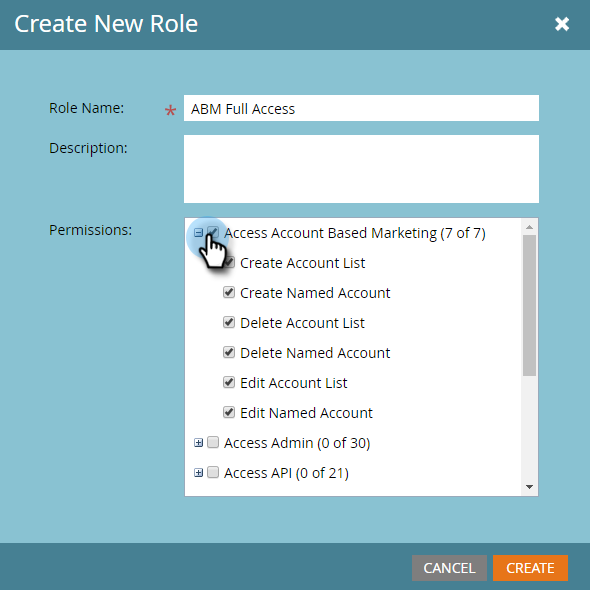

# Autorizzazioni {#permissions}

Dovrete configurare le autorizzazioni per consentire agli utenti di utilizzare ABM. Ecco come.

1. Fare clic su **Admin**.

   

1. Fare clic su **Utenti e ruoli**.

   

   >[!NOTE]
   >
   >Potete aggiungere autorizzazioni ABM per un ruolo esistente o crearne una nuova. In questo esempio viene utilizzato un nuovo ruolo.

1. Fare clic su **Ruoli**, quindi su **Nuovo ruolo**.

   

1. Immettete un nome ruolo e fate clic sull&#39;icona **+** accanto alla casella di controllo Accesso al marketing basato su account.

   

1. Per selezionare le autorizzazioni *all*, è sufficiente selezionare la casella di controllo **Accesso a Marketing basato su account**.

   

   >[!NOTE]
   >
   >Potete anche selezionare solo alcune delle opzioni. A tale scopo, selezionate ciascuna casella di controllo singolarmente.

1. Fare clic su **+** per aprire il menu Accesso all&#39;amministratore. Selezionare la casella di controllo **Accesso ad ABM Admin**.

   \
   Il nuovo ruolo ABM è ora pronto per essere [assegnato a un utente](http://docs.marketo.com/display/public/DOCS/Managing+User+Roles+and+Permissions#ManagingUserRolesandPermissions-AssignRolestoaUser)!

   

