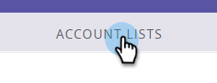
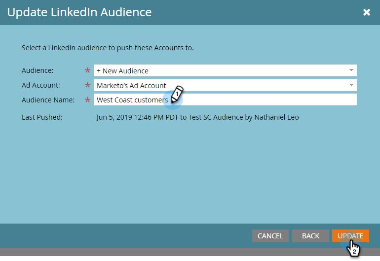

# Creare un pubblico abbinato su LinkedIn {#create-a-matched-audience-on-linkedin}

Crea audience corrispondenti dai tuoi elenchi di account ABM per il targeting degli annunci LinkedIn.

>[!PREREQUISITES]
>
>[Aggiungi tipi di pubblico associati LinkedIn come servizio LaunchPoint](http://docs.marketo.com/x/I4Fy)

1. In ABM, fare clic sulla scheda **Elenchi account**.

   

1. Scegliete l’elenco di account desiderato.

   

1. Fare clic sul menu a discesa **Azioni elenco account** e selezionare **Invia tramite AdBridge**.

   

1. Scegliere **LinkedIn** e fare clic su **Next**.

   

1. Fare clic sul menu a discesa **Audience**. Potete selezionare un&#39;audience esistente o crearne una nuova. In questo esempio, ne creeremo uno nuovo (se selezionate un&#39;audience esistente, passate al Passaggio 7).

   

1. Fate clic sul menu a discesa **Ad Account** e selezionate l&#39;account dell&#39;annuncio di destinazione.

   

1. Assegnate un nome al pubblico e fate clic su **Aggiorna**.

   

   Ed è tutto. Il pubblico è stato spinto su LinkedIn.

>[!NOTE]
>
>**Articoli correlati**
>
>* [Usare un elenco Marketo o un elenco smart come segmento di pubblico LinkedIn](http://docs.marketo.com/x/NIFy)

>

