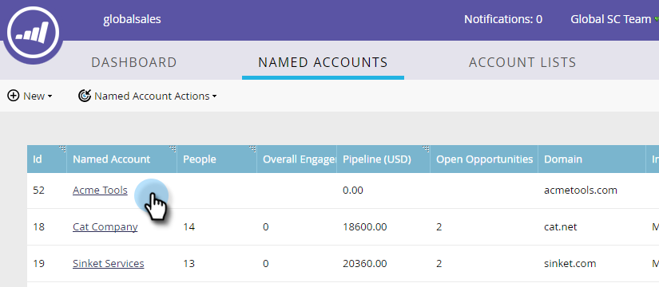

# Aggiungere un account denominato esistente a un elenco di account {#add-an-existing-named-account-to-an-account-list}

Aggiungere un account denominato a un elenco di account è semplice.

>[!NOTE]
>
>Questo vale solo per gli elenchi di account, **non** gli elenchi di account dinamici.

1. Selezionare la riga dell&#39;account denominato a cui si desidera aggiungere.

   

1. Fare clic sul menu a discesa **Azioni account denominato** e selezionare **Aggiungi a elenco account**.

   

1. Fare clic sul menu a discesa **Elenco account**, selezionare l&#39;elenco di account desiderato e fare clic su **Aggiungi**.

   

   È tutto!

>[!MORELIKETHIS]
>
>[Creare un account denominato](/help/marketo/product-docs/account-based-marketing/target/named-accounts/create-a-named-account.md)
