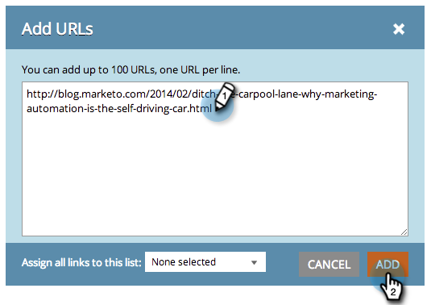
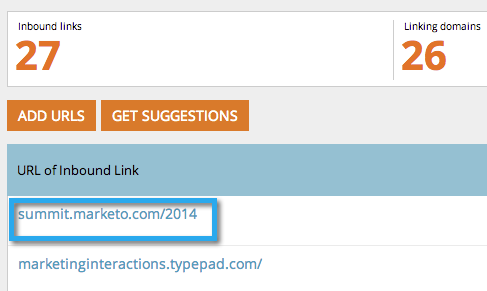

# SEO: aggiungere un URL di collegamento in entrata manualmente {#seo-add-an-inbound-link-url-manually}

Puoi aggiungere manualmente i collegamenti in entrata. Ecco come.

>[!IMPORTANT]
>
>Il 31 marzo 2026, Marketo Engage dichiarerà obsoleta la funzione di ottimizzazione dei motori di ricerca. Esportare tutti i dati pertinenti entro e non oltre il 30 marzo. [Ulteriori informazioni](https://nation.marketo.com/t5/product-blogs/marketo-engage-seo-feature-deprecation/ba-p/359060){target="_blank"}.
>
>* [Problemi di esportazione](https://experienceleague.adobe.com/it/docs/marketo/using/product-docs/additional-apps/seo/pages/seo-export-issues-to-csv){target="_blank"}
>* [Esporta risultati parole chiave](https://experienceleague.adobe.com/it/docs/marketo/using/product-docs/additional-apps/seo/keywords/seo-exporting-keyword-results){target="_blank"}
>* [Tendenze parole chiave di esportazione](https://experienceleague.adobe.com/it/docs/marketo/using/product-docs/additional-apps/seo/reports/seo-use-the-keyword-trends-report#exporting-data){target="_blank"}
>* [Esporta tendenze parole chiave concorrenti](https://experienceleague.adobe.com/it/docs/marketo/using/product-docs/additional-apps/seo/reports/seo-use-the-competitor-kw-trends-report#exporting-data){target="_blank"}

1. Passare alla sezione **[!UICONTROL Inbound Links]**.

   

1. Fai clic su **[!UICONTROL Add URLs]**.

   

1. Digita l’URL. Fai clic su **[!UICONTROL Add]**.

   

   >[!TIP]
   >
   >Lo sapevi che puoi [aggiungere il tuo collegamento in entrata a un elenco nuovo o esistente](/help/marketo/product-docs/additional-apps/seo/understanding-seo/seo-managing-lists.md){target="_blank"}? Dai un&#39;occhiata!

   

Forza, forza! Ora dovresti vedere il tuo nuovo URL aggiunto all’elenco. La raccolta dei dati potrebbe richiedere del tempo.
