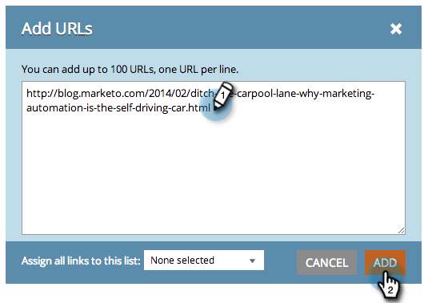

# SEO: aggiunta manuale di un URL di collegamento in entrata {#seo-add-an-inbound-link-url-manually}

Puoi aggiungere manualmente i collegamenti in entrata. Ecco come:

1. Vai a **[!UICONTROL Collegamenti in entrata]** sezione.

   

1. Clic **[!UICONTROL Aggiungi URL]**.

   

1. Digita l’URL. Clic **[!UICONTROL Aggiungi]**.

   

   >[!TIP]
   >
   >Lo sapevi che puoi [aggiungi il collegamento in entrata a un elenco nuovo o esistente](/help/marketo/product-docs/additional-apps/seo/understanding-seo/seo-managing-lists.md){target="_blank"}? Dai un&#39;occhiata!

   

Forza, forza! Ora dovresti vedere il tuo nuovo URL aggiunto all’elenco. La raccolta dei dati potrebbe richiedere del tempo.
