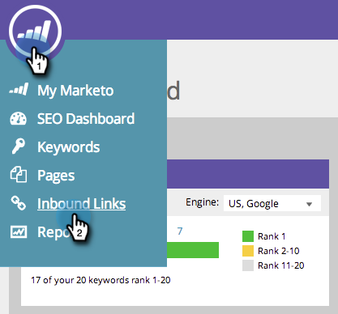

# SEO - Rimuovere/eliminare un URL di collegamento in entrata {#seo-remove-delete-an-inbound-link-url}

A volte vuoi rimuovere i link in entrata. Ecco come:

1. Vai alla sezione **Collegamenti in entrata** .

   

1. Passa il puntatore del mouse sull’URL del collegamento in entrata da eliminare.

   

1. Fare clic su **Rimuovi**.

   

Questo collegamento in entrata è stato eliminato.
