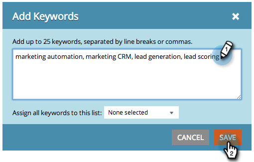

# SEO - Aggiungi parole chiave {#seo-add-keywords}

Le parole chiave sono frasi che le persone digitano nei motori di ricerca. Aggiungi le parole chiave più rilevanti per il tuo business.

>[!NOTE]
>
>Se hai molte parole chiave, puoi [importarle con un file CSV](/help/marketo/product-docs/additional-apps/seo/keywords/seo-importing-keywords-with-a-csv.md).

1. Vai alla sezione **Parole chiave** .

   

1. Immetti le parole chiave di cui desideri eseguire il targeting e fai clic su **Salva**.

   

   >[!TIP]
   >
   >Separa le parole chiave con interruzioni di riga o virgole.

   

   >[!MORELIKETHIS]
   >
   >[Parole chiave (visualizzazione di riepilogo)](/help/marketo/product-docs/additional-apps/seo/keywords/seo-understanding-keywords.md)

Ottimo lavoro! Ora dovresti vedere le nuove aggiunte all’elenco delle parole chiave.
