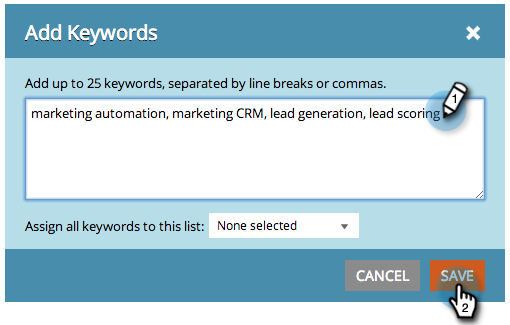
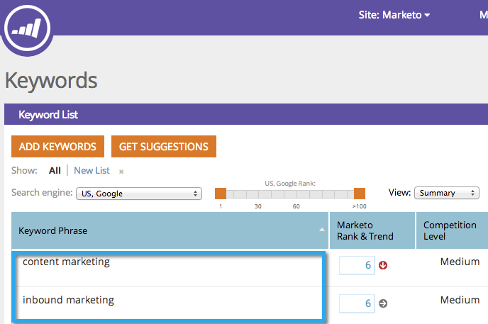

# SEO: aggiungere parole chiave {#seo-add-keywords}

Le parole chiave sono frasi digitate dagli utenti nei motori di ricerca. Aggiungi le parole chiave più rilevanti per la tua azienda.

>[!IMPORTANT]
>
>Il 31 marzo 2026, Marketo Engage dichiarerà obsoleta la funzione di ottimizzazione dei motori di ricerca. Esportare tutti i dati pertinenti entro e non oltre il 30 marzo. [Ulteriori informazioni](https://nation.marketo.com/t5/product-blogs/marketo-engage-seo-feature-deprecation/ba-p/359060){target="_blank"}.
>
>* [Problemi di esportazione](https://experienceleague.adobe.com/it/docs/marketo/using/product-docs/additional-apps/seo/pages/seo-export-issues-to-csv){target="_blank"}
>* [Esporta risultati parole chiave](https://experienceleague.adobe.com/it/docs/marketo/using/product-docs/additional-apps/seo/keywords/seo-exporting-keyword-results){target="_blank"}
>* [Tendenze parole chiave di esportazione](https://experienceleague.adobe.com/it/docs/marketo/using/product-docs/additional-apps/seo/reports/seo-use-the-keyword-trends-report#exporting-data){target="_blank"}
>* [Esporta tendenze parole chiave concorrenti](https://experienceleague.adobe.com/it/docs/marketo/using/product-docs/additional-apps/seo/reports/seo-use-the-competitor-kw-trends-report#exporting-data){target="_blank"}

1. Passare alla sezione **[!UICONTROL Keywords]**.

   

1. Immettere le parole chiave di destinazione e fare clic su **[!UICONTROL Save]**.

   

   >[!TIP]
   >
   >Separare le parole chiave con interruzioni di riga o virgole.

   

Ottimo lavoro! Verranno visualizzate le nuove aggiunte all&#39;elenco delle parole chiave.

>[!NOTE]
>
>I dati vengono visualizzati solo per le parole chiave con classificazione da 1 a 100.

>[!MORELIKETHIS]
>
>[Informazioni sulle parole chiave (visualizzazione di riepilogo)](/help/marketo/product-docs/additional-apps/seo/keywords/seo-understanding-keywords.md)
