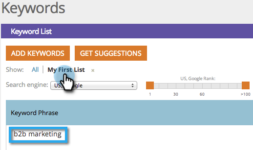
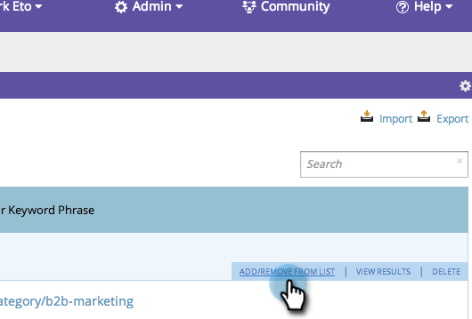
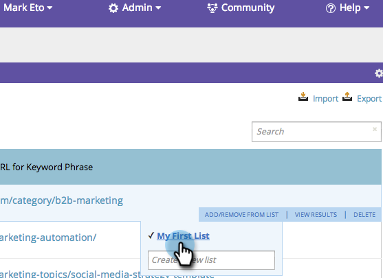

# SEO - Aggiungi/rimuovi parole chiave da un elenco {#seo-add-remove-keywords-from-a-list}

È possibile mantenere tutte le parole chiave belle e organizzate utilizzando elenchi. Questo renderà facile trovare dati su parole chiave specifiche come torta.

## Aggiungi a un elenco {#add-to-a-list}

1. Vai a **Parole chiave** sezione .

   

1. Passa il puntatore del mouse sulla parola chiave da aggiungere a un elenco. Fai clic su **Aggiungi/Rimuovi dall&#39;elenco**.

   

1. Fai clic sull’elenco e le parole chiave verranno aggiunte.

   

   >[!TIP]
   >
   >È inoltre possibile creare un nuovo elenco per le parole chiave. Digita il nome in Crea un nuovo elenco.

   

Ehi! Seleziona l’elenco per visualizzare le nuove parole chiave.

## Rimuovi parola chiave dall&#39;elenco {#remove-keyword-from-list}

È inoltre possibile rimuovere le parole chiave da un elenco.

1. Vai a **Parole chiave** sezione .

   

1. Passa il puntatore del mouse sulla parola chiave da rimuovere da un elenco. Fai clic su **Aggiungi/Rimuovi dall&#39;elenco**.

   

1. Fare clic sull&#39;elenco da cui si desidera rimuovere le parole chiave.

   >[!NOTE]
   >
   >Tutti gli elenchi a cui appartiene la parola chiave al momento avranno un segno di spunta. Una volta rimosso dall’elenco, il controllo scompare.

   

   Perfetto, la parola chiave non è più in questo elenco. Aggiorna la pagina per aggiornare la visualizzazione.

   >[!MORELIKETHIS]
   >
   >[Parole chiave (visualizzazione di riepilogo)](/help/marketo/product-docs/additional-apps/seo/keywords/seo-understanding-keywords.md)
