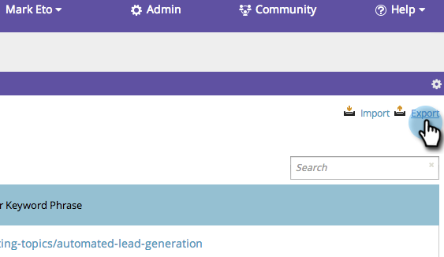

# SEO: esportare risultati delle parole chiave {#seo-exporting-keyword-results}

Puoi esportare i risultati delle parole chiave da condividere con il team o per creare un rapporto.
>[!IMPORTANT]
>
>Il 31 marzo 2026, Marketo Engage dichiarerà obsoleta la funzione di ottimizzazione dei motori di ricerca. Esportare tutti i dati pertinenti entro e non oltre il 30 marzo. [Ulteriori informazioni](https://nation.marketo.com/t5/product-blogs/marketo-engage-seo-feature-deprecation/ba-p/359060){target="_blank"}.
>
>* [Problemi di esportazione](https://experienceleague.adobe.com/en/docs/marketo/using/product-docs/additional-apps/seo/pages/seo-export-issues-to-csv){target="_blank"}
>* [Esporta risultati parole chiave](https://experienceleague.adobe.com/en/docs/marketo/using/product-docs/additional-apps/seo/keywords/seo-exporting-keyword-results){target="_blank"}
>* [Tendenze parole chiave di esportazione](https://experienceleague.adobe.com/en/docs/marketo/using/product-docs/additional-apps/seo/reports/seo-use-the-keyword-trends-report#exporting-data){target="_blank"}
>* [Esporta tendenze parole chiave concorrenti](https://experienceleague.adobe.com/en/docs/marketo/using/product-docs/additional-apps/seo/reports/seo-use-the-competitor-kw-trends-report#exporting-data){target="_blank"}

1. Passare alla sezione **[!UICONTROL Keywords]**.

   

1. Fai clic su **[!UICONTROL Export]**.

   

   Sì, è davvero così facile.
