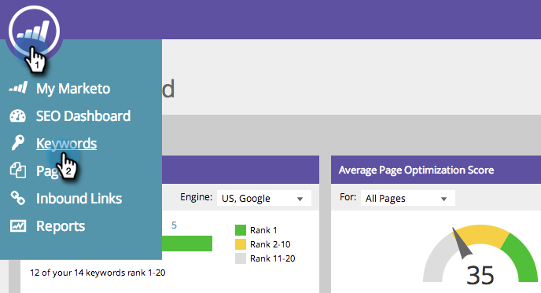

# SEO - Risultati parola chiave filtro {#seo-filter-keyword-results}

Potresti avere molte [parole chiave](/help/marketo/product-docs/additional-apps/seo/keywords/seo-understanding-keywords.md). Di seguito sono riportati diversi modi per filtrarli:

## Filtra per elenco {#filter-by-list}

1. Vai alla sezione **Parole chiave** .

   

1. Fare clic sul nome dell&#39;elenco su cui si è concentrati.

   

   >[!NOTE]
   >
   >Se non trovi elenchi, [scopri come creare un elenco di parole chiave](/help/marketo/product-docs/additional-apps/seo/understanding-seo/seo-managing-lists.md).

Dolce! Ora si vedranno solo le parole chiave in quell&#39;elenco.

## Filtra per classificazione SERP {#filter-by-serp-rank}

1. Vai alla sezione Parole chiave .

   

   I quadrati arancioni definiscono i limiti superiore (sinistro) e inferiore (destro). Il filtro funziona sul rango [SERP](/help/marketo/product-docs/additional-apps/seo/understanding-seo/understanding-search-engine-optimization.md) della parola chiave.

1. Far scorrere i quadrati arancioni a sinistra/a destra per filtrare i risultati.

   

## Filtra per ricerca {#filter-by-search}

Puoi anche trovare le parole chiave che stai cercando utilizzando il campo di ricerca nell’angolo in alto a destra.

1. Vai alla sezione **Parole chiave** .

   

1. Immetti la parola chiave nel campo di ricerca.

   
