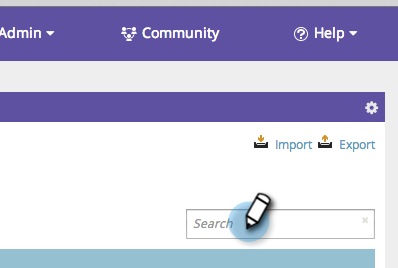

# SEO - Risultati parola chiave filtro {#seo-filter-keyword-results}

È possibile che ci siano molte [parole chiave](seo-understanding-keywords.md). Esistono diversi modi per filtrarli:

## Filtrare per elenco {#filter-by-list}

1. Andate alla sezione **Parole chiave**.

   

1. Fare clic sul nome dell&#39;elenco sul quale si desidera visualizzare lo stato attivo.

   

   >[!NOTE]
   >
   >Se non viene visualizzato alcun elenco, [l](../../../../product-docs/additional-apps/seo/understanding-seo/seo-managing-lists.md) [imparare a creare un elenco di parole chiave](../../../../product-docs/additional-apps/seo/understanding-seo/seo-managing-lists.md).

Dolce! In questa lista verranno visualizzate solo le parole chiave.

## Filtra per SERP Rank {#filter-by-serp-rank}

1. Andate alla sezione Parole chiave.

   

   I quadrati arancioni definiscono i limiti superiore (sinistro) e inferiore (destro). Il filtro funziona sul [SERP rank](../../../../product-docs/additional-apps/seo/understanding-seo/understanding-search-engine-optimization.md) della parola chiave.

1. Fate scorrere i quadrati arancioni verso sinistra/destra per filtrare i risultati.

   

## Filtra per ricerca {#filter-by-search}

È inoltre possibile trovare le parole chiave da cercare utilizzando il campo di ricerca nell’angolo in alto a destra.

1. Andate alla sezione **Parole chiave**.

   

1. Inserite la parola chiave nel campo di ricerca.

   

   Congratulazioni! Ora sei una parola chiave filtrante samurai guerriero!

